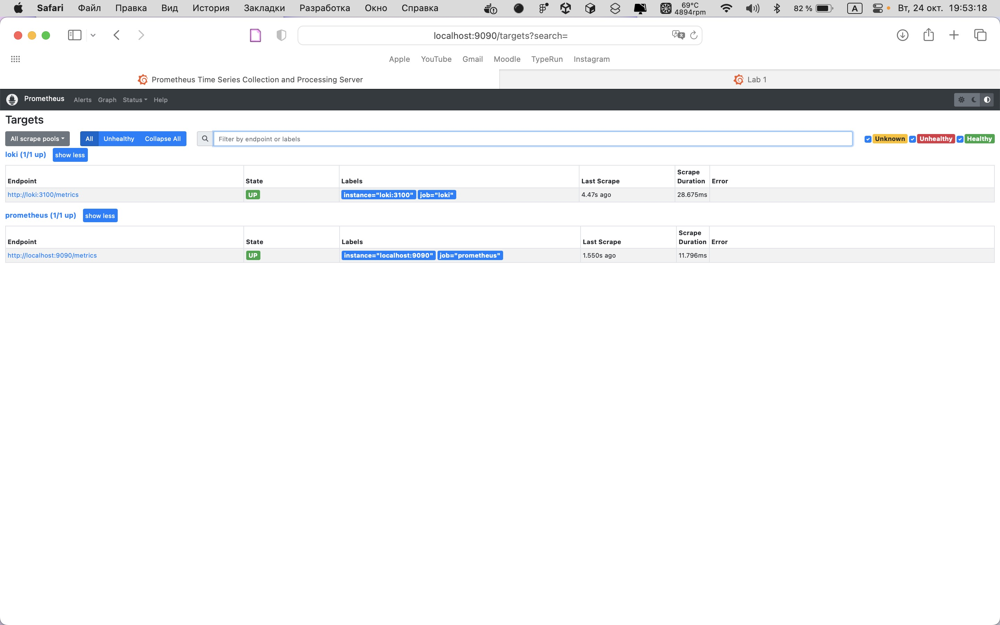
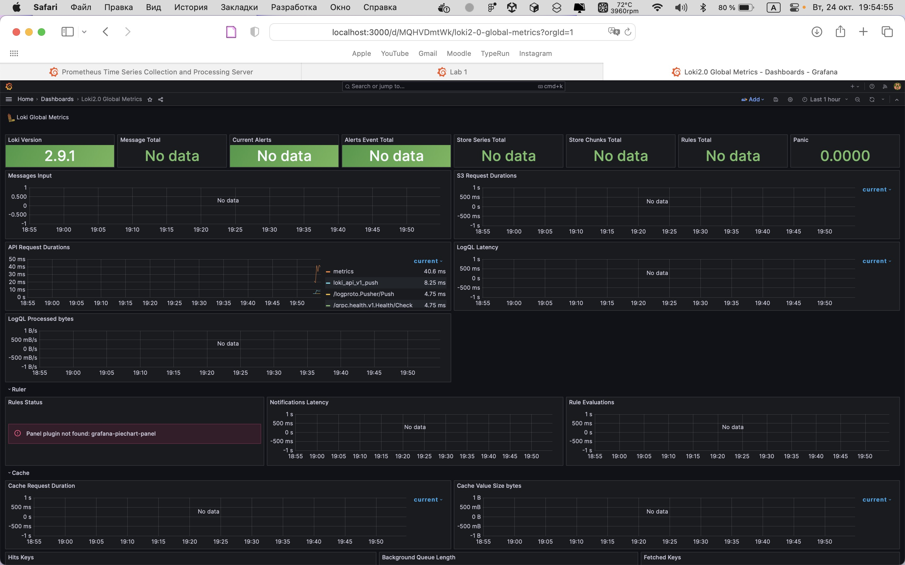
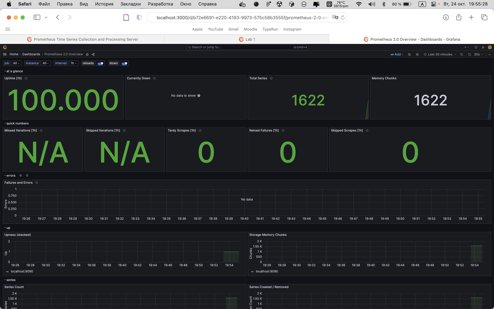

# Metrics

## Metrics scraping with Prometheus



## Service configurations

### Log Rotation (YAML configuration)

```yaml
x-logging: &log
  driver: "json-file"
  options:
    max-size: "64m"
    max-file: "2"
    tag: "{{.ImageName}}|{{.Name}}|{{.ImageFullID}}|{{.FullID}}"
```

### Memory limits

- `python_app`: `512m`

- `loki`: `512m`

- `promtail`: `512m`

- `grafana`: `512m`

- `prometheus`: `512m`

## Dashboards

**Loki**:



**Prometheus**:


