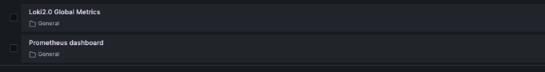
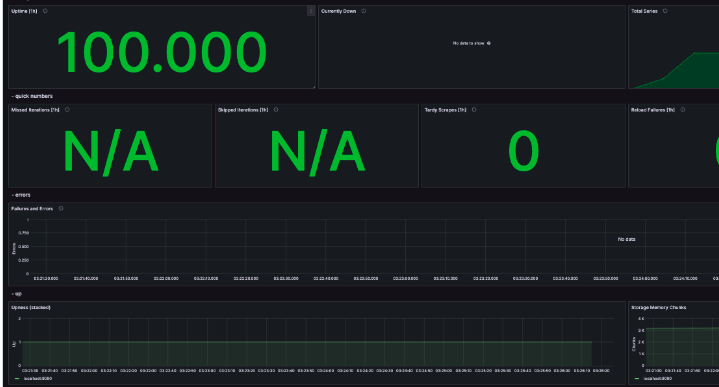

# Metrics

## How ot run?
```
docker compose up -d
```

## How to use?
Navigate to `http://localhost:3000` in your web browser and use the login credentials specified in the compose file to access Grafana. It is already configured with prometheus as the default datasource.

Navigate to `http://localhost:9090` in your web browser to access directly the web interface of prometheus.

## Proofs
Grafana


Prometheus


Loki


## healthcheck
```
healthcheck:
  test: ["CMD-SHELL", {command to check status}]
  timeout: {amount of time}
  start_period: {amount of time}
```

