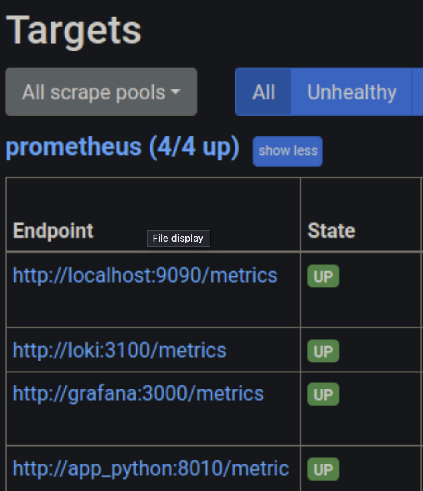

# Metrics overview

## Prometheus

1. Created and added prometheus to docker-compose file.

1. Initialized prometheus with config file `./config/prometheus.yml`.

1. Got metrics from prometheus to loki.

## Task 2

1. Added Grafana Dashboards

1. Changed log rotation and memory limit

```json
    logging: &logging
    driver: "json-file"
    options:
    max-size: "15m"
    max-file: "5"
    tag: "{{.ImageName}}|{{.Name}}"
```

