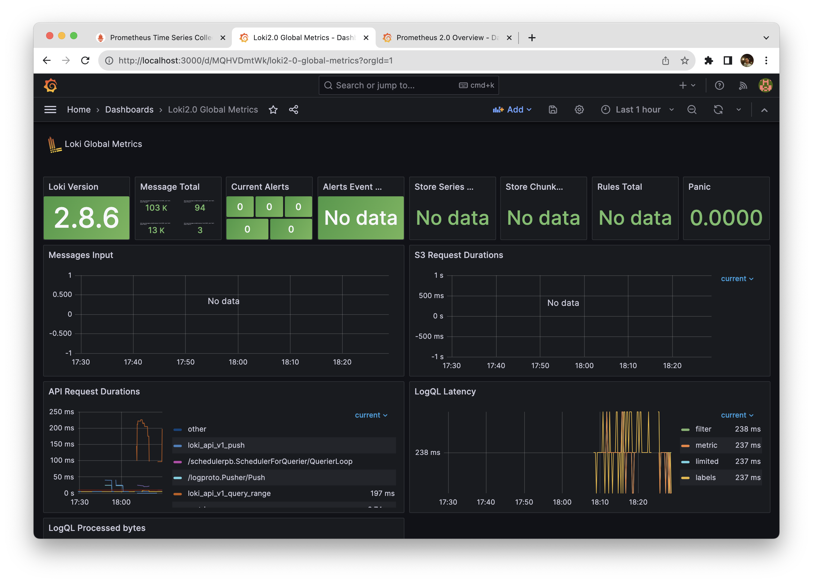
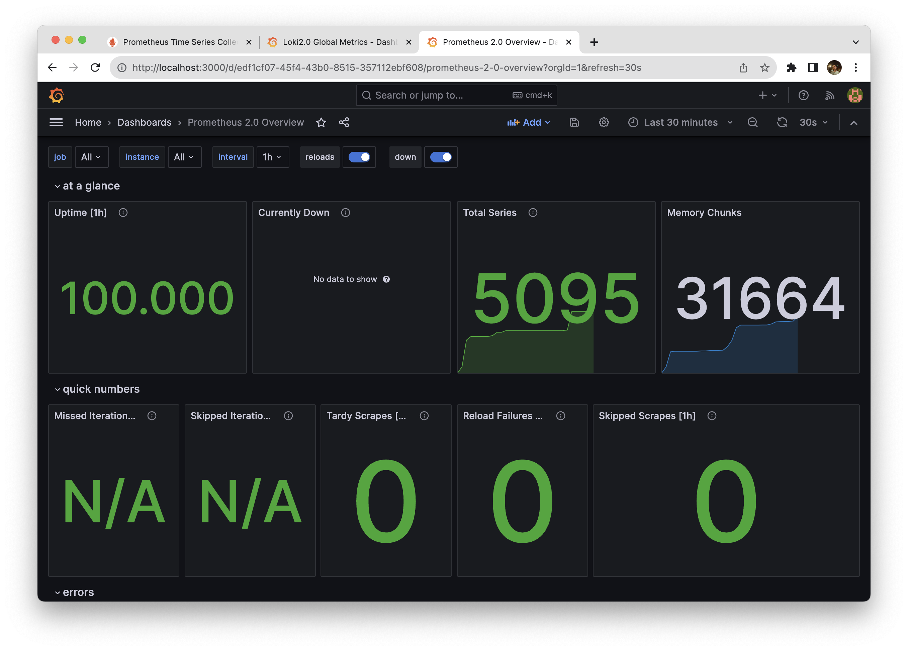

# Metrics

### Prometheus


As seen on the screenshot, metrics are fully scrapped.

### Log rotation

I used this x-logging configuration:
```yml
x-logging: &logger
  driver: "json-file"
  options:
    max-size: "64m"
    max-file: "2"
    tag: "{{.ImageName}}|{{.Name}}|{{.ImageFullID}}|{{.FullID}}"
```

### Container sizes

I put deployment memory restrictions on grafana and prometheus containers to be no more than 512mb, and 256mb for others. This is achieved via:
```yml
deploy:
  resources:
    limits:
      memory: 256m
```

### Loki Dashboard


### Prometheus Dashboard
