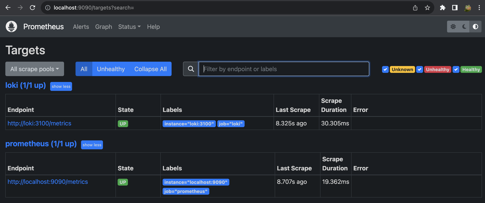
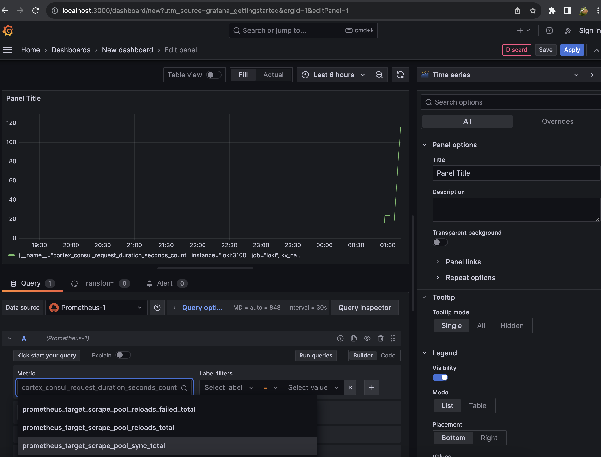
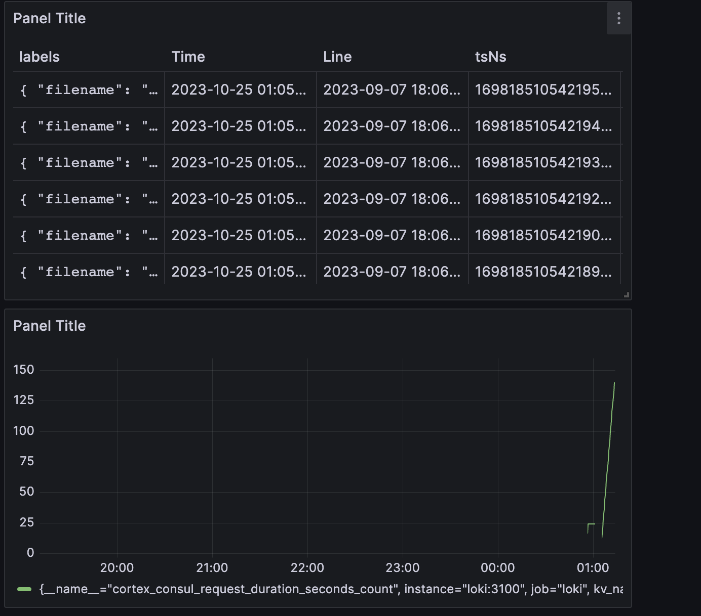

# Prometheus metrics
## Task 1:


## Task 2:
* Assume the task I set memmory RAM limit and logging size limit on each service by:
```yml
deploy:
      resources:
        limits:
          memory: 500M

logging:
    driver: "json-file"
    options:
    max-size: "200k"
    max-file: "10"
```

* Also I have set-up prometheus metrics from each services in `docker-compose.yml`:


* And created dashboard in Grafana with Loki logs and Prometheus metrics:

