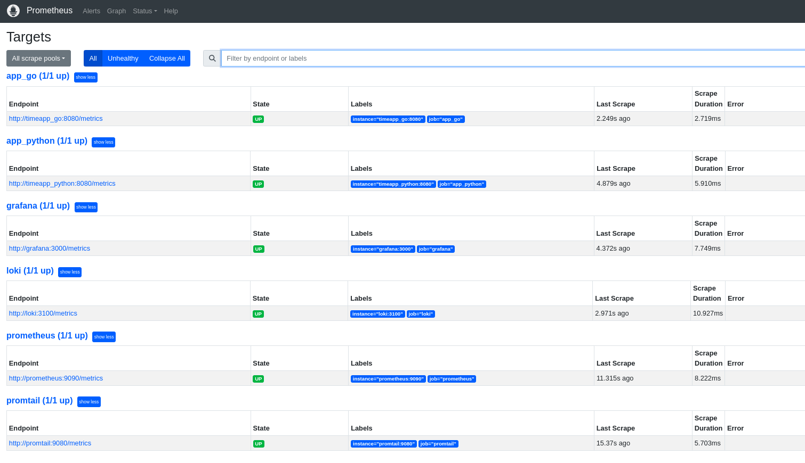
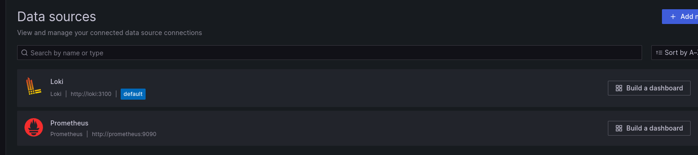
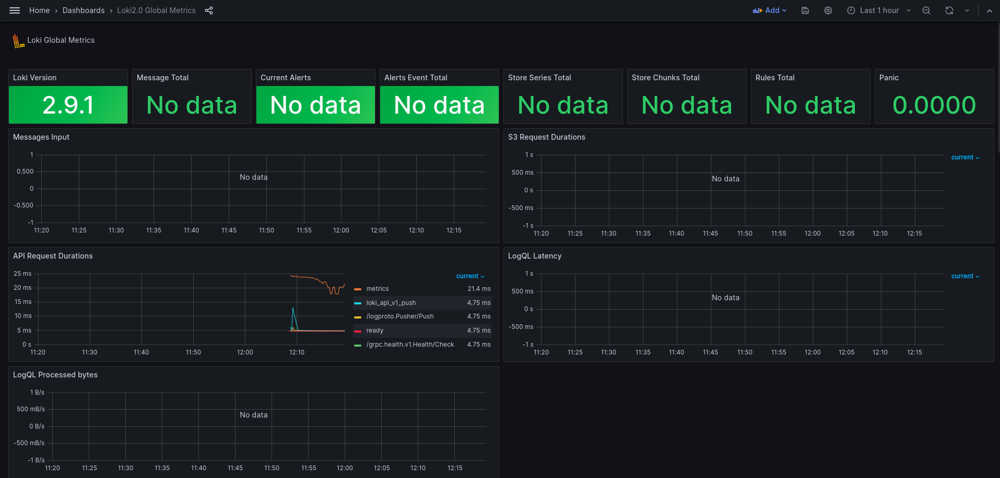
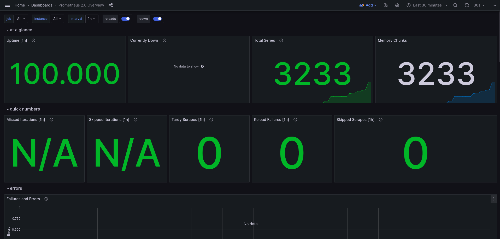
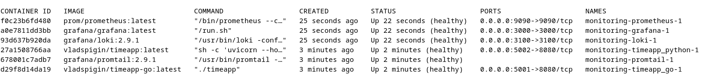

## Prometheus
Accessing http://localhost:9090/targets we can ensure that Prometheus is correctly scraping metrics from all containers, including Loki and Prometheus.


## Grafana
Prometheus is configured in grafana as a datasource:


I have set up dashboards in Grafana for both Loki and Prometheus using proposed from grafana cloud catalog:
[Dashboard for Loki](https://grafana.com/grafana/dashboards/13407)


[Dashboard for Prometheus](https://grafana.com/grafana/dashboards/3662)


## Golang + Python apps metrics
For the golang app, I have used [following](https://github.com/prometheus/client_golang/prometheus) prometheus framework. I have written custom healthcheck utility on golang, since I have used `scratch` base image in docker.
```go
mux.HandleFunc("/health", healthHandler)
mux.Handle("/metrics", promhttp.Handler())
```
```go
package main

import (
	"fmt"
	"net/http"
	"os"
)

func main() {
	_, err := http.Get(fmt.Sprintf("http://127.0.0.1:%s/health", os.Getenv("APP_PORT")))
	if err != nil {
		os.Exit(1)
	}
}

```

For the python app I have used [following](https://github.com/prometheus/client_golang/prometheus) prometheus framework, and `wget` for healthcheck.
```Dockerfile
HEALTHCHECK  --interval=10s --timeout=3s \
  CMD wget --no-verbose --tries=1 --spider http://${APP_HOST}:${APP_PORT}/health || exit 1

```

Example of metric query for python app.


## Docker-compose config
I have set up log rotation using docker-compose configuration. It will rotate files every 20mb.
```yaml
x-logging: &default-logging
  driver: "json-file"
  options:
    tag: "{{.ImageName}}|{{.Name}}|{{.ImageFullID}}|{{.FullID}}"
    max-size: "20m"
    max-file: "3"
```

Limits for all containers using docker-compose configuration:
```yaml
x-small-resources: &small-resources
  limits:
    cpus: "1"
    memory: 512M

x-medium-resources: &medium-resources
  limits:
    cpus: "2"
    memory: 1G

x-large-resources: &large-resources
  limits:
    cpus: "4"
    memory: 2G
```
Example of usage on single container.
```yaml
deploy:
    mode: global
    resources: *medium-resources
```
Also I have set up healthchecks for all containers using docker-compose configuration:

For the golang and python apps healthchecks are defined inside `Dockerfile`, and they inhered in `docker-compose.yml`. For other cintainers, healthcheck test endpoints are configured directly in `docker-compose.yml`.
