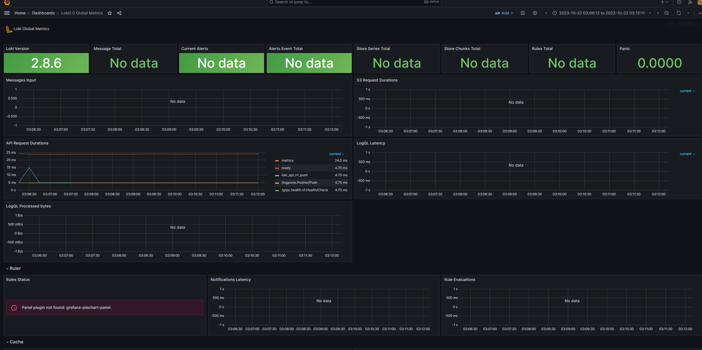
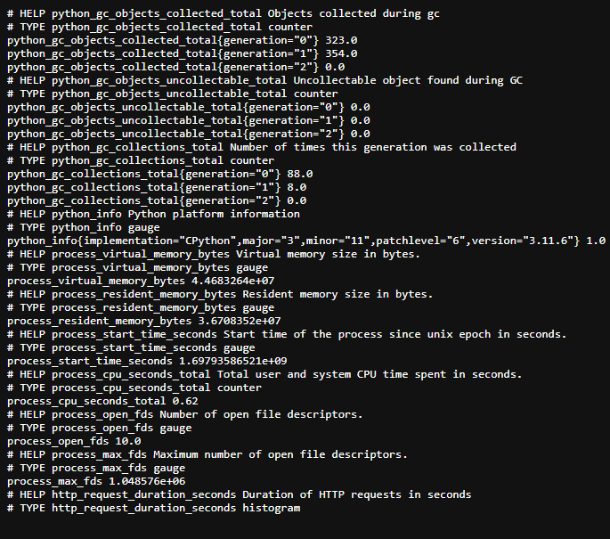
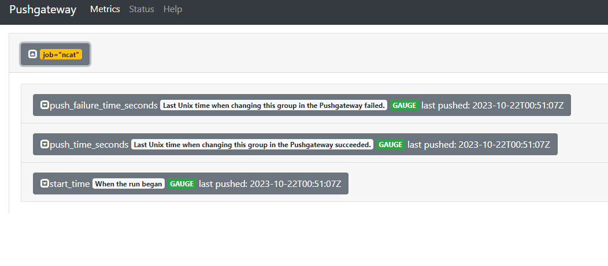

## targets in prometheus

## loki dashboard

## prometheus dashboard

## app_python metrics
prometheus_fastapi_instrumentator module used to collect metrics

## app_bash metrics
prometheush.bash is used to send metrics to pushgateway service

## Memory limits
all services have memory limit 512mb

## Log rotation
3 log files with max size 10mb