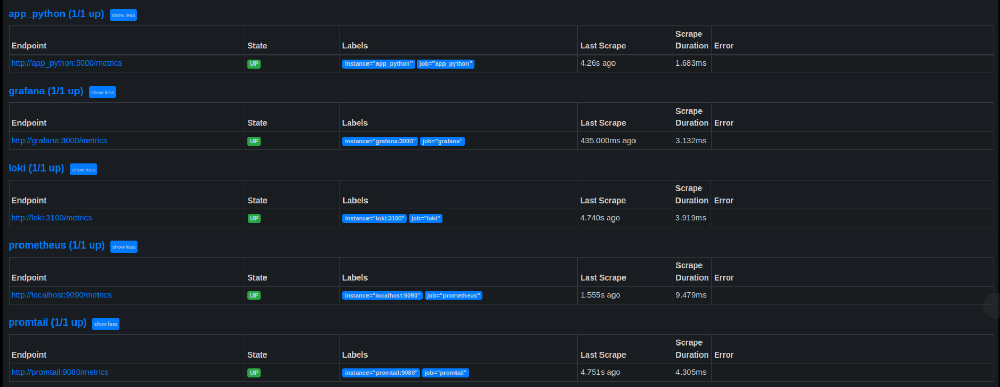
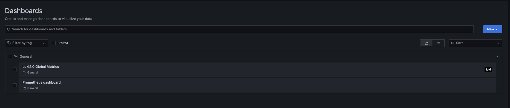
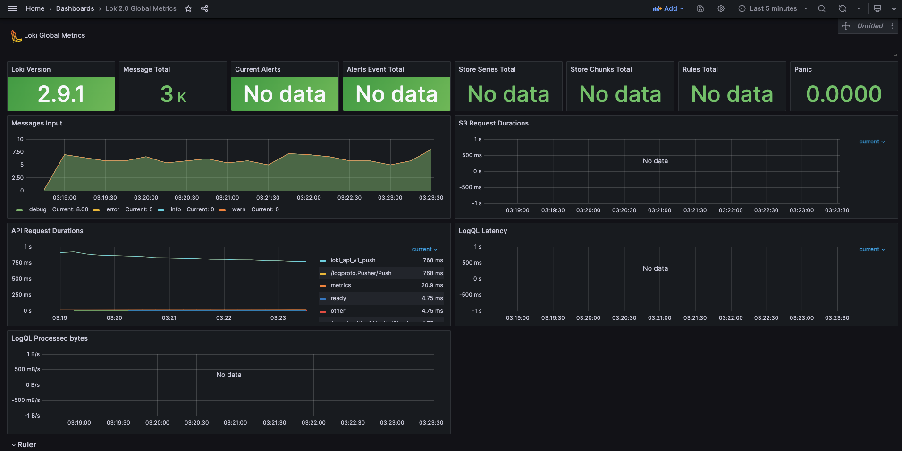
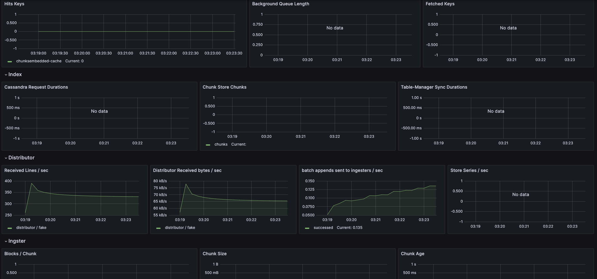
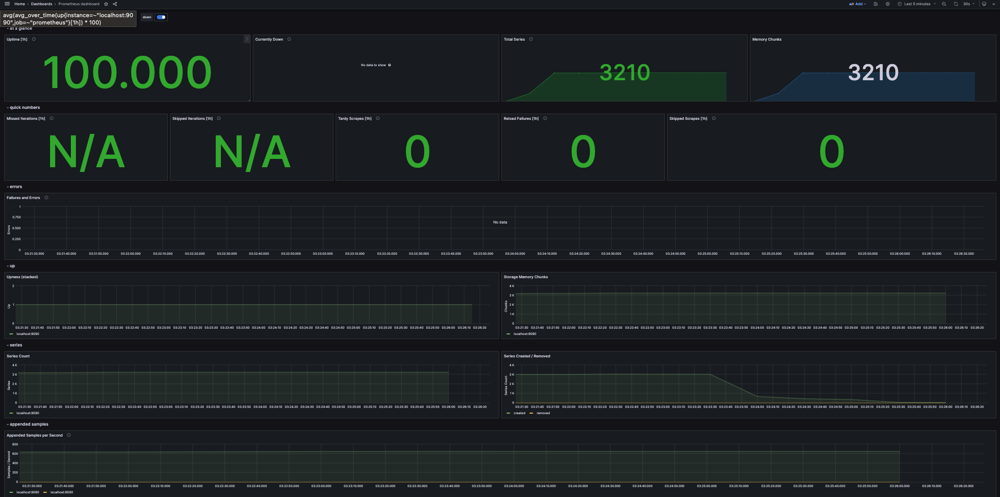
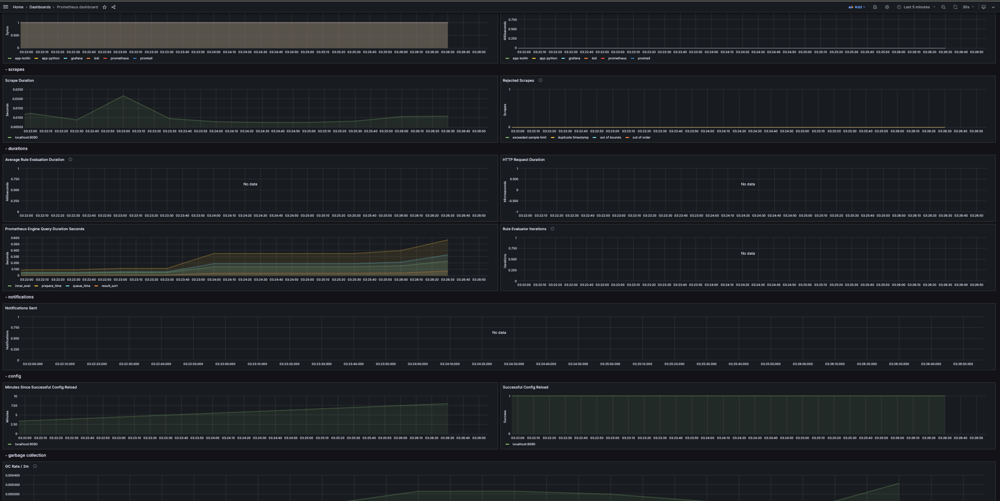

# Metrics

## Prometheus

### Prometheus targets


Here we can see all the services that are defined in `/monitoring/docker-compose.yml`.

* **Python** application requires `prometheus-flask-exporter` dependency as **Prometheus** client.
The metrics are available at `/metrics` path.
* **Kotlin** application requires **Spring Actuator** and **Micrometer**.
The metrics are available at `/actuator/prometheus` path.

---

## Grafana Dashboards
The dashboards' definition files are stored in `/monitoring/config/grafana/dashboards/`.



### Loki



### Metrics



---

## Docker Compose enhancements

### Memory limit
I have included this code block to each container definition inside `/monitoring/docker-compose.yml`:
```yaml
deploy:
  resources:
    limits:
      memory: {amount of memory}
```
Here, I tried to allocate as much memory as was necessary for the application to work successfully.

### Log rotation
I have included this code block to each container definition inside `/monitoring/docker-compose.yml`:
```yaml
driver: "json-file"
options:
  max-size: "100m"
  tag: '{{.ImageName}}|{{.Name}}|{{.ImageFullID}}|{{.FullID}}'
```
Here, I explicitly set the driver file format to **JSON** and maximum size of log file to 100 megabytes.
Also, I set the specific tag to make **Loki** logs aggregation more flexible.

### Health Check
I have included this code block to each container definition inside `/monitoring/docker-compose.yml`:
```yaml
healthcheck:
  test: ["CMD-SHELL", {command to check status}]
  timeout: {amount of time}
  start_period: {amount of time}
```
Here, I point the command to check status, timeout after which the healthcheck will be failed, and the start_period to give a container some time to start first. Also, some parameters are set omitted because of default values. For example number of retries is set to `3` by default.

---
