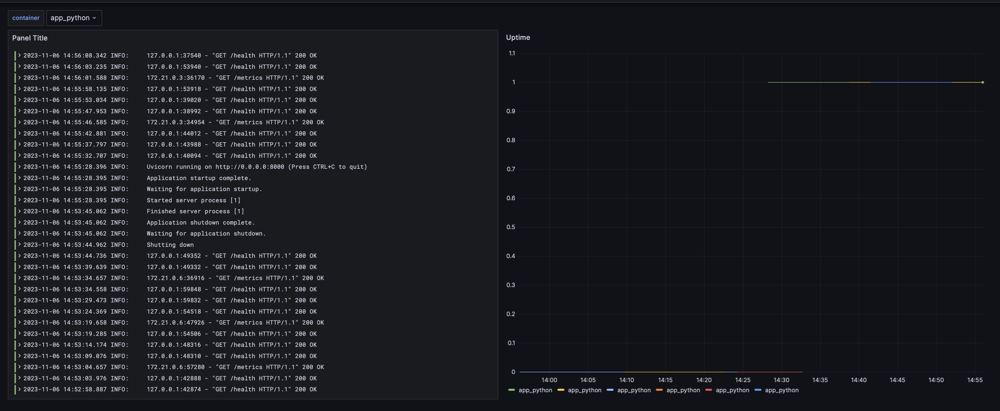
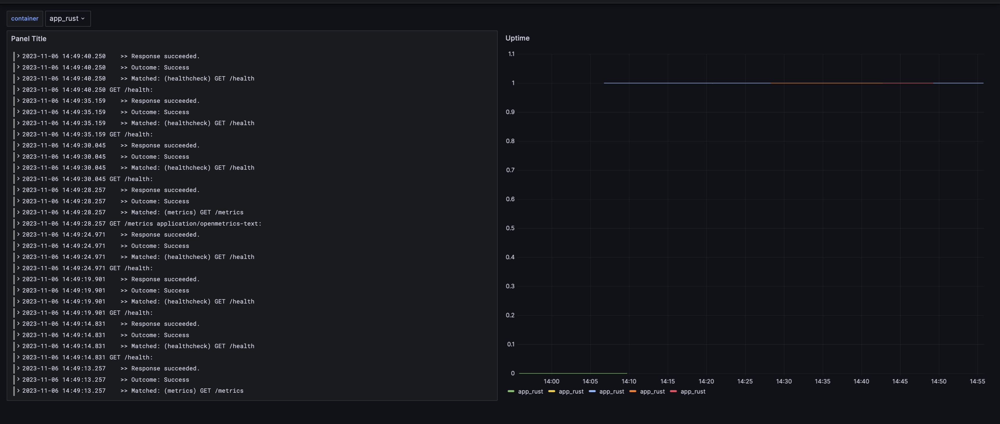
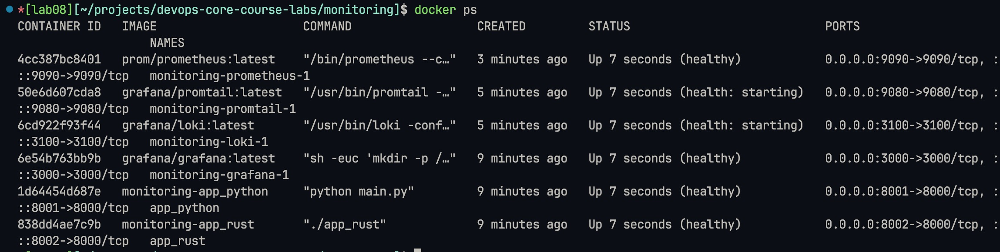

# Monitoring lab

## Targets discovery

## Service configuration

Now we store at most 1Kb file and 2 files with container log for each service

For applications I set 100Mb memory limit each, for infrastrcture - 1Gb

## Application-scraped metrics

## Healtchecks

