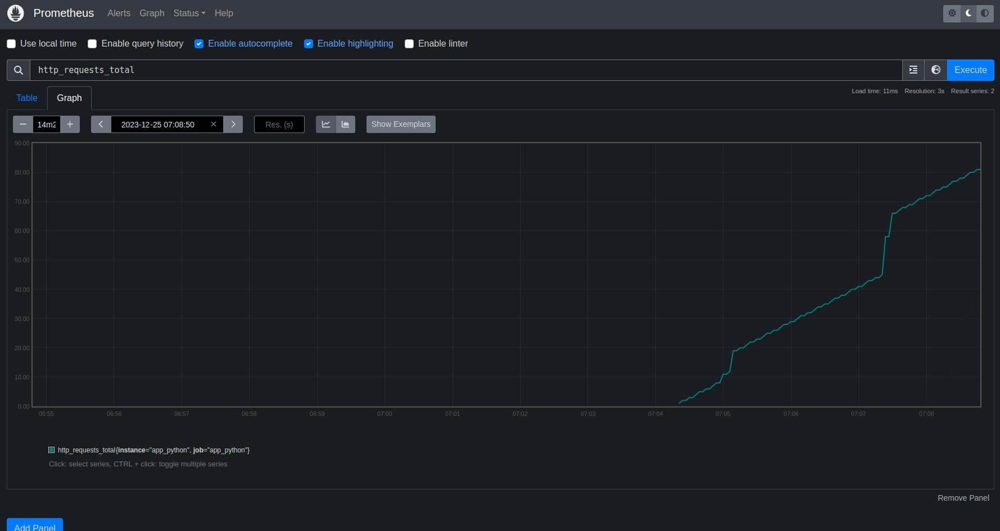

# Metrics

## Prometheus
* `promitheus_client` library is used to calculate metrics in python application.

* The `http_requests_total` metrics is implemented to count the number of HTTP request.

## Healthcheck
For my custom services, `app_python`, healthcheck is implemented using `curl`

## Screenshots

### Prometheus targets:

### Custom prometheus metric (http_requests_total):

