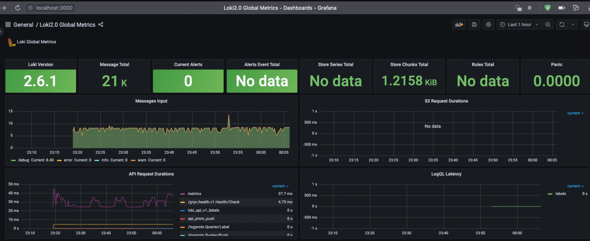
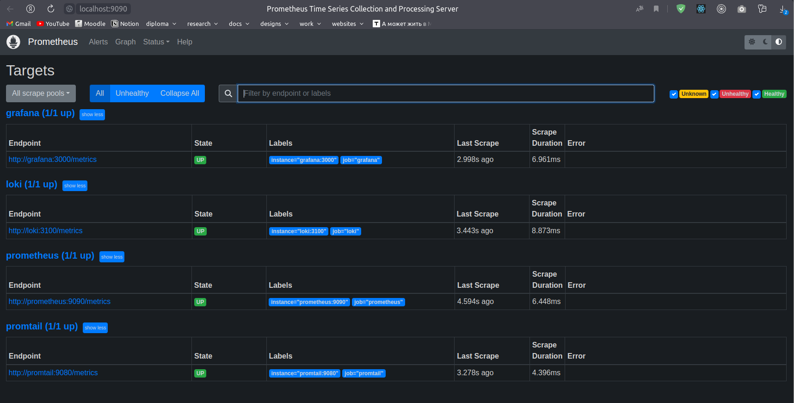

## Metrics

These [instructions](https://grafana.com/docs/grafana-cloud/quickstart/docker-compose-linux/) were utilized for setting up Prometheus. They assisted in the addition and configuration of Prometheus.

## Run

Use `docker-compose up` in the monitoring directory, then go to:

- http://localhost:9090/targets - to check metrics

