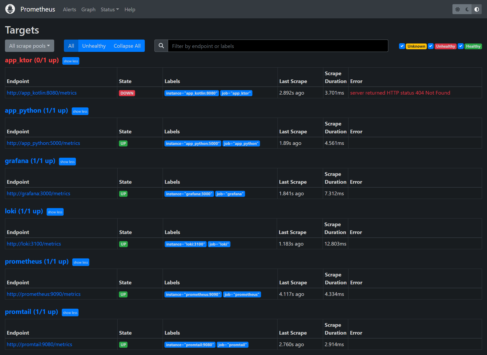

# Prometheus target list

For python app i've added `prometheus_flask_exporter`, for ktor app `io.micrometer:micrometer-registry-prometheus`, but for kotlin there are some bug with connection to prometheus, so it responds with 404 (I had no time to reapair this, i'm on buiseness trip)

# Loki dashboard

# Prometheus dashboard

