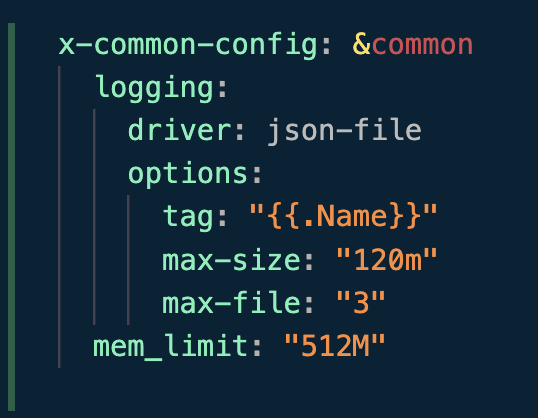

# Lab 8: Monitoring with Prometheus

## Task 1: Prometheus Setup

I read about Prometheus and it's fundamental concepts. I didn't have to expand my `docker-compose.yml` in order for it to include Prometheus.

I configure Prometheus in such a way that I was able to collect metrics from Loki, Prometheus and App containers.

> I faced an interesting problem, in order to access metrics for my Python App, I had to explicitly replace localhost with `docker.for.mac.localhost:8080`, as I was using mac, hence this specific implementation may not work in windows.

As you can see on the image : loki, prometheus and app are all up and running. 

## Task 2: Dashboard and Configuration Enhancements

In order to monitor my Python Application I sat up dashboards in Grafana for both Loki and Prometheus. 

The dashboard for Prometheus looks like this : 

The dashboard for Loki looks like this : 

I added log rotation mechanisms, specified memory limits for containers. 

## (Bonus) Implement Application Metrics 

As I was using Flask for my python application, I used `prometheus_flask_exporter` in order to collect metrics from the application. Also, I have succesfully configured the application to export metrics. After implementing the metrics I rebuild the docker file and pushed it to dockerhub. 

> Metrics for the application are accessible throught the main url slash metrics. 

Also, I fully implemented healtchecks for all the containers inside `docker-compose.yml`.