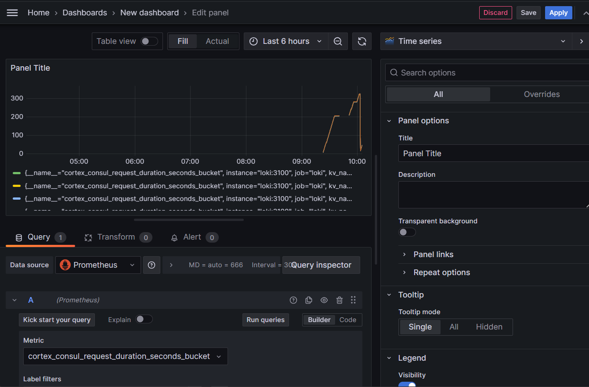
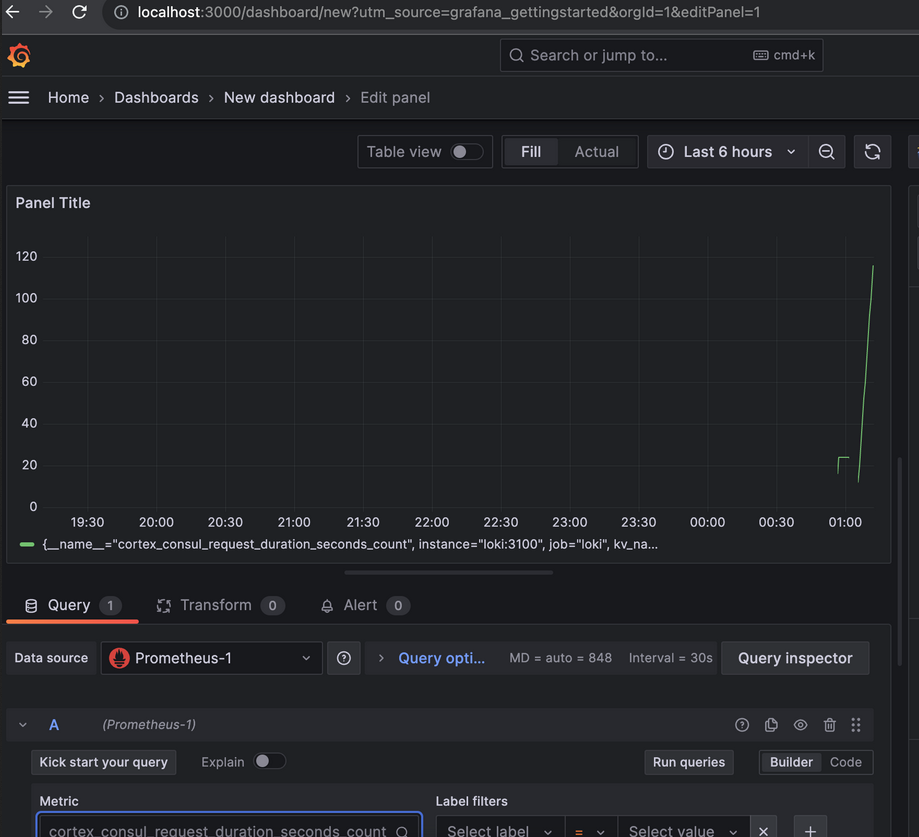
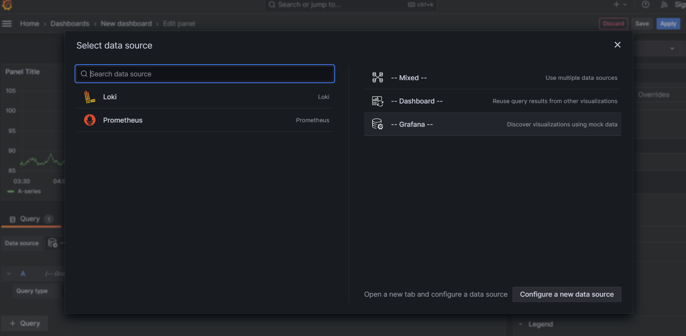

# Prometheus metrics
## Task 1:
See metrics of prometheus:


## Task 2:
Note config of RAM limit and logging size on each service.
```yml
deploy:
    resources:
        limits:
            memory: 500M

logging:
    driver: "json-file"
    options:
    max-size: "200k"
    max-file: "10"
```

Set-up prometheus metrics for each service in `docker-compose.yml`:


Created dashboard in Grafana with Loki logs and Prometheus metrics:
