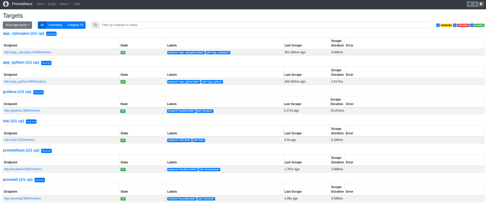
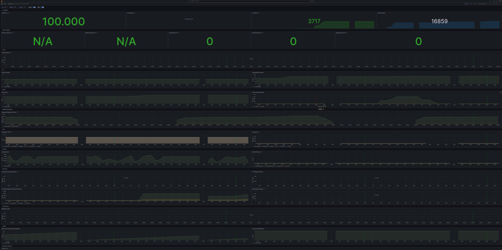
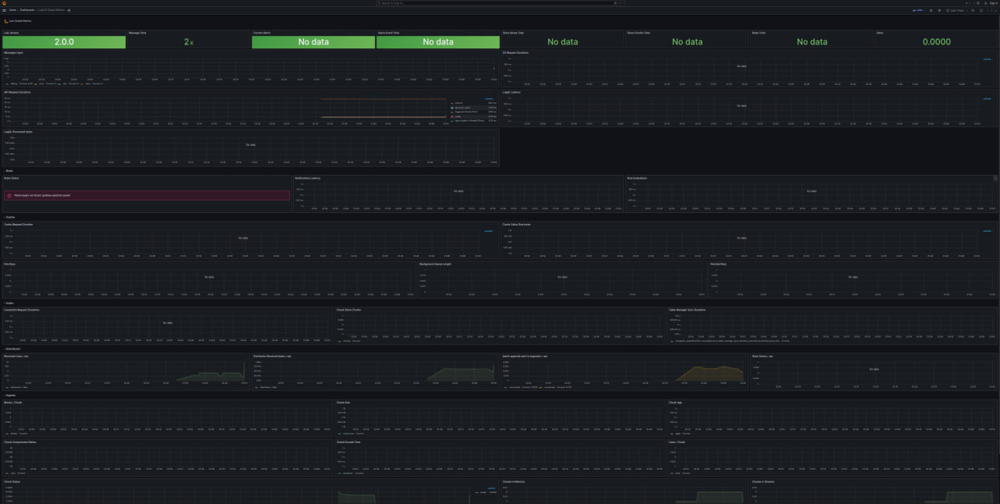
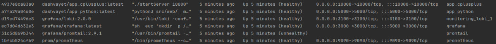
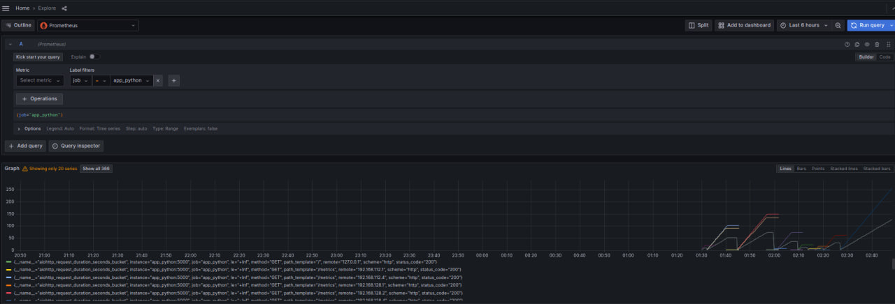
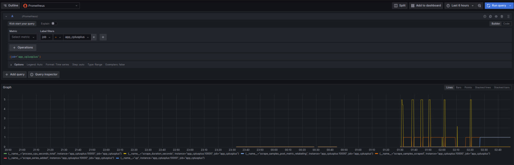

# Prometheus setup

this screenshot shows that I have configured metric collection for all services

# Prometheus dashboard


# Loki dashboard


# Logging mechanism
 For logging rotation I have added:
 ```
    options:
      max-size: '50m'
      max-file: '2'
```

# Limitation mechanism
 For limitation of containers sources I have created:
 ```
     deploy: &limiter
      resources:
        limits:
          memory: 200M
 ```

# Healthchecks


# Applications metrics
## app_python


## app_cplusplus
