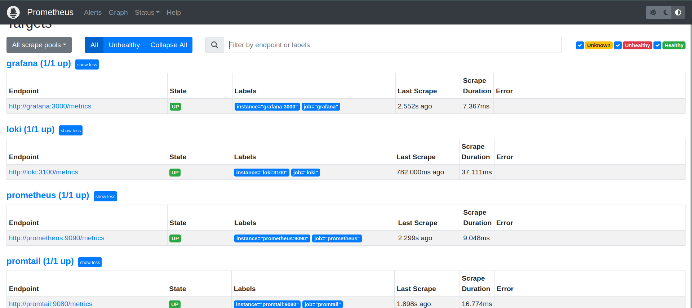
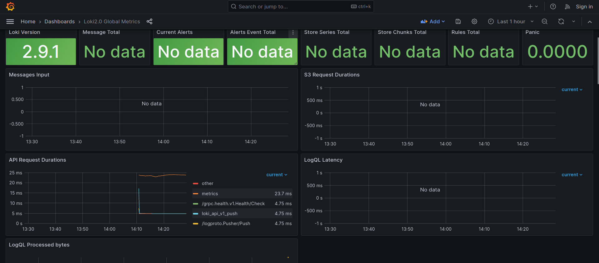
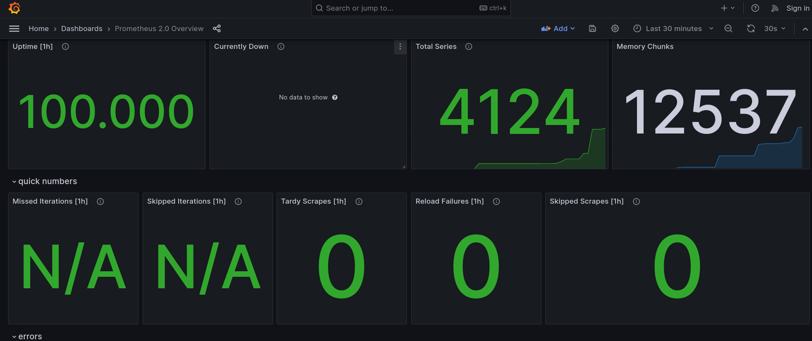
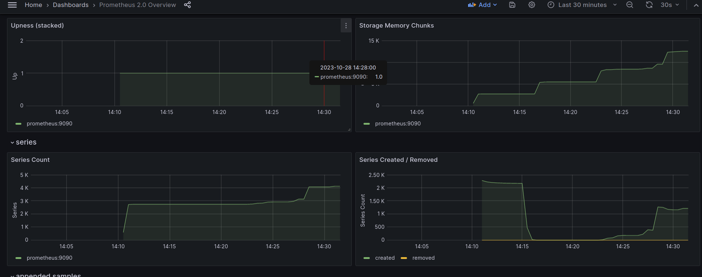

# Metrics

**Prometheus** is an open-source monitoring tool that collects metrics from configured targets, evaluates these metrics against predefined rules, and triggers alerts if conditions are met. It stores metrics in a time-series database and uses a flexible query language for data analysis.

The configuration also applies log rotation and sets memory limits.

---

Prometheus successfully connected to logging stack:

---

Here is the [imported](https://grafana.com/grafana/dashboards/13407-loki2-0-global-metrics/) grafana dashboard for loki:

---

Here is the [imported](https://grafana.com/grafana/dashboards/3662-prometheus-2-0-overview/) grafana dashboard for prometheus:

