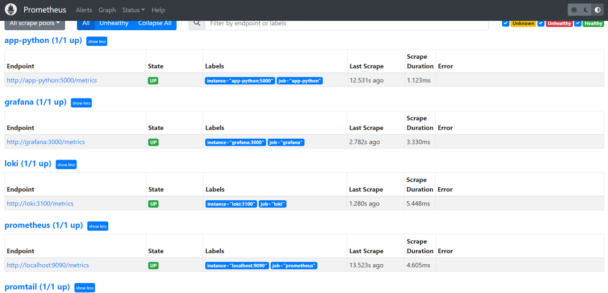
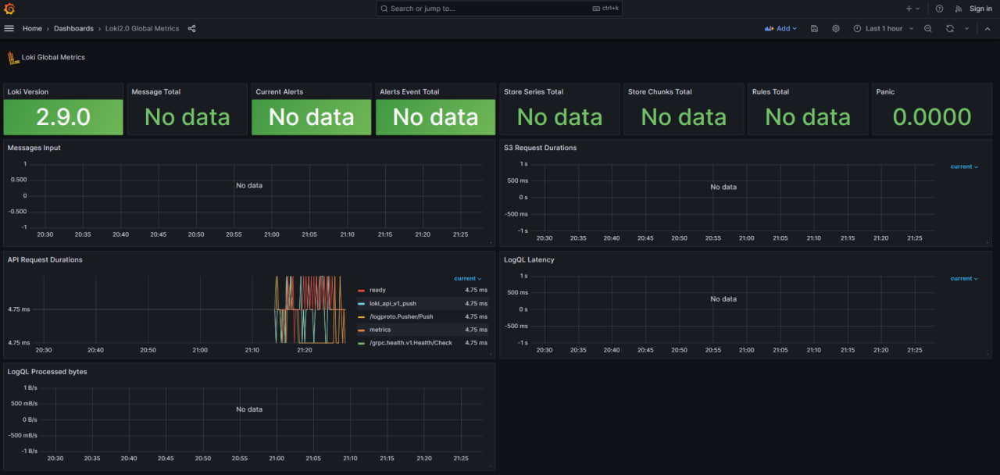
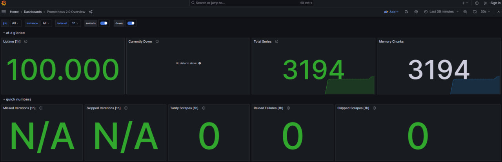

# Metrics

## Prometheus

Calculating metrics in python application.

### Targets



## Dashboards

### Loki



### Prometheus



## Configuration Enhancements

### Log Rotation

Log rotation for each service was specified in `docker-compose` file.
```
logging: &logger
  driver: "json-file"
  options:
    max-size: "100m"
    tag: "{{.ImageName}}|{{.Name}}|{{.ImageFullID}}|{{.FullID}}"
```
For best practices tag, max size of the file and driver type were specified.

### Memory Limits

Memory limits for each service were specified.
```
deploy:
  resources:
    limits:
      memory: Xm
```

### Health Check

Healthcheck is implemented using `curl`.
```
healthcheck:
  test: [ "CMD-SHELL", "curl -f http://localhost:5000/health" ]
  interval: 10s
  timeout: 10s
  start_period: 10s
```
Interval, Timeout and Start period for each service were specified.