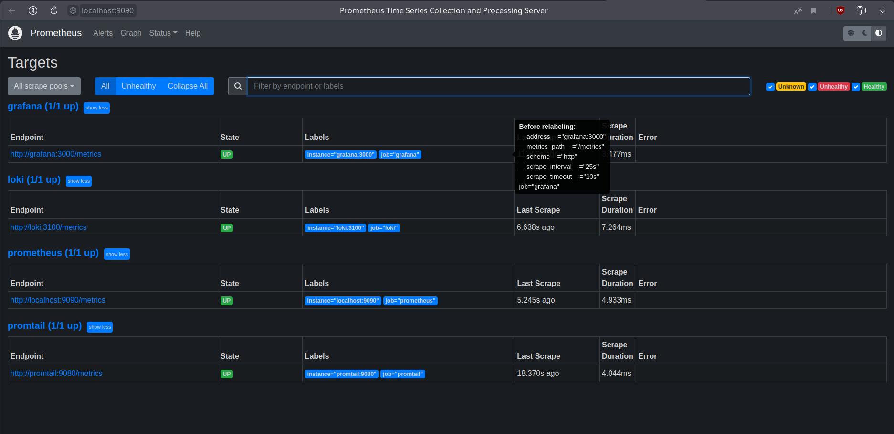
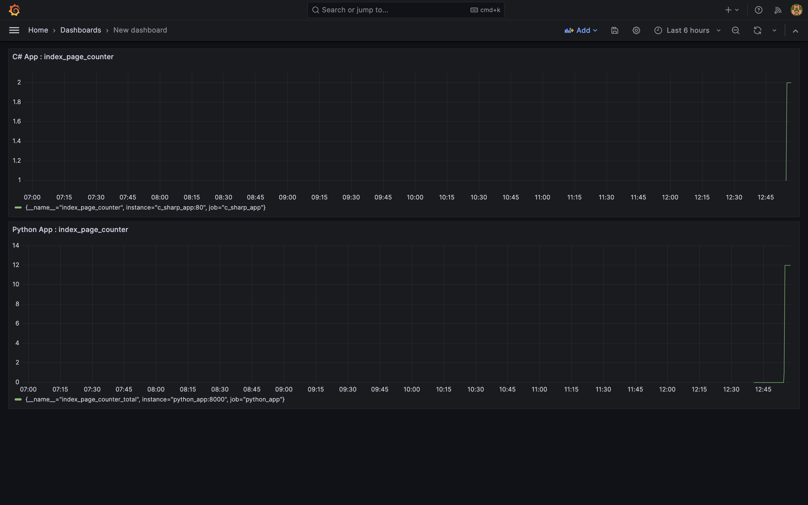
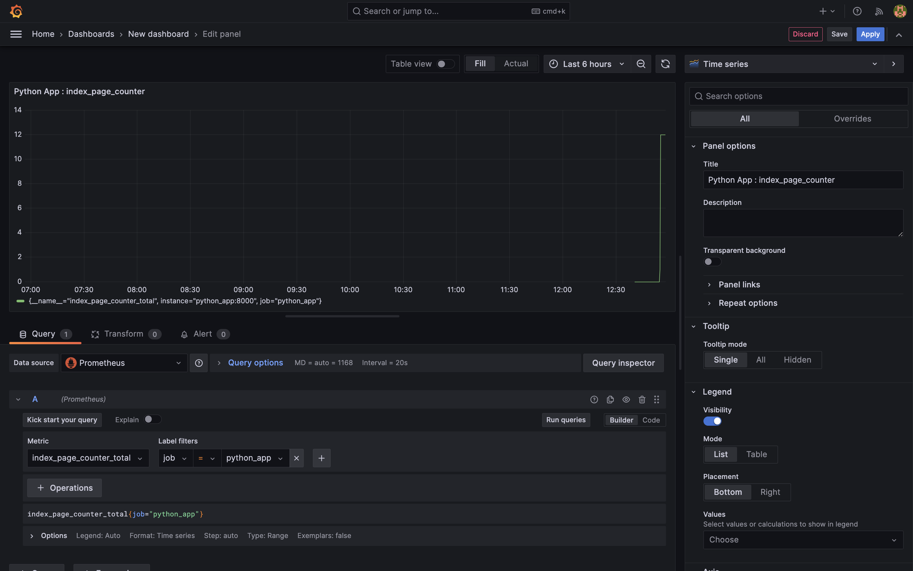
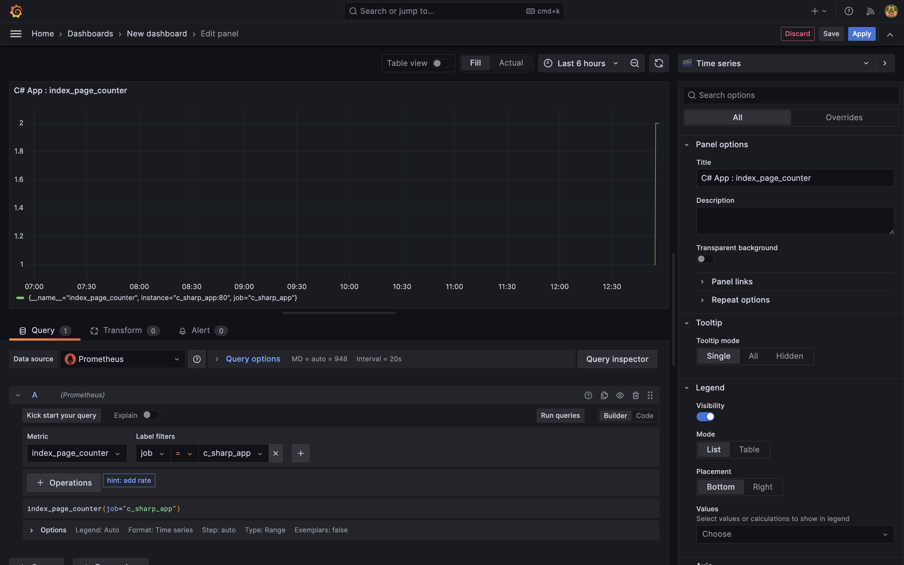
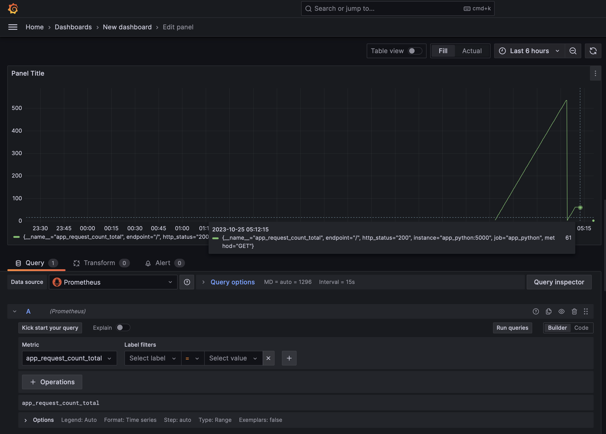
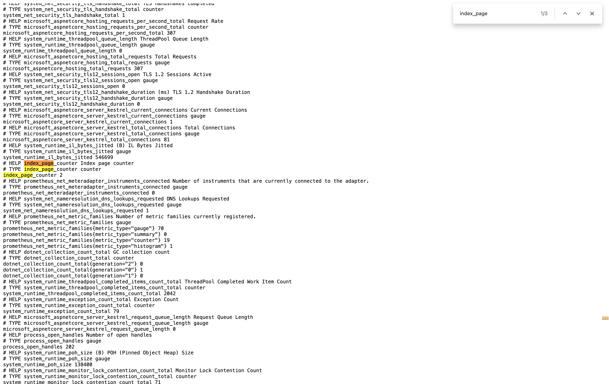

# Metrics

## Prometheus scraping metrics



As it shown on the screen - metrics from all apps are scrapped correctly.

## Configuration of all services

I have configured memory limits and log rotation mechanisms.

For log rotation I have:

```yaml
x-logging: &logger
  driver: "json-file"
  options:
    max-size: "64m"
    max-file: "2"
    tag: "{{.ImageName}}|{{.Name}}|{{.ImageFullID}}|{{.FullID}}"
```

For memory limits:

```
python_app
    memory: 256m

c_sharp_app
    memory: 256m

loki
    memory: 256m

promtail
    memory: 256m

grafana
    memory: 512m

prometheus
    memory: 512m
```

## Dashboards

**Loki**:


**Prometheus**:


## Bonus task

### Dashboard of applications metrics



### Dashboard configurations

**Python**:



**C#**:



### Metrics page

**Python**:



**C#**:



## HealthChecks

For my apps i used ```<app>/healthz``` route to set up health checks. 

In docker I use such commands for healthcheck (applied command depends on container):

```yaml
x-healthcheck: &healthcheck
  interval: 15s
  timeout: 5s
  retries: 3
  start_period: 3s

services:
  <container_name>:
    ...
    healthcheck:
      test: ["CMD-SHELL", "wget --quiet --spider --timeout=1 http://localhost:8000/healthz || exit 1"]
      <<: *healthcheck
```