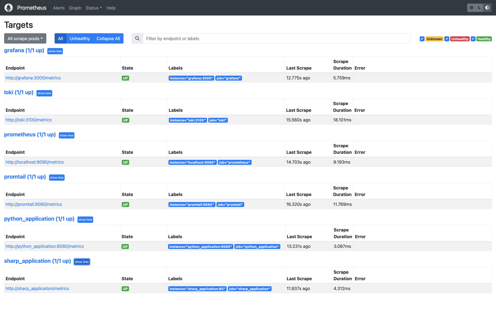
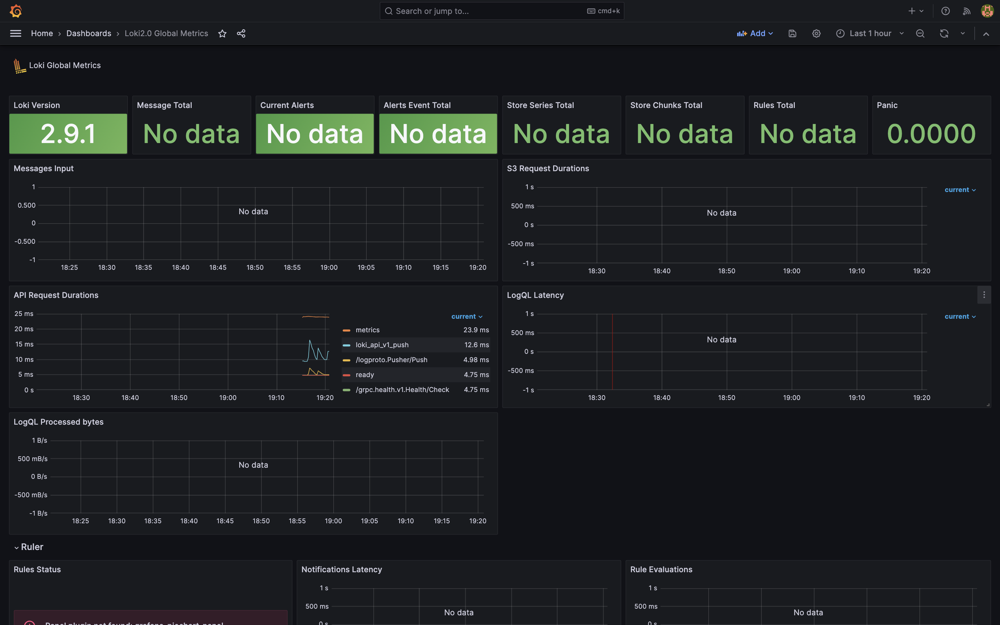
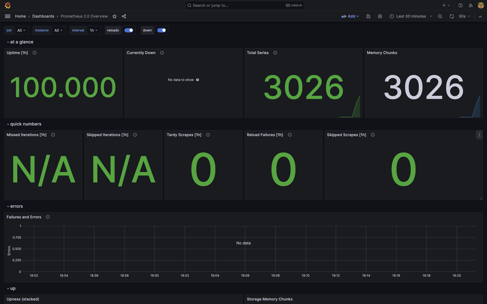
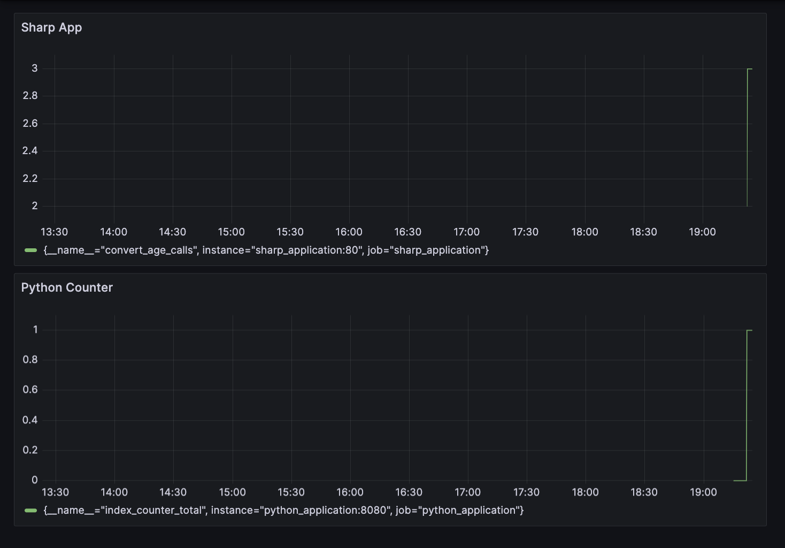
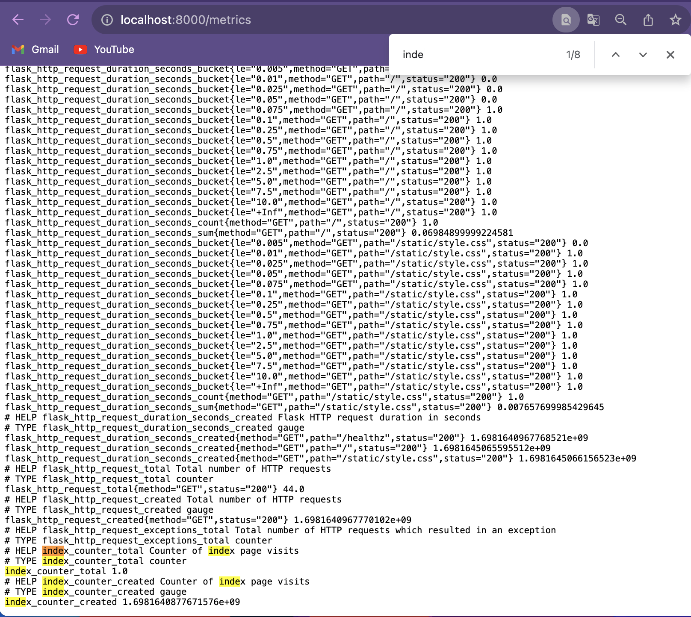
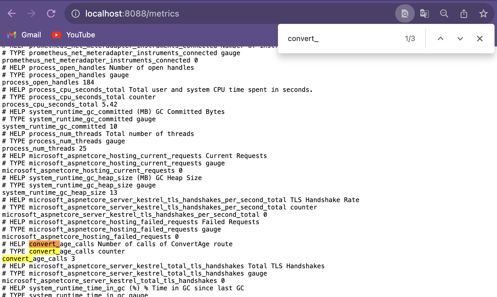

# Metrics

## Task 1

- Prometheus Targets



## Task 2

### Grafana Dashboards

- Loki


- Prometheus


### Service Configuration Updates

- Log rotation
```
x-logging: &logging
  driver: "json-file"
  options:
    max-size: "50m"
    max-file: "3"
    tag: "{{.ImageName}}|{{.Name}}|{{.ImageFullID}}|{{.FullID}}"
```

- Memory limits

| Name               | Size |
|--------------------|------|
| python_application | 128m |
| sharp_application  | 256m |
| loki               | 128m |
| promtail           | 128m |
| grafana            | 512m |
| prometheus         | 512m |

## Bonus task

### Dashboard

- Applications metrics


### Metrics page

- Python


- C#


### Health check
```
x-healthcheck: &healthcheck
  interval: 10s
  timeout: 5s
  retries: 5
  start_period: 5s
```

```
healthcheck:
  test: ["CMD-SHELL", "wget --quiet --spider --timeout=1 http://localhost:PORT/healthz || exit 1"]
  <<: *healthcheck
```
