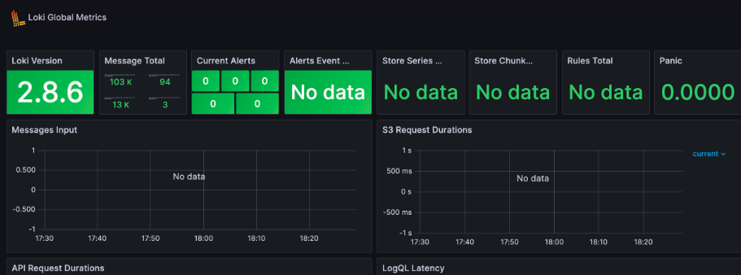

# Metrics
This file contains metrics from Loki, Prometheus

## Grafana dashboards:

## Prometheus:

## Loki:


## Healthcheck

```
healthcheck:
  test: ["CMD-SHELL", {command to check status}]
  timeout: {amount of time}
  start_period: {amount of time}
```
In this case, I specify the command to verify the status, the duration after which the health check will fail if no response is received, and the start period to allow the container some time to start before checking its health. Certain parameters are excluded as they have default values. For instance, the default number of retries is 3.