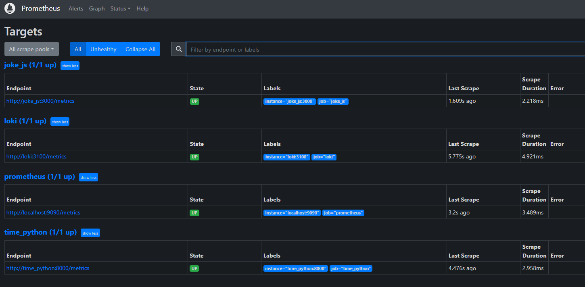
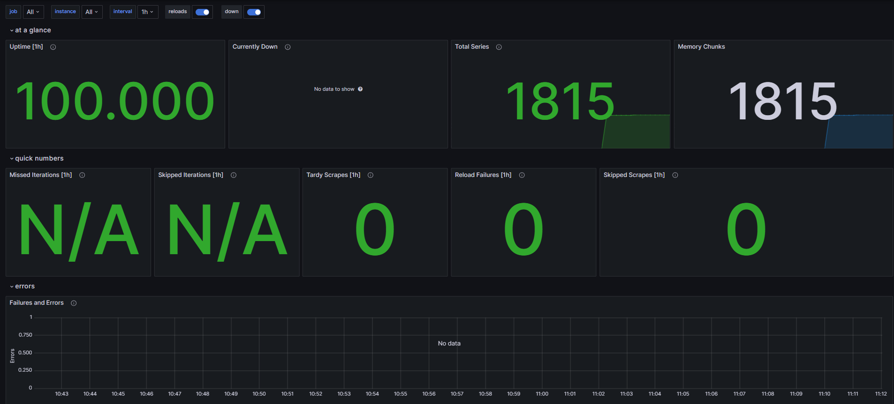
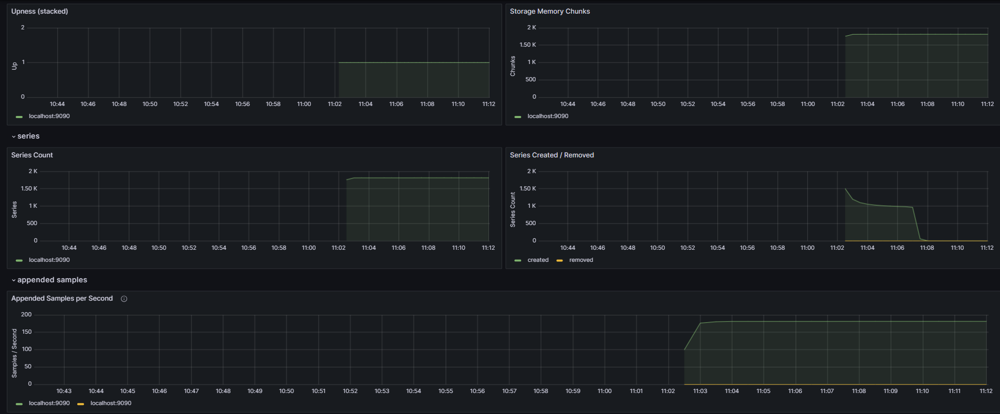
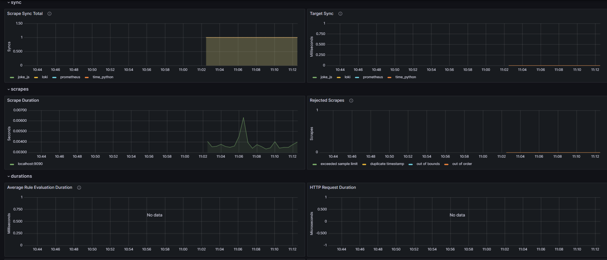

# Metrics
## Service Configuration Updates
- Added log rotation mechanisms via extending `/etc/docker/daemon.json`:
```json
{
  "log-driver": "json-file",
  "log-opts": {
    "max-size": "10m",
    "max-file": "3"
  }
}
```
- Specified memory limits for containers via `mem_limit: 256m` inside `docker-compose.yml`

## Bonus task
- Added metrics for the `time_python` service via `prometheus-fastapi-instrumentator` python package
- Added metrics for the `time_nodejs` service via `prom-client` and `express-prom-bundle` npm packages
- Added health checks for the containers via `healthcheck` inside `docker-compose.yml`


## Prometheus `http://localhost:9090/targets`

## Grafana Dashboard for Prometheus


