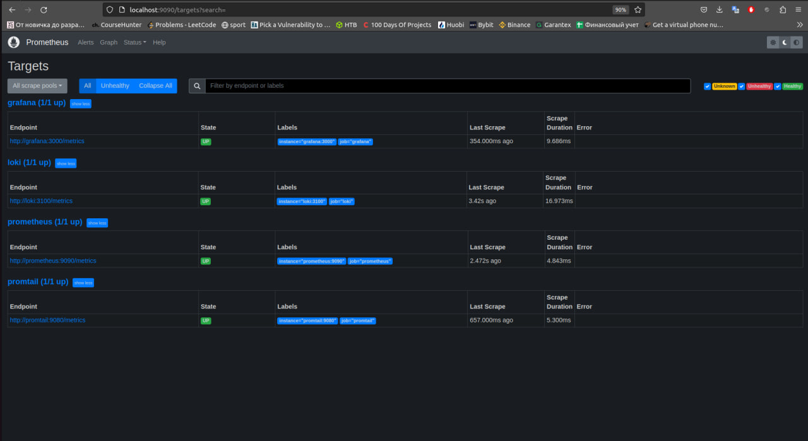
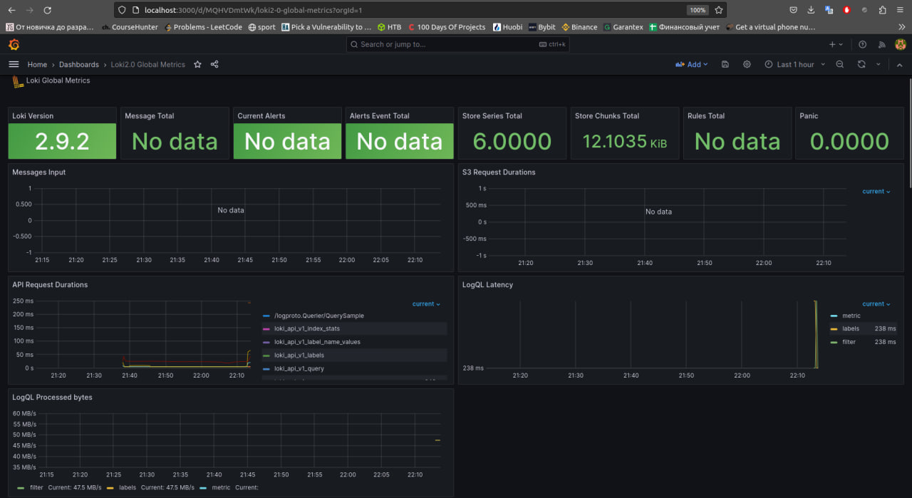
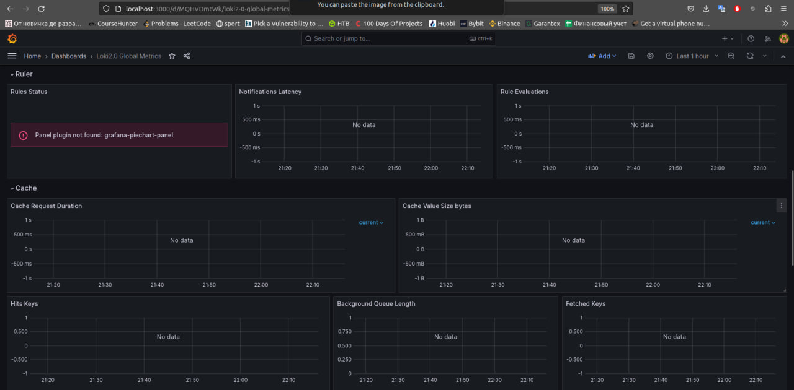
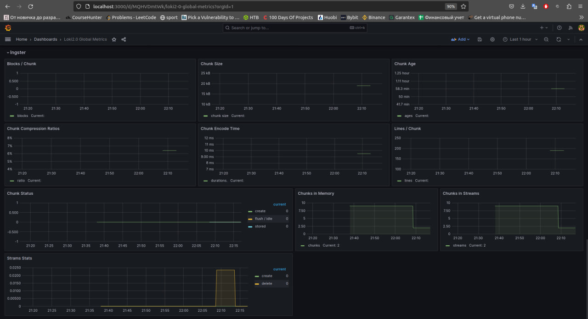
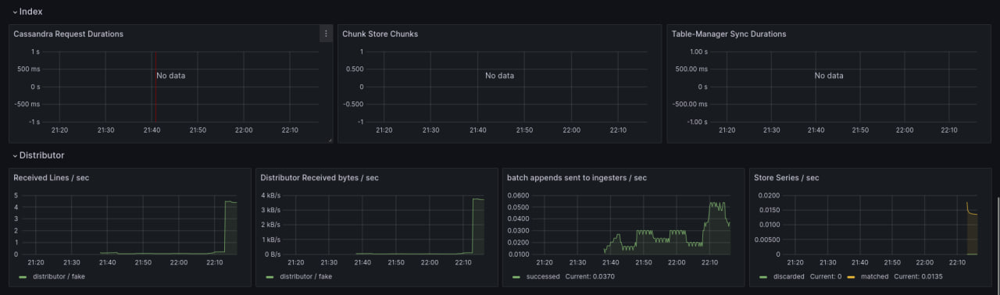
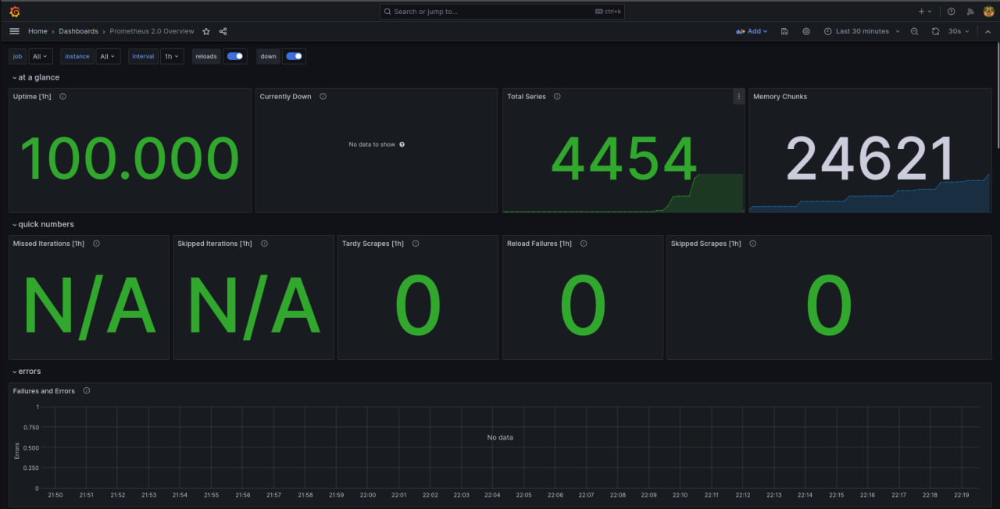
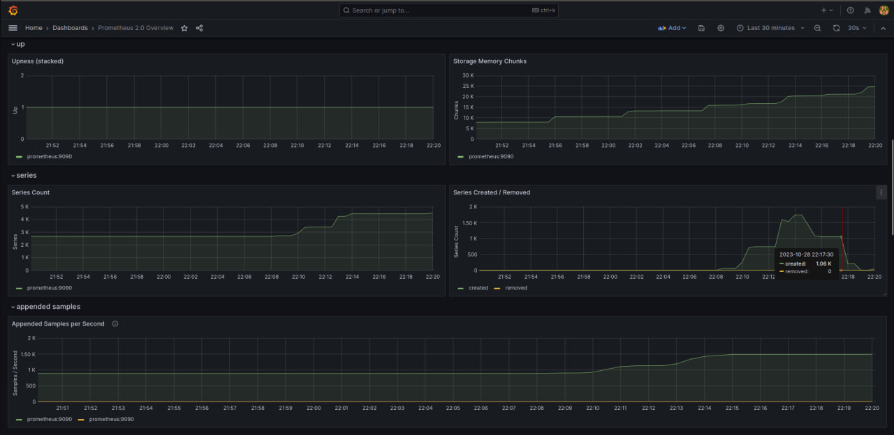
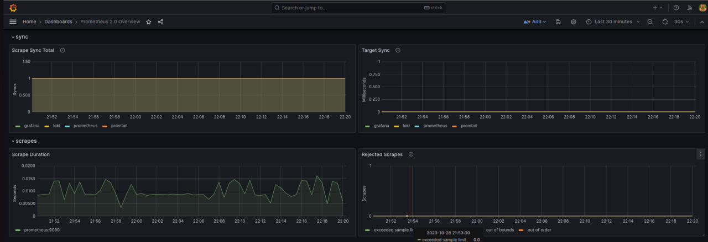
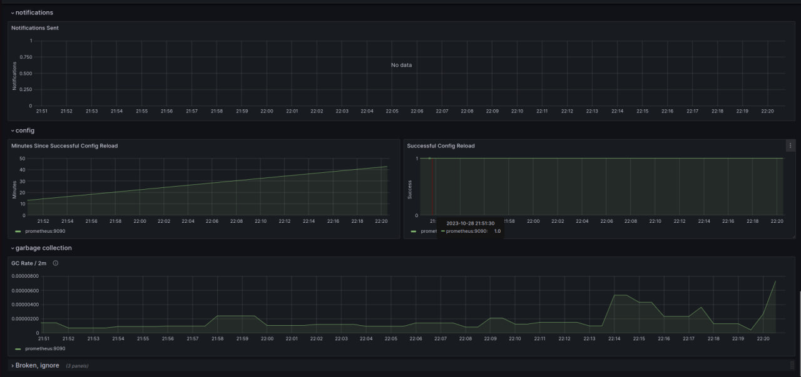

# METRICS.md

In this lab, I set up Prometheus to collect and monitor metrics from various containers in my environment.

## Prometheus Setup

### Prometheus Configuration

I have configured Prometheus to scrape metrics from both Loki and Prometheus containers. The configuration can be found in the `prometheus.yml` file.

### Prometheus Targets

Prometheus is correctly scraping metrics from the following targets:

- Loki
- Promtail
- Grafana

I verified the Prometheus targets by accessing [http://localhost:9090/targets](http://localhost:9090/targets).

## Grafana Dashboards

I have set up Grafana dashboards for both Loki and Prometheus.

### Loki Dashboard

I have imported the Loki dashboard from [Grafana.com](https://grafana.com/grafana/dashboards/13407-loki2-0-global-metrics/). Here's what the Loki dashboard looks like:

### Prometheus Dashboard

I have also configured a Prometheus dashboard from [Grafana.com](https://grafana.com/grafana/dashboards/3662-prometheus-2-0-overview/). Here's what the Prometheus dashboard looks like:

## Service Configuration Enhancements

I have made some enhancements to the service configurations within our `docker-compose.yml` file. Changes include:

- Log rotation mechanisms
- Memory limits for containers

## Metrics Gathering

I have extended Prometheus to gather metrics from all services defined in the `docker-compose.yml` file.
