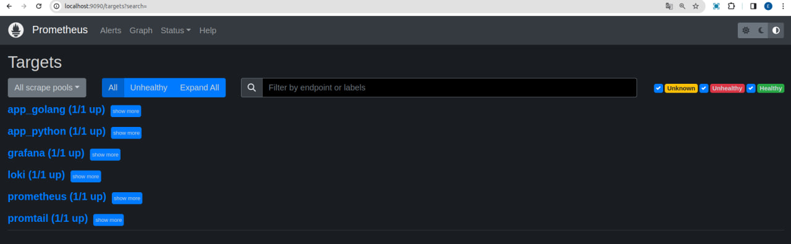
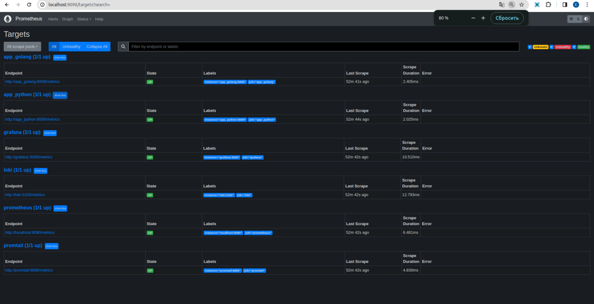
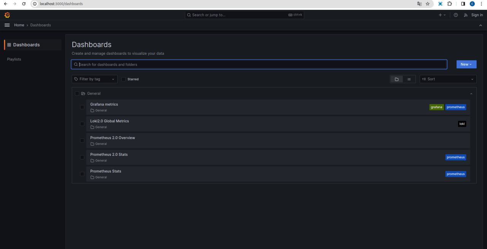
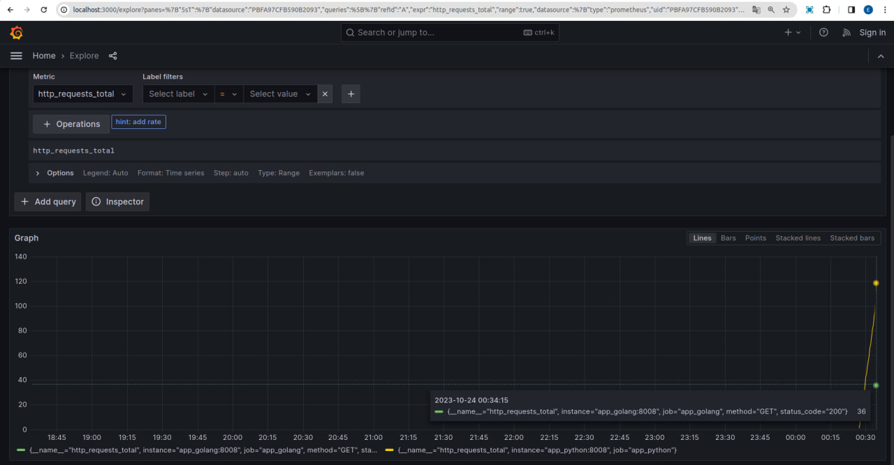
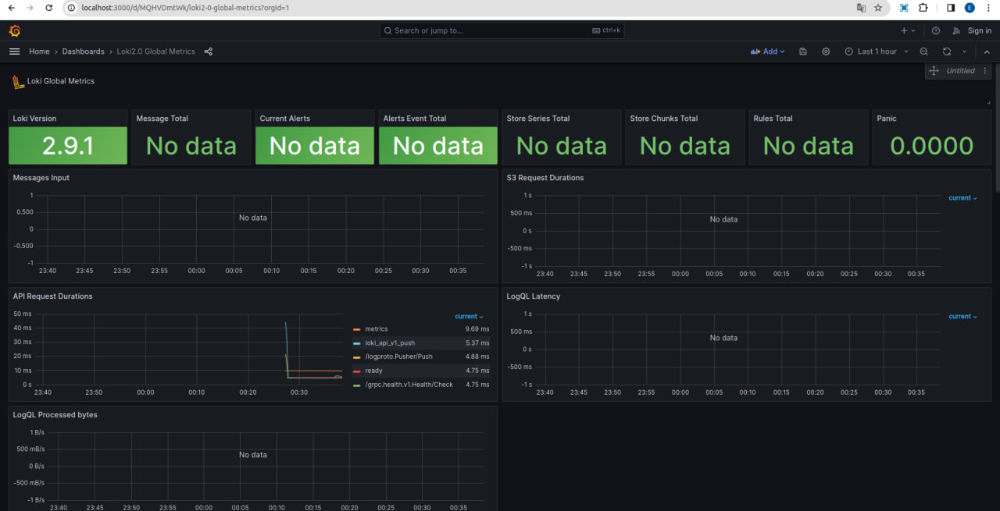
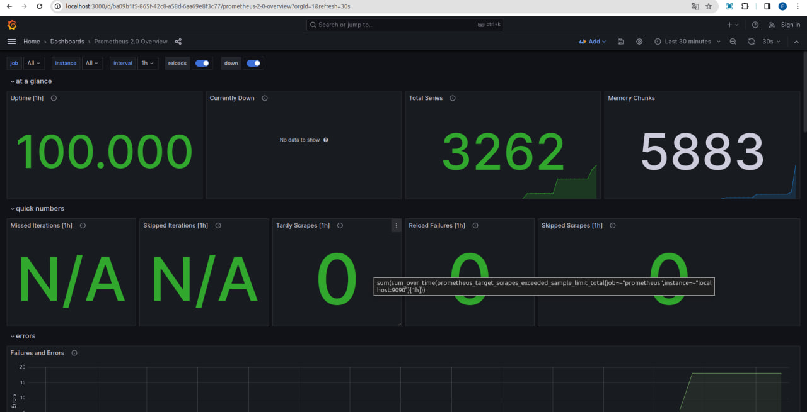
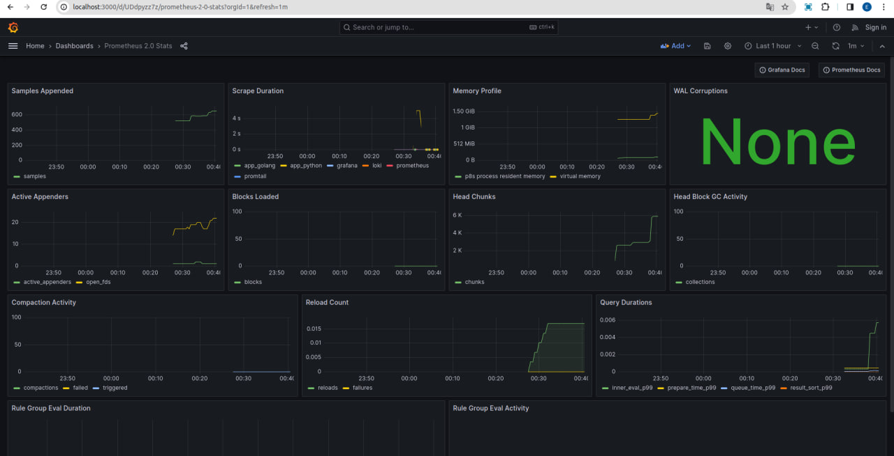
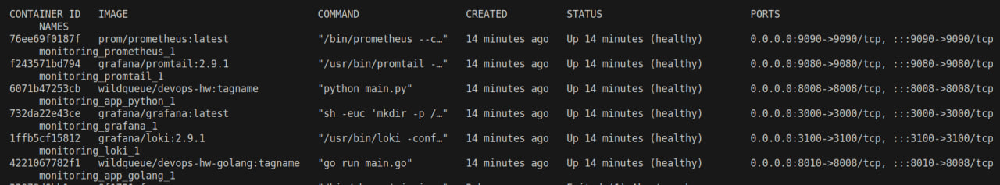

# Metrics


## Prometheus





## Grafana

### Grafana Dashboards




#### Total Requests logs



#### Loki Dashboard



#### Prometheus Overview



#### Prometheus Stats




# Health Checkers




# Configuration details

### Log rotation

Log rotation with 5 files of 15 MB is set

```shell
options:
    tag: "{{.ImageName}}|{{.Name}}|{{.ImageFullID}}|{{.FullID}}"
    max-size: "15m"
    max-file: "5"
```

### Memory limits

1 GB memory limit is specified

```shell
deploy:
    resources:
    limits:
        memory: 1g
```