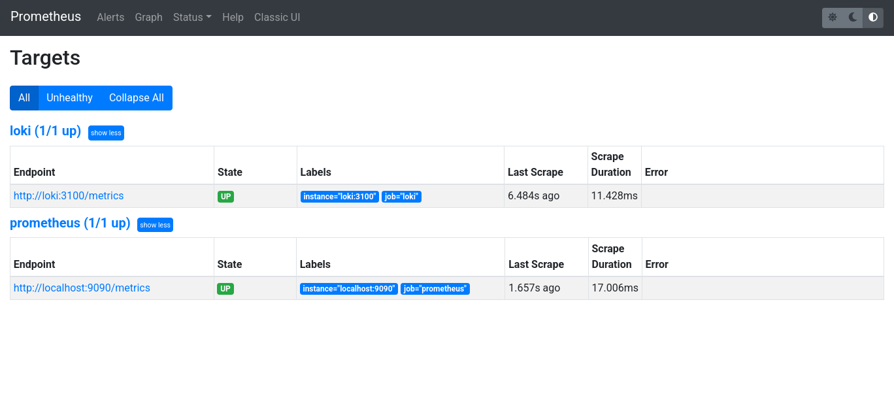
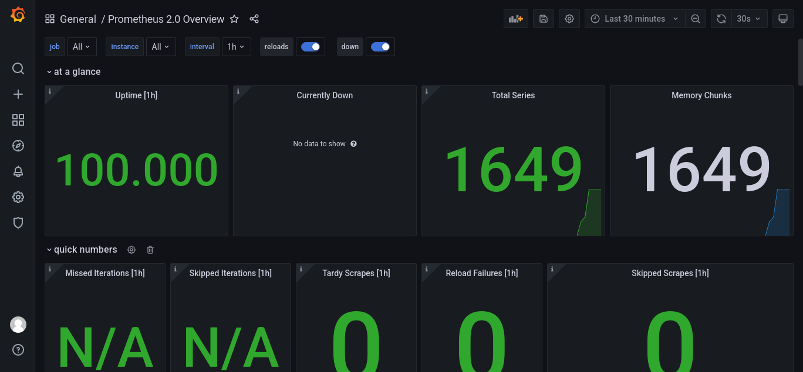

## Prometheus Targets



## Grafana Dashboard



## Service Configuration Updates

Log rotation mechanisms: 

I've enhanced the service configurations in the `docker-compose.yml` file to include log rotation mechanisms. This helps manage log files and avoid excessive disk usage. Here are the changes I made:

         deploy:
           resources:
             limits:
               memory: 999M

Memory limits for containers: 

````````
I've also specified memory limits for the containers to prevent them from consuming excessive resources. Here's how I set memory limits for the Prometheus service: 

          logging:
        driver: json-file
        options:
          tag: '{{.ImageName}}|{{.Name}}'
          max-size: "100m"
          max-file: 3
````````

## Metrics Gathering:

scrape_interval sets the interval for collecting metrics to 10 seconds.

evaluation_interval sets the interval for evaluating alert rules equal to 5 seconds.

static_config: This is where I define the list of static targets that Prometheus will scrape metrics from.

