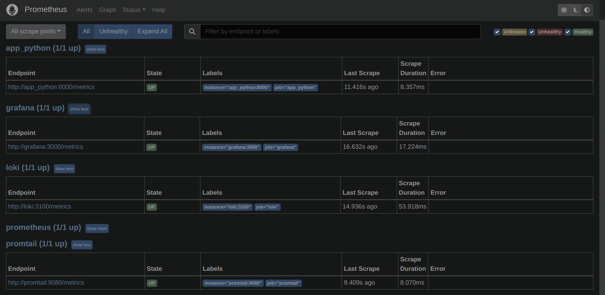
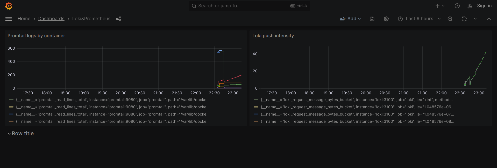

# Metrics

## Prometheus & Graphana
Prometheus targets

Loki metrics in graphana

Prometheus metrics in graphana

Dashboard with promtail (you can see logging rate from all containers)

Python app metrics in prometheus (starlette middleware plugin used to collect the data)

Kotlin native app metrics in prometheus (well, it's not a metric we need, but definitely metric we deserve - mean value for each thrown dice)

## Memory and log rotation
For all containers except grafana I gave 0.1 of CPU and 100M of memory. For grafana I gave 0.3 and 300M because it has lots of heavy tasks

About log rotation, 10 files of 10M seems suitable in our case

## Healthcheck
For both apps healthcheck implemented using simple commands `wget` or `curl`