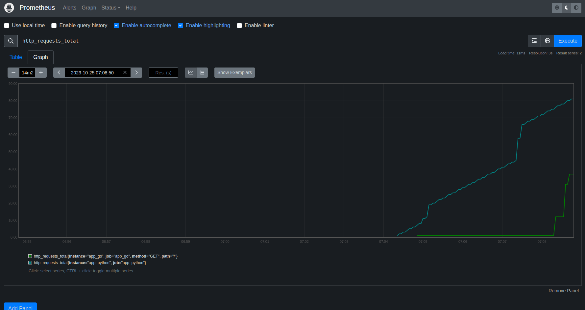
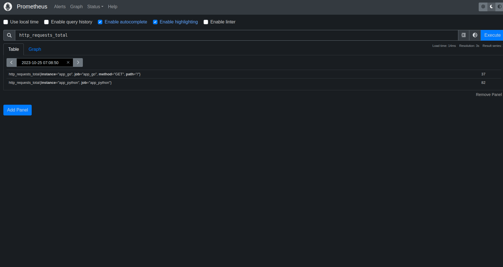

# Metrics

## Prometheus
* `promitheus_client` library is used to calculate metrics in python application.
* `github.com/prometheus/client_golang/prometheus` is used in golang applicaiton.

## Healthcheck
For my custom services, `app_python` and `app_go`, healthcheck is implemented using `curl`

## Screenshots

### Prometheus targets:

### Custom prometheus metric (http_requests_total):

