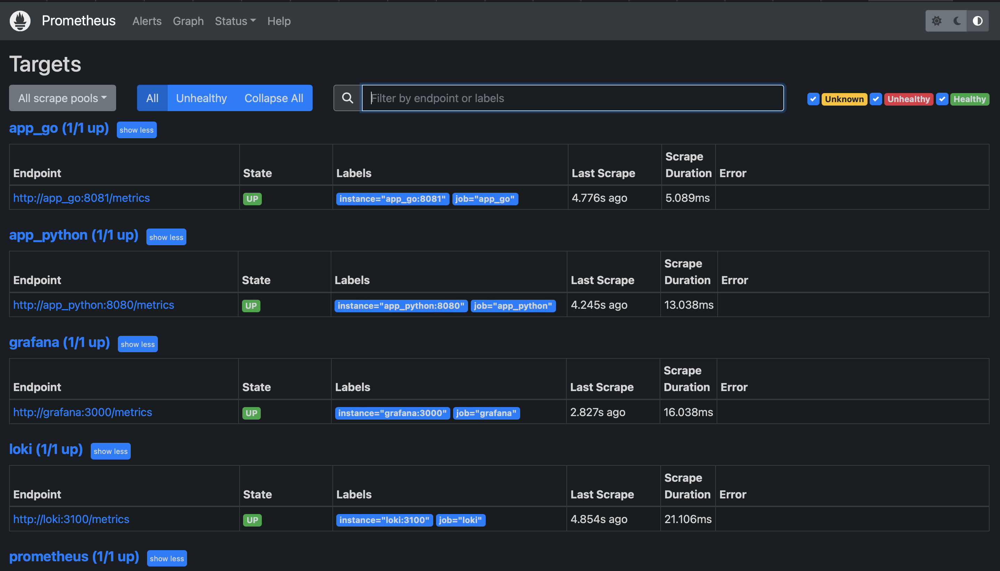
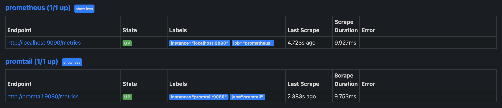

# Metrics 
## Prometheus targets



## Dashboards 
I've used templates proposed in the task 
### Loki

 ### Prometheus


## Service configuration updates 
### Log rotation 
```
    logging: &logging
      driver: "json-file"
      options:
        max-size: "100m"
        max-file: "2"
        tag: '{{.ImageName}}|{{.Name}}|{{.ImageFullID}}|{{.FullID}}'
```
### Memory limits for containers
```
    deploy:
      resources:
        limits:
          memory: 256m
```
## Metrics 
All applications have /health and /metrics endpoints 

