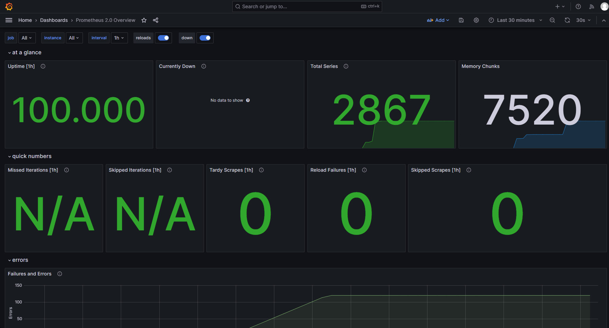

# Metrics
## Set up


- ##  For python app
```python

### prometheus_client

from prometheus_client import Counter, generate_latest, CollectorRegistry

# Create Prometheus metrics
request_counter = Counter('http_requests_total', 'Total number of requests to the app')

@app.route("/")
def show_time():
    request_counter.inc()
    ...

@app.route('/metrics')
def metrics():
    registry = CollectorRegistry()
    data = generate_latest(registry)
    return Response(data, content_type='text/plain; version=0.0.4')
```

- ## For typescript app (cat pics app)

```typescript

// prom-client library

import { register } from 'prom-client';

const pageLoadTimeMetric = new register.Gauge({
  name: 'frontend_page_load_time',
  help: 'Page load time in milliseconds',
});

const errorCountMetric = new register.Counter({
  name: 'frontend_error_count',
  help: 'Count of errors in the frontend',
});


...
    useEffect(() => {
        // Simulate page load time
        const startTime = Date.now();
        setTimeout(() => {
        const pageLoadTime = Date.now() - startTime;
        pageLoadTimeMetric.set(pageLoadTime);
        }, 1000);

        // Simulate an error
        if (Math.random() < 0.2) {
        errorCountMetric.inc();
        }
    }, []);
....
```

- ## Implemented simple healthcheck for my app in docker container

```
healthcheck:
      test:
        - CMD-SHELL
        - wget --no-verbose --tries=1 -O /dev/null http://url:port || exit 1
      interval: 1m30s
      timeout: 10s
      retries: 3
      start_period: 5s
```


## Prometheus `http://localhost:9090/targets`


## Prometheus Dashboard



## Loki Dashboard 
