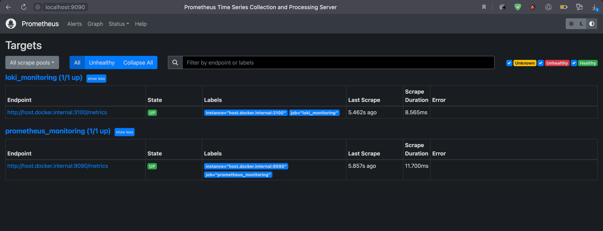

### Configured prometheus targets:



Then I also added other services to scrape metrics from:


### Scraped Loki metrics:


### Scraped Promtail metrics:


### Loki Grafana Dashboard:


### Prometheus Grafana Dashboard:


## Log rotation

For log rotation I used options for docker default json-file logging driver:

```
logging:
  driver: "json-file"
  options:
    max-size: "100k"
    max-file: "10"
```

which means that docker will store all the logs in files of maximum 100KB.

## Memory limits

To limit resources for each container I used docker-compose `deploy` option:

```
deploy:
  resources:
    limits:
      memory: 100M
```

This option also supports CPU limits.

I chose different values of memory limit for different containers appropriately by their needs.

## Python application metrics and dashboard

I used django-prometheus dependency to export default metrics in prometheus view on `/metrics` endpoint.

I setted up my prometheus to scrape metrics from Python application:


And build small dashboard with application uptime and RPS on different pages:


## Kotlin application metrics and dashboard

I used spring-boot-actuator along with micrometer dependencies to export metrics in prometheus view
on `/actuator/metrics` endpoint.

I setted up my prometheus to scrape metrics from this endpoint:


And imported dashboard to check my JVM:


## Healthchecks

I added healthchecks for my applications. Both of them make GET request to some endpoint and checking if curl will exit
with 0 status code. After interval timeout my docker ps shows that both applications are healthy:
