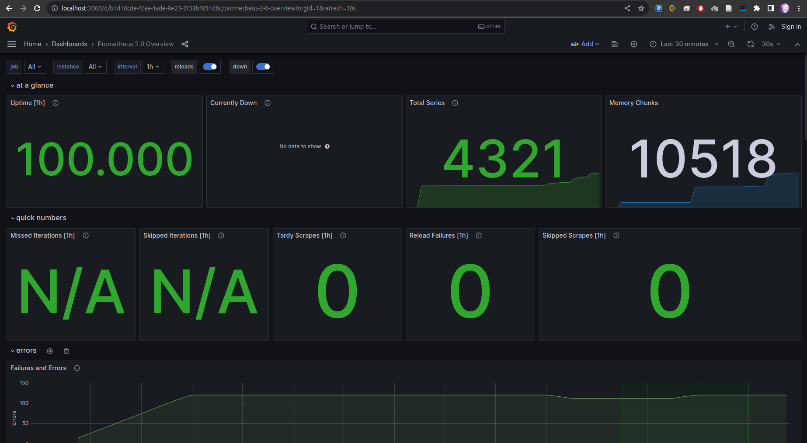

# Metrics

## Prometheus targets

Prometheus is successfully scraping metrics from 4 apps:
- Prometheus
- Loki
- App Python
- App Golang

## Grafana dashboards

Used external dashboards:
[Loki](https://grafana.com/grafana/dashboards/13407),
[Prometheus](https://grafana.com/grafana/dashboards/3662)

### Loki

### Prometheus

## Service configuration

### Log rotation

...

### Memory limits

...