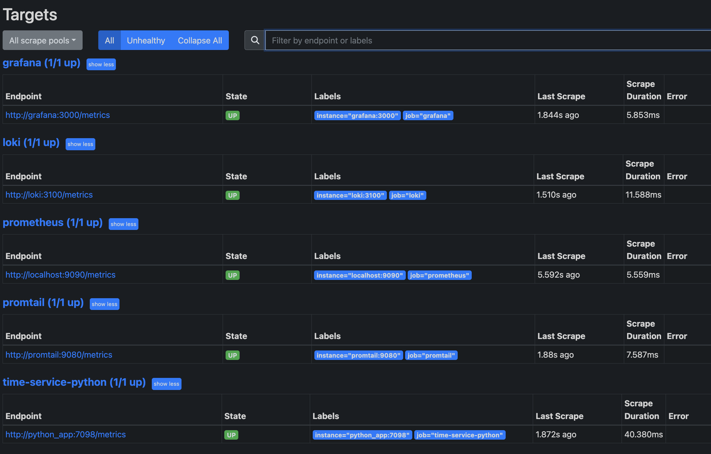

# Metrics

## Prometheus Targets:



## Grafana Dashboards:


## Service Configuration Updates:

- Log rotation:

```yaml
logging:
  driver: "json-file"
  options:
    tag: "{{.ImageName}}|{{.Name}}"
    max-size: "1k"
    max-file: "3"
```

- Memory limits:

```yaml
deploy:
  resources:
  limits:
    memory: 100M
```

## Application Metrics

Thanks to FastAPI they done in one line

```python
Instrumentator().instrument(app).expose(app)
```


