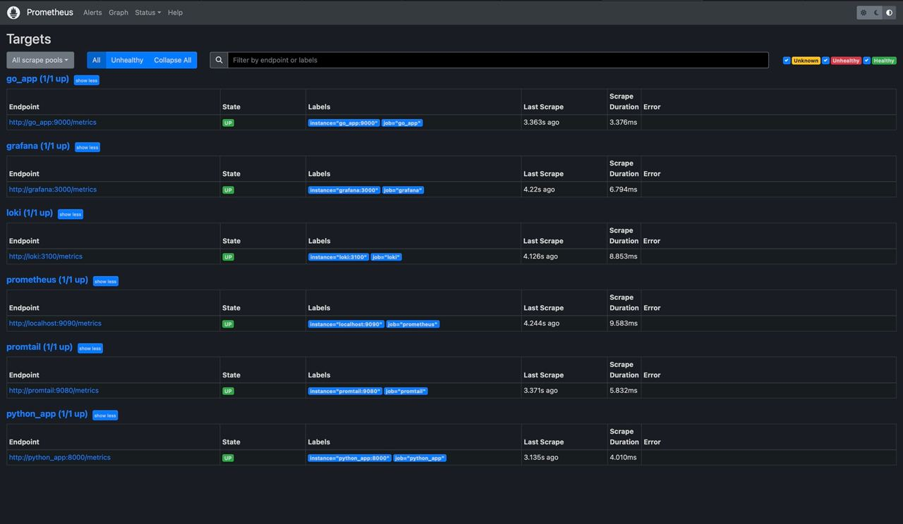
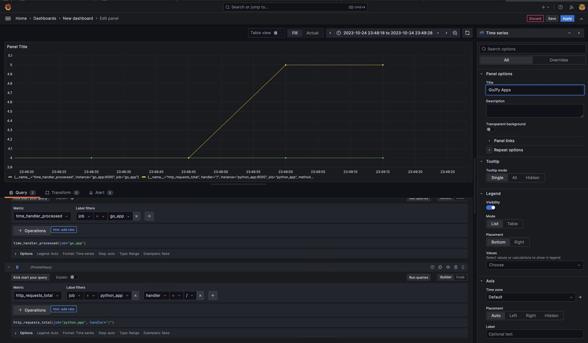
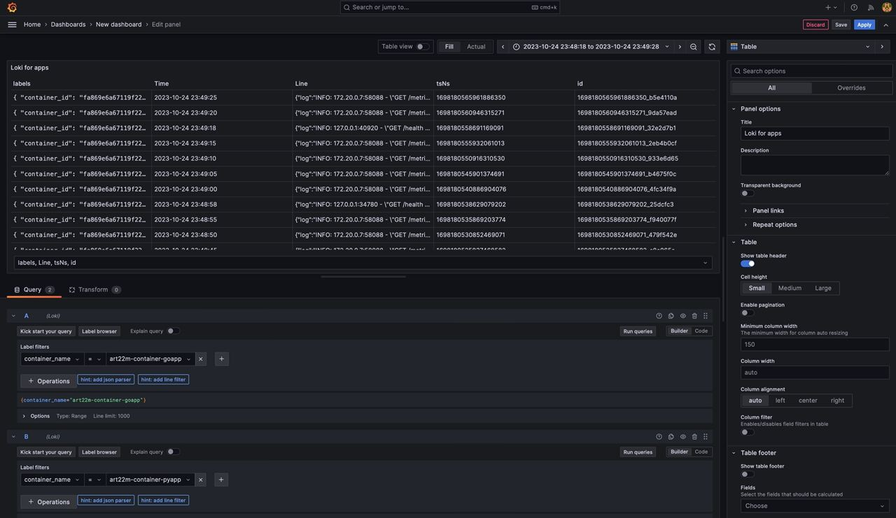

# Monitoring

## Logrotate
I have implemented logrotation mechanism using the `max-size` and `max-file` logging options.
Memory limits is the same for all files, but they should be changed and should be found
empirically.
```
logging:
    driver: "json-file"
        options:
            max-size: "64m"
            max-file: "3"
            tag: "{{.ImageName}}|{{.Name}}|{{.ImageFullID}}|{{.FullID}}"
```

## Healthchecks
I have added healthcheck handlers for Python and Go apps.
You can healthcheck using /health endpoint.

```
curl localhost:<port>/health
```

For example, for Grafana I have the following healthcheck:
(NOTE: curl may not work properly, so it is better to use wget)
```
healthcheck:
    test: ["CMD-SHELL", "wget --no-verbose --tries=1 --spider http://localhost:3000/api/health || exit 1"]
    interval: 15s
    timeout: 5s
    retries: 5
    start_period: 5s
```

## Metrics
I have added Prometheus metrics for Python and Go apps.
You can get them calling /metrics endpoint.

```
curl localhost:<port>/metrics
```

## Images

### Prometheus targets


### Prometheus dashboard


### Loki dashboard


### All dashboards

