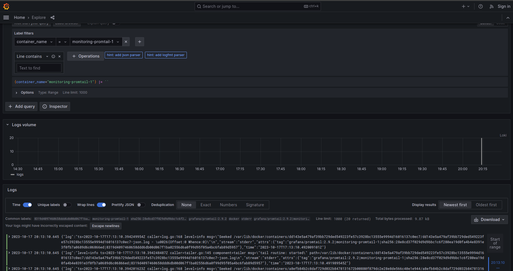

# Logging

## Logging stack

- Loki

    Loki is a horizontally-scalable, highly-available, multi-tenant log aggregation system inspired by Prometheus. It is designed to be very efficient in terms of storage and performance and allows users to query logs using a powerful query language. Loki is used as a data source in Grafana to visualize and explore log data in real-time.
    
- Promtail

    Promtail is a lightweight agent that streams logs from various sources and sends them to Loki for storage and analysis. It is part of the Loki project and is designed to be highly efficient in terms of resource usage and network bandwidth. Promtail can be configured to scrape logs from files, systemd journal, Docker containers, and other sources, and it can also enrich log data with additional metadata such as labels or timestamps.

- Grafana

    Grafana is an open-source data visualization and monitoring tool that allows users to create interactive and customizable dashboards for various data sources. It supports a wide range of data sources including Prometheus, Elasticsearch, InfluxDB, Graphite, and many more. Grafana provides a user-friendly interface for creating and managing dashboards, alerts, and panels, and supports a variety of visualization options such as graphs, tables, heatmaps, and gauges. It is widely used in the industry for monitoring and analyzing system performance, application metrics, and business data.

## Results

Available labels:

### Python App 

### Go App 

### Grafana

### Loki

### Promtail

