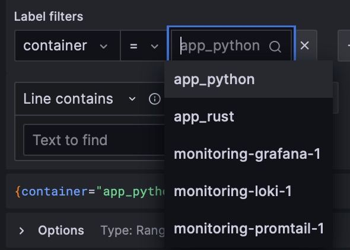

# Logging collection description

## Promtail

Collects logs from sources described in a config. Here I use docker socket mount and filter by project name, so only containers from the `docker-compose.yml` are encountered

## Loki

