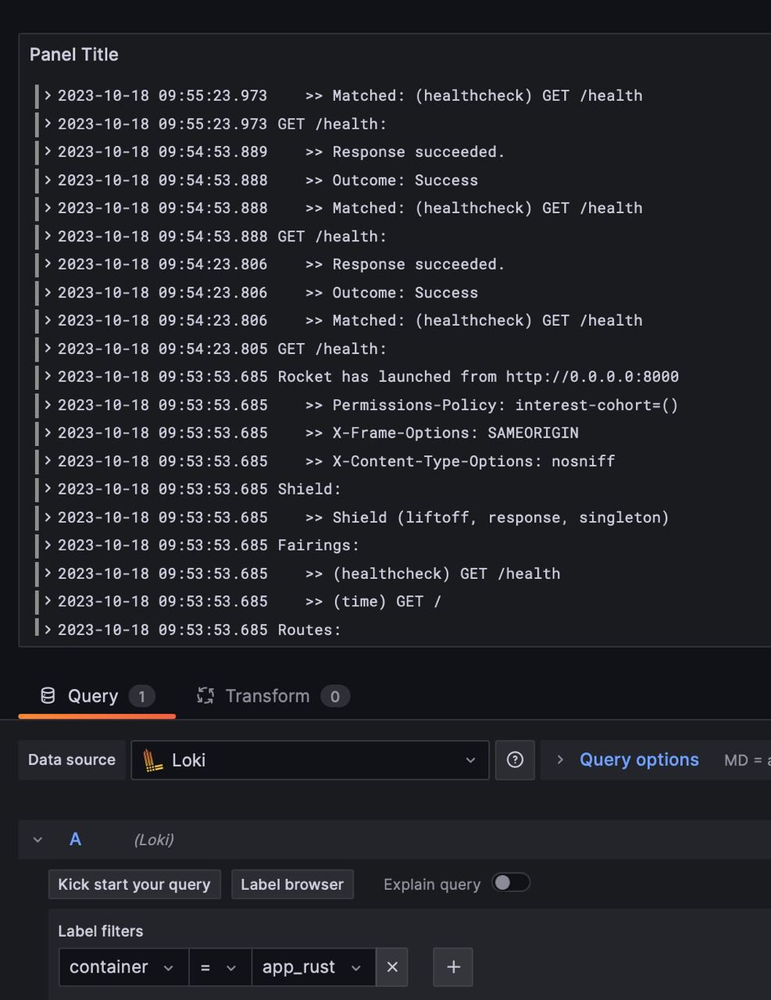
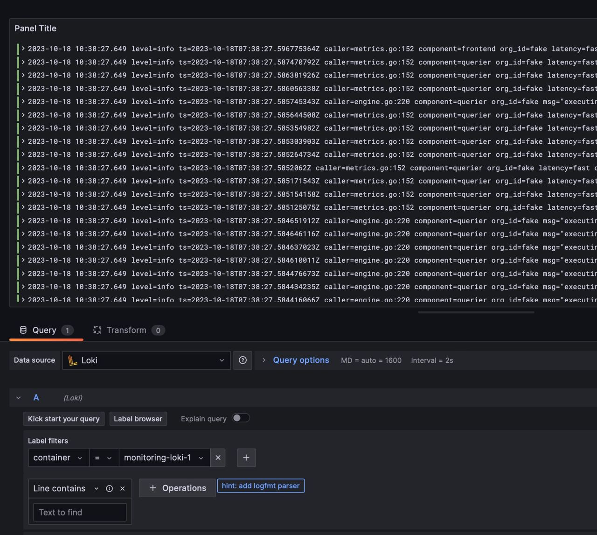

# Logging collection description

## Description

### Promtail

Scrapes logs from sources described in a config. Here I use docker socket mount and filter by project name, so only containers from the `docker-compose.yml` are encountered

### Loki

Datasource over clients such as `promtail`. Provides an API for logs retrieval

### Grafana

Visualisation tool. Allows to query logs, see labels, etc.

## Screenshots

### Python app

### Rust app

### Loki

