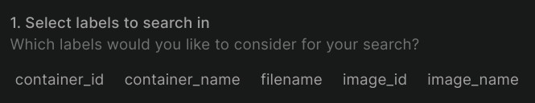

# Logging
## Graphana
Used to access the log using pretty UI.

## Loki
Concentrates the logs.

## Promtail
Brings the logs from given sources.

In this solution we keep tracking of logs with the following tags:

## The result
### List of containers

### Python app logs

### Promtail logs
