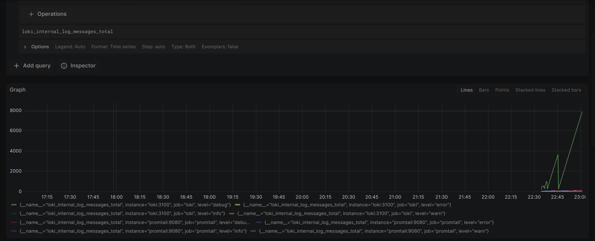
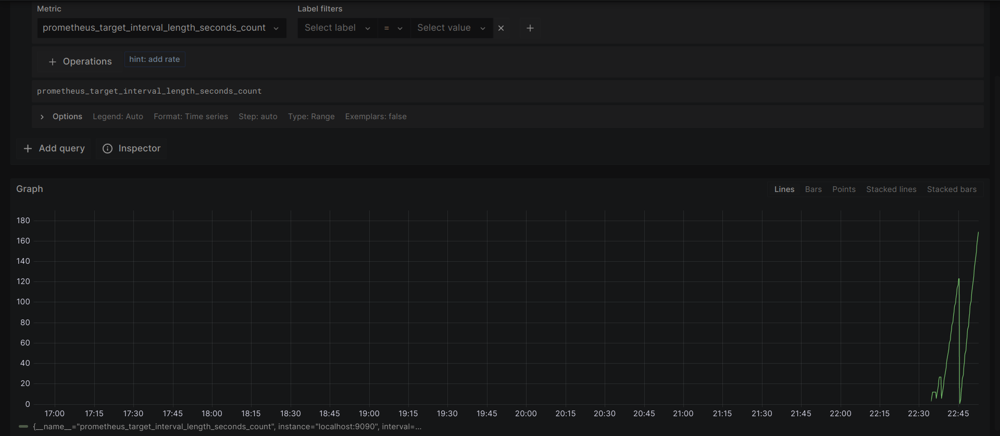
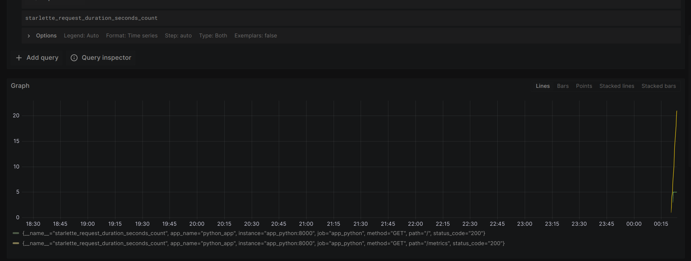

# Metrics

## Prometheus & Graphana
Prometheus targets

Loki metrics in graphana

Prometheus metrics in graphana

Dashboard with promtail

Python app metrics in prometheus

## Memory and log rotation
For all containers except grafana I gave 0.1 of CPU and 100M of memory. For grafana I gave 0.3 and 300M because it has lots of heavy tasks

About log rotation, 10 files of 10M seems suitable in our case

## Healthcheck
For both apps healthcheck implemented using simple commands `wget` or `curl`