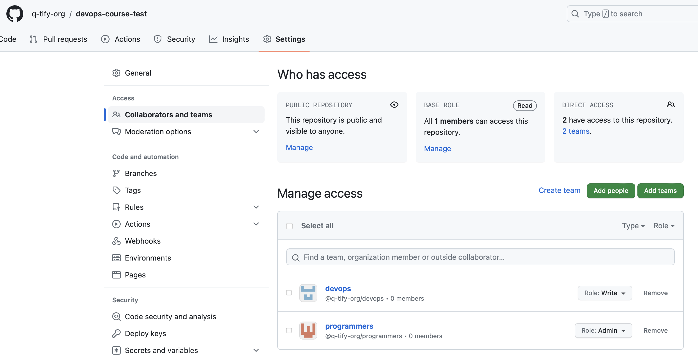

# Terraform

## Docker infrastructure using terraform

### terraform apply
```
arseniyrubtsov@MacBook-Pro-Arseniy docker-tutorial % terraform apply

Terraform used the selected providers to generate the following execution plan. Resource actions are indicated with the following symbols:
  + create

Terraform will perform the following actions:

  # docker_container.nginx will be created
  + resource "docker_container" "nginx" {
      + attach                                      = false
      + bridge                                      = (known after apply)
      + command                                     = (known after apply)
      + container_logs                              = (known after apply)
      + container_read_refresh_timeout_milliseconds = 15000
      + entrypoint                                  = (known after apply)
      + env                                         = (known after apply)
      + exit_code                                   = (known after apply)
      + hostname                                    = (known after apply)
      + id                                          = (known after apply)
      + image                                       = (known after apply)
      + init                                        = (known after apply)
      + ipc_mode                                    = (known after apply)
      + log_driver                                  = (known after apply)
      + logs                                        = false
      + must_run                                    = true
      + name                                        = "ExampleNginxContainer"
      + network_data                                = (known after apply)
      + read_only                                   = false
      + remove_volumes                              = true
      + restart                                     = "no"
      + rm                                          = false
      + runtime                                     = (known after apply)
      + security_opts                               = (known after apply)
      + shm_size                                    = (known after apply)
      + start                                       = true
      + stdin_open                                  = false
      + stop_signal                                 = (known after apply)
      + stop_timeout                                = (known after apply)
      + tty                                         = false
      + wait                                        = false
      + wait_timeout                                = 60

      + ports {
          + external = 8080
          + internal = 80
          + ip       = "0.0.0.0"
          + protocol = "tcp"
        }
    }

  # docker_image.nginx will be created
  + resource "docker_image" "nginx" {
      + id           = (known after apply)
      + image_id     = (known after apply)
      + keep_locally = false
      + name         = "nginx:latest"
      + repo_digest  = (known after apply)
    }

Plan: 2 to add, 0 to change, 0 to destroy.

Changes to Outputs:
  + container_id = (known after apply)
  + image_id     = (known after apply)

Do you want to perform these actions?
  Terraform will perform the actions described above.
  Only 'yes' will be accepted to approve.

  Enter a value: yes

docker_image.nginx: Creating...
docker_image.nginx: Creation complete after 10s [id=sha256:2a4fbb36e96607b16e5af2e24dc6a1025a4795520c98c6b9ead9c4113617cb73nginx:latest]
docker_container.nginx: Creating...
docker_container.nginx: Creation complete after 1s [id=b4a6aca1ddfc015fd5746693ccc382a25817828d3c8bef0a57c93d790842c928]

Apply complete! Resources: 2 added, 0 changed, 0 destroyed.
```
### terraform show
```
arseniyrubtsov@MacBook-Pro-Arseniy docker-tutorial % terraform show
# docker_container.nginx:
resource "docker_container" "nginx" {
    attach                                      = false
    command                                     = [
        "nginx",
        "-g",
        "daemon off;",
    ]
    container_read_refresh_timeout_milliseconds = 15000
    cpu_shares                                  = 0
    entrypoint                                  = [
        "/docker-entrypoint.sh",
    ]
    env                                         = []
    hostname                                    = "b4a6aca1ddfc"
    id                                          = "b4a6aca1ddfc015fd5746693ccc382a25817828d3c8bef0a57c93d790842c928"
    image                                       = "sha256:2a4fbb36e96607b16e5af2e24dc6a1025a4795520c98c6b9ead9c4113617cb73"
    init                                        = false
    ipc_mode                                    = "private"
    log_driver                                  = "json-file"
    logs                                        = false
    max_retry_count                             = 0
    memory                                      = 0
    memory_swap                                 = 0
    must_run                                    = true
    name                                        = "ExampleNginxContainer"
    network_data                                = [
        {
            gateway                   = "172.17.0.1"
            global_ipv6_address       = ""
            global_ipv6_prefix_length = 0
            ip_address                = "172.17.0.2"
            ip_prefix_length          = 16
            ipv6_gateway              = ""
            mac_address               = "02:42:ac:11:00:02"
            network_name              = "bridge"
        },
    ]
    network_mode                                = "default"
    privileged                                  = false
    publish_all_ports                           = false
    read_only                                   = false
    remove_volumes                              = true
    restart                                     = "no"
    rm                                          = false
    runtime                                     = "runc"
    security_opts                               = []
    shm_size                                    = 64
    start                                       = true
    stdin_open                                  = false
    stop_signal                                 = "SIGQUIT"
    stop_timeout                                = 0
    tty                                         = false
    wait                                        = false
    wait_timeout                                = 60

    ports {
        external = 8080
        internal = 80
        ip       = "0.0.0.0"
        protocol = "tcp"
    }
}

# docker_image.nginx:
resource "docker_image" "nginx" {
    id           = "sha256:2a4fbb36e96607b16e5af2e24dc6a1025a4795520c98c6b9ead9c4113617cb73nginx:latest"
    image_id     = "sha256:2a4fbb36e96607b16e5af2e24dc6a1025a4795520c98c6b9ead9c4113617cb73"
    keep_locally = false
    name         = "nginx:latest"
    repo_digest  = "nginx@sha256:32da30332506740a2f7c34d5dc70467b7f14ec67d912703568daff790ab3f755"
}
```
### terraform state list
```
arseniyrubtsov@MacBook-Pro-Arseniy docker-tutorial % terraform state list
docker_container.nginx
docker_image.nginx
```
### terraform output
```
arseniyrubtsov@MacBook-Pro-Arseniy docker-tutorial % terraform output
container_id = "b4a6aca1ddfc015fd5746693ccc382a25817828d3c8bef0a57c93d790842c928"
image_id = "sha256:2a4fbb36e96607b16e5af2e24dc6a1025a4795520c98c6b9ead9c4113617cb73nginx:latest"
```

## VK Cloud infrastructure using terraform

### terraform apply
```
arseniyrubtsov@MacBook-Pro-Arseniy cloud-terraform % terraform apply
data.vkcs_compute_flavor.compute: Reading...
data.vkcs_networking_network.extnet: Reading...
data.vkcs_images_image.compute: Reading...
data.vkcs_images_image.compute: Read complete after 1s [id=b75595ca-4e1d-47e0-8e95-7a02edc0e242]
data.vkcs_networking_network.extnet: Read complete after 1s [id=298117ae-3fa4-4109-9e08-8be5602be5a2]
data.vkcs_compute_flavor.compute: Read complete after 1s [id=25ae869c-be29-4840-8e12-99e046d2dbd4]

Terraform used the selected providers to generate the following execution plan. Resource actions are indicated with the following symbols:
  + create

Terraform will perform the following actions:

  # vkcs_compute_floatingip_associate.fip will be created
  + resource "vkcs_compute_floatingip_associate" "fip" {
      + floating_ip = (known after apply)
      + id          = (known after apply)
      + instance_id = (known after apply)
      + region      = (known after apply)
    }

  # vkcs_compute_instance.compute will be created
  + resource "vkcs_compute_instance" "compute" {
      + access_ip_v4        = (known after apply)
      + all_metadata        = (known after apply)
      + all_tags            = (known after apply)
      + availability_zone   = "MS1"
      + flavor_id           = "25ae869c-be29-4840-8e12-99e046d2dbd4"
      + flavor_name         = (known after apply)
      + force_delete        = false
      + id                  = (known after apply)
      + image_id            = (known after apply)
      + image_name          = (known after apply)
      + key_pair            = "keypair-terraform"
      + name                = "compute-instance"
      + power_state         = "active"
      + region              = (known after apply)
      + security_groups     = [
          + "default",
          + "security_group",
        ]
      + stop_before_destroy = false

      + block_device {
          + boot_index            = 0
          + delete_on_termination = true
          + destination_type      = "volume"
          + source_type           = "image"
          + uuid                  = "b75595ca-4e1d-47e0-8e95-7a02edc0e242"
          + volume_size           = 8
          + volume_type           = "ceph-ssd"
        }

      + network {
          + access_network = false
          + fixed_ip_v4    = (known after apply)
          + mac            = (known after apply)
          + name           = (known after apply)
          + port           = (known after apply)
          + uuid           = (known after apply)
        }
    }

  # vkcs_networking_floatingip.fip will be created
  + resource "vkcs_networking_floatingip" "fip" {
      + address   = (known after apply)
      + fixed_ip  = (known after apply)
      + id        = (known after apply)
      + pool      = "ext-net"
      + port_id   = (known after apply)
      + region    = (known after apply)
      + sdn       = (known after apply)
      + subnet_id = (known after apply)
    }

  # vkcs_networking_network.network will be created
  + resource "vkcs_networking_network" "network" {
      + admin_state_up        = true
      + all_tags              = (known after apply)
      + id                    = (known after apply)
      + name                  = "net"
      + port_security_enabled = true
      + private_dns_domain    = (known after apply)
      + region                = (known after apply)
      + sdn                   = (known after apply)
    }

  # vkcs_networking_port.port will be created
  + resource "vkcs_networking_port" "port" {
      + admin_state_up         = true
      + all_fixed_ips          = (known after apply)
      + all_security_group_ids = (known after apply)
      + all_tags               = (known after apply)
      + device_id              = (known after apply)
      + device_owner           = (known after apply)
      + dns_assignment         = (known after apply)
      + dns_name               = (known after apply)
      + id                     = (known after apply)
      + mac_address            = (known after apply)
      + name                   = "port_1"
      + network_id             = (known after apply)
      + port_security_enabled  = true
      + region                 = (known after apply)
      + sdn                    = (known after apply)

      + fixed_ip {
          + ip_address = "192.168.199.23"
          + subnet_id  = (known after apply)
        }
    }

  # vkcs_networking_port_secgroup_associate.port will be created
  + resource "vkcs_networking_port_secgroup_associate" "port" {
      + all_security_group_ids = (known after apply)
      + enforce                = false
      + id                     = (known after apply)
      + port_id                = (known after apply)
      + region                 = (known after apply)
      + sdn                    = (known after apply)
      + security_group_ids     = (known after apply)
    }

  # vkcs_networking_router.router will be created
  + resource "vkcs_networking_router" "router" {
      + admin_state_up      = true
      + all_tags            = (known after apply)
      + external_network_id = "298117ae-3fa4-4109-9e08-8be5602be5a2"
      + id                  = (known after apply)
      + name                = "router"
      + region              = (known after apply)
      + sdn                 = (known after apply)
    }

  # vkcs_networking_router_interface.db will be created
  + resource "vkcs_networking_router_interface" "db" {
      + id        = (known after apply)
      + port_id   = (known after apply)
      + region    = (known after apply)
      + router_id = (known after apply)
      + sdn       = (known after apply)
      + subnet_id = (known after apply)
    }

  # vkcs_networking_secgroup.secgroup will be created
  + resource "vkcs_networking_secgroup" "secgroup" {
      + all_tags    = (known after apply)
      + description = "terraform security group"
      + id          = (known after apply)
      + name        = "security_group"
      + region      = (known after apply)
      + sdn         = (known after apply)
    }

  # vkcs_networking_secgroup_rule.secgroup_rule_1 will be created
  + resource "vkcs_networking_secgroup_rule" "secgroup_rule_1" {
      + description       = "secgroup_rule_1"
      + direction         = "ingress"
      + ethertype         = "IPv4"
      + id                = (known after apply)
      + port_range_max    = 22
      + port_range_min    = 22
      + protocol          = "tcp"
      + region            = (known after apply)
      + remote_group_id   = (known after apply)
      + remote_ip_prefix  = "0.0.0.0/0"
      + sdn               = (known after apply)
      + security_group_id = (known after apply)
    }

  # vkcs_networking_secgroup_rule.secgroup_rule_2 will be created
  + resource "vkcs_networking_secgroup_rule" "secgroup_rule_2" {
      + direction         = "ingress"
      + ethertype         = "IPv4"
      + id                = (known after apply)
      + port_range_max    = 3389
      + port_range_min    = 3389
      + protocol          = "tcp"
      + region            = (known after apply)
      + remote_group_id   = (known after apply)
      + remote_ip_prefix  = "0.0.0.0/0"
      + sdn               = (known after apply)
      + security_group_id = (known after apply)
    }

  # vkcs_networking_subnet.subnetwork will be created
  + resource "vkcs_networking_subnet" "subnetwork" {
      + all_tags    = (known after apply)
      + cidr        = "192.168.199.0/24"
      + enable_dhcp = true
      + gateway_ip  = (known after apply)
      + id          = (known after apply)
      + name        = "subnet_1"
      + network_id  = (known after apply)
      + no_gateway  = false
      + region      = (known after apply)
      + sdn         = (known after apply)
    }

Plan: 12 to add, 0 to change, 0 to destroy.

Changes to Outputs:
  + instance_fip = (known after apply)

Do you want to perform these actions?
  Terraform will perform the actions described above.
  Only 'yes' will be accepted to approve.

  Enter a value: yes

vkcs_networking_secgroup.secgroup: Creating...
vkcs_networking_floatingip.fip: Creating...
vkcs_networking_network.network: Creating...
vkcs_networking_router.router: Creating...
vkcs_networking_secgroup.secgroup: Creation complete after 2s [id=45d58e1e-7791-4939-b5eb-3170223dcdb8]
vkcs_networking_secgroup_rule.secgroup_rule_1: Creating...
vkcs_networking_secgroup_rule.secgroup_rule_2: Creating...
vkcs_networking_secgroup_rule.secgroup_rule_1: Creation complete after 1s [id=d1b2e96b-63f9-424e-96c5-68a50e98a3a4]
vkcs_networking_secgroup_rule.secgroup_rule_2: Creation complete after 2s [id=af3c724f-98c2-4c14-aaaf-8d65cc3ee7ed]
vkcs_networking_network.network: Creation complete after 7s [id=399b5813-cdb2-41bd-b448-848f17e1d331]
vkcs_networking_subnet.subnetwork: Creating...
vkcs_networking_router.router: Still creating... [10s elapsed]
vkcs_networking_floatingip.fip: Still creating... [10s elapsed]
vkcs_networking_subnet.subnetwork: Creation complete after 7s [id=49c6fa0a-3fca-45be-b92b-8af2feb4ad5e]
vkcs_networking_port.port: Creating...
vkcs_compute_instance.compute: Creating...
vkcs_networking_floatingip.fip: Still creating... [20s elapsed]
vkcs_networking_router.router: Still creating... [20s elapsed]
vkcs_networking_router.router: Creation complete after 23s [id=01a8c13a-1e67-481d-83a6-a496e13865e5]
vkcs_networking_router_interface.db: Creating...
vkcs_networking_port.port: Creation complete after 9s [id=4b7565d6-0824-4ad5-a8df-de2a1506ac03]
vkcs_networking_port_secgroup_associate.port: Creating...
vkcs_compute_instance.compute: Still creating... [10s elapsed]
vkcs_networking_port_secgroup_associate.port: Creation complete after 2s [id=4b7565d6-0824-4ad5-a8df-de2a1506ac03]
vkcs_networking_floatingip.fip: Creation complete after 28s [id=23f2a13b-5130-4d33-b921-f29043a0dd3e]
vkcs_networking_router_interface.db: Still creating... [10s elapsed]
vkcs_networking_router_interface.db: Creation complete after 10s [id=54a213b6-6e37-461a-a799-56b0cb03eae9]
vkcs_compute_instance.compute: Still creating... [20s elapsed]
vkcs_compute_instance.compute: Still creating... [30s elapsed]
vkcs_compute_instance.compute: Still creating... [40s elapsed]
vkcs_compute_instance.compute: Still creating... [50s elapsed]
vkcs_compute_instance.compute: Creation complete after 50s [id=8eaba9ef-0a95-4cc8-b956-23f3d35ce169]
vkcs_compute_floatingip_associate.fip: Creating...
vkcs_compute_floatingip_associate.fip: Still creating... [10s elapsed]
vkcs_compute_floatingip_associate.fip: Creation complete after 11s [id=212.233.95.147/8eaba9ef-0a95-4cc8-b956-23f3d35ce169/]

Apply complete! Resources: 12 added, 0 changed, 0 destroyed.
```
### terraform show
```
arseniyrubtsov@MacBook-Pro-Arseniy cloud-terraform % terraform show
# data.vkcs_compute_flavor.compute:
data "vkcs_compute_flavor" "compute" {
    disk         = 20
    extra_specs  = {
        "agg_common"     = "true"
        "hw:cpu_sockets" = "1"
        "mcs:cpu_type"   = "standard"
    }
    flavor_id    = "25ae869c-be29-4840-8e12-99e046d2dbd4"
    id           = "25ae869c-be29-4840-8e12-99e046d2dbd4"
    is_public    = true
    name         = "Basic-1-2-20"
    ram          = 2048
    rx_tx_factor = 1
    swap         = 0
    vcpus        = 1
}

# data.vkcs_images_image.compute:
data "vkcs_images_image" "compute" {
    checksum         = "6d4ade04c95ed136e8c0f2832ee31cd2"
    container_format = "bare"
    created_at       = "2022-08-15T14:12:15Z"
    disk_format      = "raw"
    file             = "/v2/images/b75595ca-4e1d-47e0-8e95-7a02edc0e242/file"
    id               = "b75595ca-4e1d-47e0-8e95-7a02edc0e242"
    metadata         = {}
    min_disk_gb      = 0
    min_ram_mb       = 0
    most_recent      = false
    name             = "Ubuntu-22.04-202208"
    owner            = "9d013ed7c41e4bf38dd91f899e40185a"
    protected        = false
    region           = "RegionOne"
    schema           = "/v2/schemas/image"
    size_bytes       = 3758096384
    tags             = []
    updated_at       = "2022-08-16T06:01:24Z"
    visibility       = "public"
}

# data.vkcs_networking_network.extnet:
data "vkcs_networking_network" "extnet" {
    admin_state_up       = "true"
    all_tags             = [
        "dm.semenov",
        "rivalsec123qwerty",
    ]
    external             = true
    id                   = "298117ae-3fa4-4109-9e08-8be5602be5a2"
    name                 = "ext-net"
    private_dns_domain   = "openstacklocal."
    region               = "RegionOne"
    sdn                  = "neutron"
    shared               = "true"
    subnets              = [
        "01009166-1de2-413d-995c-8c2272f1bc19",
        "0dbaf324-1c17-4c51-ab6f-817a2223a097",
        "13b6afaa-a0da-4ffb-8061-f7b28d318fdf",
        "191efdda-cd5a-4327-987d-1eb1b5b32b4d",
        "1e68063b-96e0-45bc-b010-579e9aabb485",
        "1ea7f321-4ed0-4ae7-a136-a0226b9c5969",
        "2267f99b-83a5-49b6-ba19-e0cbac642583",
        "389a5241-76e3-48b9-89f5-5b0a938cf8b3",
        "41d17c6b-d2cf-4bd2-8784-f8a846656c3b",
        "489f81ad-2a0c-449d-8aed-1876ddbd7840",
        "5a66e4b1-1676-444e-94cf-eb37ac80d464",
        "62a77e13-ccc0-44b7-8cac-0567163a8a3b",
        "7f876978-01fe-43ab-8c77-7e6e32cd28c4",
        "888682e5-abdd-4274-853f-b091115cce84",
        "94640c6b-6298-40d0-8c71-6aab8716d48f",
        "aa2689f9-a208-4bf2-bed0-c20dab001467",
        "b1911f6b-9185-45fd-a0c2-424b0c9155ce",
        "b2298251-6be3-444b-b213-59c66e25346b",
        "b5502dbd-18c7-4f44-857a-5819265bbbdc",
        "be8539d5-eeff-4eaa-8048-9f7c3dbc8804",
        "be9cabcf-c5f8-4e88-9e27-c5ba80f4a638",
        "c4f89da6-529f-4a08-9df1-6b95842a07b9",
        "c6fafdba-deb7-4ad0-83fd-ec893dedfb69",
        "cbd9c937-5339-42df-b0a7-edfb2ccfee59",
        "d10ef821-cba1-476c-bcfd-582632939e80",
        "d5f70b09-6d49-445b-99f1-184d366decf6",
        "ec5d4a62-5039-460c-833f-7084a19794d2",
    ]
    tenant_id            = "c9fe9505fdde4de680679748c7cfee7e"
    vkcs_services_access = false
}

# vkcs_compute_floatingip_associate.fip:
resource "vkcs_compute_floatingip_associate" "fip" {
    floating_ip = "212.233.95.147"
    id          = "212.233.95.147/8eaba9ef-0a95-4cc8-b956-23f3d35ce169/"
    instance_id = "8eaba9ef-0a95-4cc8-b956-23f3d35ce169"
    region      = "RegionOne"
}

# vkcs_compute_instance.compute:
resource "vkcs_compute_instance" "compute" {
    access_ip_v4        = "192.168.199.7"
    all_metadata        = {}
    all_tags            = []
    availability_zone   = "MS1"
    flavor_id           = "25ae869c-be29-4840-8e12-99e046d2dbd4"
    flavor_name         = "Basic-1-2-20"
    force_delete        = false
    id                  = "8eaba9ef-0a95-4cc8-b956-23f3d35ce169"
    image_id            = "Attempt to boot from volume - no image supplied"
    key_pair            = "keypair-terraform"
    name                = "compute-instance"
    power_state         = "active"
    region              = "RegionOne"
    security_groups     = [
        "default",
        "security_group",
    ]
    stop_before_destroy = false

    block_device {
        boot_index            = 0
        delete_on_termination = true
        destination_type      = "volume"
        source_type           = "image"
        uuid                  = "b75595ca-4e1d-47e0-8e95-7a02edc0e242"
        volume_size           = 8
        volume_type           = "ceph-ssd"
    }

    network {
        access_network = false
        fixed_ip_v4    = "192.168.199.7"
        mac            = "fa:16:3e:d8:21:80"
        name           = "net"
        uuid           = "399b5813-cdb2-41bd-b448-848f17e1d331"
    }
}

# vkcs_networking_floatingip.fip:
resource "vkcs_networking_floatingip" "fip" {
    address = "212.233.95.147"
    id      = "23f2a13b-5130-4d33-b921-f29043a0dd3e"
    pool    = "ext-net"
    region  = "RegionOne"
    sdn     = "neutron"
}

# vkcs_networking_network.network:
resource "vkcs_networking_network" "network" {
    admin_state_up        = true
    all_tags              = []
    id                    = "399b5813-cdb2-41bd-b448-848f17e1d331"
    name                  = "net"
    port_security_enabled = true
    private_dns_domain    = "mcs.local."
    region                = "RegionOne"
    sdn                   = "neutron"
    vkcs_services_access  = false
}

# vkcs_networking_port.port:
resource "vkcs_networking_port" "port" {
    admin_state_up         = true
    all_fixed_ips          = [
        "192.168.199.23",
    ]
    all_security_group_ids = [
        "1ba24dae-91de-42ec-9deb-208721e7b372",
    ]
    all_tags               = []
    dns_assignment         = [
        {
            "hostname"   = "host-192-168-199-23"
            "ip_address" = "192.168.199.23"
        },
    ]
    id                     = "4b7565d6-0824-4ad5-a8df-de2a1506ac03"
    mac_address            = "fa:16:3e:62:56:98"
    name                   = "port_1"
    network_id             = "399b5813-cdb2-41bd-b448-848f17e1d331"
    port_security_enabled  = true
    region                 = "RegionOne"
    sdn                    = "neutron"

    fixed_ip {
        ip_address = "192.168.199.23"
        subnet_id  = "49c6fa0a-3fca-45be-b92b-8af2feb4ad5e"
    }
}

# vkcs_networking_port_secgroup_associate.port:
resource "vkcs_networking_port_secgroup_associate" "port" {
    all_security_group_ids = [
        "1ba24dae-91de-42ec-9deb-208721e7b372",
        "45d58e1e-7791-4939-b5eb-3170223dcdb8",
    ]
    enforce                = false
    id                     = "4b7565d6-0824-4ad5-a8df-de2a1506ac03"
    port_id                = "4b7565d6-0824-4ad5-a8df-de2a1506ac03"
    region                 = "RegionOne"
    sdn                    = "neutron"
    security_group_ids     = [
        "45d58e1e-7791-4939-b5eb-3170223dcdb8",
    ]
}

# vkcs_networking_router.router:
resource "vkcs_networking_router" "router" {
    admin_state_up      = true
    all_tags            = []
    external_network_id = "298117ae-3fa4-4109-9e08-8be5602be5a2"
    id                  = "01a8c13a-1e67-481d-83a6-a496e13865e5"
    name                = "router"
    region              = "RegionOne"
    sdn                 = "neutron"
}

# vkcs_networking_router_interface.db:
resource "vkcs_networking_router_interface" "db" {
    id        = "54a213b6-6e37-461a-a799-56b0cb03eae9"
    port_id   = "54a213b6-6e37-461a-a799-56b0cb03eae9"
    region    = "RegionOne"
    router_id = "01a8c13a-1e67-481d-83a6-a496e13865e5"
    sdn       = "neutron"
    subnet_id = "49c6fa0a-3fca-45be-b92b-8af2feb4ad5e"
}

# vkcs_networking_secgroup.secgroup:
resource "vkcs_networking_secgroup" "secgroup" {
    all_tags    = []
    description = "terraform security group"
    id          = "45d58e1e-7791-4939-b5eb-3170223dcdb8"
    name        = "security_group"
    region      = "RegionOne"
    sdn         = "neutron"
}

# vkcs_networking_secgroup_rule.secgroup_rule_1:
resource "vkcs_networking_secgroup_rule" "secgroup_rule_1" {
    description       = "secgroup_rule_1"
    direction         = "ingress"
    ethertype         = "IPv4"
    id                = "d1b2e96b-63f9-424e-96c5-68a50e98a3a4"
    port_range_max    = 22
    port_range_min    = 22
    protocol          = "tcp"
    region            = "RegionOne"
    remote_ip_prefix  = "0.0.0.0/0"
    sdn               = "neutron"
    security_group_id = "45d58e1e-7791-4939-b5eb-3170223dcdb8"
}

# vkcs_networking_secgroup_rule.secgroup_rule_2:
resource "vkcs_networking_secgroup_rule" "secgroup_rule_2" {
    direction         = "ingress"
    ethertype         = "IPv4"
    id                = "af3c724f-98c2-4c14-aaaf-8d65cc3ee7ed"
    port_range_max    = 3389
    port_range_min    = 3389
    protocol          = "tcp"
    region            = "RegionOne"
    remote_ip_prefix  = "0.0.0.0/0"
    sdn               = "neutron"
    security_group_id = "45d58e1e-7791-4939-b5eb-3170223dcdb8"
}

# vkcs_networking_subnet.subnetwork:
resource "vkcs_networking_subnet" "subnetwork" {
    all_tags    = []
    cidr        = "192.168.199.0/24"
    enable_dhcp = true
    gateway_ip  = "192.168.199.1"
    id          = "49c6fa0a-3fca-45be-b92b-8af2feb4ad5e"
    name        = "subnet_1"
    network_id  = "399b5813-cdb2-41bd-b448-848f17e1d331"
    no_gateway  = false
    region      = "RegionOne"
    sdn         = "neutron"

    allocation_pool {
        end   = "192.168.199.254"
        start = "192.168.199.2"
    }
}
```
### terraform state list
```
arseniyrubtsov@MacBook-Pro-Arseniy cloud-terraform % terraform state list
data.vkcs_compute_flavor.compute
data.vkcs_images_image.compute
data.vkcs_networking_network.extnet
vkcs_compute_floatingip_associate.fip
vkcs_compute_instance.compute
vkcs_networking_floatingip.fip
vkcs_networking_network.network
vkcs_networking_port.port
vkcs_networking_port_secgroup_associate.port
vkcs_networking_router.router
vkcs_networking_router_interface.db
vkcs_networking_secgroup.secgroup
vkcs_networking_secgroup_rule.secgroup_rule_1
vkcs_networking_secgroup_rule.secgroup_rule_2
vkcs_networking_subnet.subnetwork
```
### terraform output
```
arseniyrubtsov@MacBook-Pro-Arseniy cloud-terraform % terraform output
instance_fip = "212.233.95.147"
```

## Github infrastructure using terraform

### terraform import "github_repository.devops-course-test" "devops-course-test"
```
arseniyrubtsov@MacBook-Pro-Arseniy github % terraform import "github_repository.devops-course-test" "devops-course-test"
var.token
  Specifies the GitHub PAT token or `GITHUB_TOKEN`

  Enter a value: 

github_repository.devops-course-test: Importing from ID "devops-course-test"...
github_repository.devops-course-test: Import prepared!
  Prepared github_repository for import
github_repository.devops-course-test: Refreshing state... [id=devops-course-test]

Import successful!

The resources that were imported are shown above. These resources are now in
your Terraform state and will henceforth be managed by Terraform.
```
### terraform apply
```
arseniyrubtsov@MacBook-Pro-Arseniy github % terraform apply
var.token
  Specifies the GitHub PAT token or `GITHUB_TOKEN`

  Enter a value: 

github_repository.devops-course-test: Refreshing state... [id=devops-course-test]

Terraform used the selected providers to generate the following execution plan. Resource actions are indicated with the following symbols:
  + create
  ~ update in-place

Terraform will perform the following actions:

  # github_branch_default.main will be created
  + resource "github_branch_default" "main" {
      + branch     = "main"
      + id         = (known after apply)
      + rename     = false
      + repository = "devops-course-test"
    }

  # github_branch_protection.default will be created
  + resource "github_branch_protection" "default" {
      + allows_deletions                = false
      + allows_force_pushes             = false
      + blocks_creations                = false
      + enforce_admins                  = true
      + id                              = (known after apply)
      + lock_branch                     = false
      + pattern                         = "main"
      + repository_id                   = "devops-course-test"
      + require_conversation_resolution = true
      + require_signed_commits          = false
      + required_linear_history         = false

      + required_pull_request_reviews {
          + require_last_push_approval      = false
          + required_approving_review_count = 1
        }
    }

  # github_repository.devops-course-test will be updated in-place
  ~ resource "github_repository" "devops-course-test" {
        id                          = "devops-course-test"
      + license_template            = "mit"
        name                        = "devops-course-test"
        # (34 unchanged attributes hidden)

        # (1 unchanged block hidden)
    }

Plan: 2 to add, 1 to change, 0 to destroy.

Do you want to perform these actions?
  Terraform will perform the actions described above.
  Only 'yes' will be accepted to approve.

  Enter a value: yes

github_repository.devops-course-test: Modifying... [id=devops-course-test]
github_repository.devops-course-test: Modifications complete after 4s [id=devops-course-test]
github_branch_default.main: Creating...
github_branch_default.main: Creation complete after 1s [id=devops-course-test]
github_branch_protection.default: Creating...
github_branch_protection.default: Creation complete after 4s [id=BPR_kwDOKYpsk84CgWOb]

Apply complete! Resources: 2 added, 1 changed, 0 destroyed.
```
## Github Teams infrastructure using terraform

### terraform apply
```
arseniyrubtsov@MacBook-Pro-Arseniy github % terraform apply
var.token
  Specifies the GitHub PAT token or `GITHUB_TOKEN`

  Enter a value: 

github_repository.devops-course-test: Refreshing state... [id=devops-course-test]

Terraform used the selected providers to generate the following execution plan. Resource actions are indicated with the following symbols:
  + create
  ~ update in-place

Terraform will perform the following actions:

  # github_branch_default.main will be created
  + resource "github_branch_default" "main" {
      + branch     = "main"
      + id         = (known after apply)
      + rename     = false
      + repository = "devops-course-test"
    }

  # github_branch_protection.default will be created
  + resource "github_branch_protection" "default" {
      + allows_deletions                = false
      + allows_force_pushes             = false
      + blocks_creations                = false
      + enforce_admins                  = true
      + id                              = (known after apply)
      + lock_branch                     = false
      + pattern                         = "main"
      + repository_id                   = "devops-course-test"
      + require_conversation_resolution = true
      + require_signed_commits          = false
      + required_linear_history         = false

      + required_pull_request_reviews {
          + require_last_push_approval      = false
          + required_approving_review_count = 1
        }
    }

  # github_repository.devops-course-test will be updated in-place
  ~ resource "github_repository" "devops-course-test" {
      + description                 = "This is cool experience at 5 am!"
      - has_downloads               = true -> null
      - has_issues                  = true -> null
      - has_projects                = true -> null
      - has_wiki                    = true -> null
        id                          = "devops-course-test"
      + license_template            = "mit"
        name                        = "devops-course-test"
        # (29 unchanged attributes hidden)

        # (1 unchanged block hidden)
    }

  # github_team.devops_team will be created
  + resource "github_team" "devops_team" {
      + create_default_maintainer = false
      + description               = "Do devops."
      + etag                      = (known after apply)
      + id                        = (known after apply)
      + members_count             = (known after apply)
      + name                      = "devops"
      + node_id                   = (known after apply)
      + parent_team_read_id       = (known after apply)
      + parent_team_read_slug     = (known after apply)
      + privacy                   = "secret"
      + slug                      = (known after apply)
    }

  # github_team.programmers_team will be created
  + resource "github_team" "programmers_team" {
      + create_default_maintainer = false
      + description               = "Do coding."
      + etag                      = (known after apply)
      + id                        = (known after apply)
      + members_count             = (known after apply)
      + name                      = "programmers"
      + node_id                   = (known after apply)
      + parent_team_read_id       = (known after apply)
      + parent_team_read_slug     = (known after apply)
      + privacy                   = "secret"
      + slug                      = (known after apply)
    }

  # github_team_repository.add_devops will be created
  + resource "github_team_repository" "add_devops" {
      + etag       = (known after apply)
      + id         = (known after apply)
      + permission = "push"
      + repository = "devops-course-test"
      + team_id    = (known after apply)
    }

  # github_team_repository.add_programmers will be created
  + resource "github_team_repository" "add_programmers" {
      + etag       = (known after apply)
      + id         = (known after apply)
      + permission = "admin"
      + repository = "devops-course-test"
      + team_id    = (known after apply)
    }

Plan: 6 to add, 1 to change, 0 to destroy.

Do you want to perform these actions?
  Terraform will perform the actions described above.
  Only 'yes' will be accepted to approve.

  Enter a value: yes

github_team.devops_team: Creating...
github_team.programmers_team: Creating...
github_repository.devops-course-test: Modifying... [id=devops-course-test]
github_team.programmers_team: Creation complete after 9s [id=8646980]
github_team.devops_team: Still creating... [10s elapsed]
github_repository.devops-course-test: Still modifying... [id=devops-course-test, 10s elapsed]
github_repository.devops-course-test: Modifications complete after 11s [id=devops-course-test]
github_branch_default.main: Creating...
github_team_repository.add_programmers: Creating...
github_team.devops_team: Creation complete after 11s [id=8646981]
github_team_repository.add_devops: Creating...
github_team_repository.add_devops: Creation complete after 4s [id=8646981:devops-course-test]
github_branch_default.main: Creation complete after 5s [id=devops-course-test]
github_branch_protection.default: Creating...
github_team_repository.add_programmers: Creation complete after 5s [id=8646980:devops-course-test]
github_branch_protection.default: Creation complete after 4s [id=BPR_kwDOKYtqvc4CgWli]

Apply complete! Resources: 6 added, 1 changed, 0 destroyed.
```



## Terraform best practices

### 1. Sensitive data flag
    
- Sensitive data refers to information that should be protected and not exposed in the output. By setting the `sensitive` flag to true, the system ensures that the value of these variables is not displayed or included in the output, adding an extra layer of security. This practice helps to maintain the confidentiality of sensitive data and prevents it from being inadvertently exposed in logs or other output sources.

### 2. Terraform separate responsibility file structure
- The Terraform file structure is a best practice used to organize and maintain Terraform files and modules in a clear and manageable way. It involves creating a consistent folder structure and file naming conventions for Terraform configurations. I separated main.tf, variables.tf, outputs.tf and etc.

### 3. Used terraform fmt to format code

### 4. Used .gitignote to ignore tfvars and other unimportant files.

### 5. Folders structure
- Separated each terraform project into separate directory.

### 6. Used terraform validate to check that the config is valid

### 7. Included outputs to retrieve important info

### 8. Avoided hardcoding sensitive data
