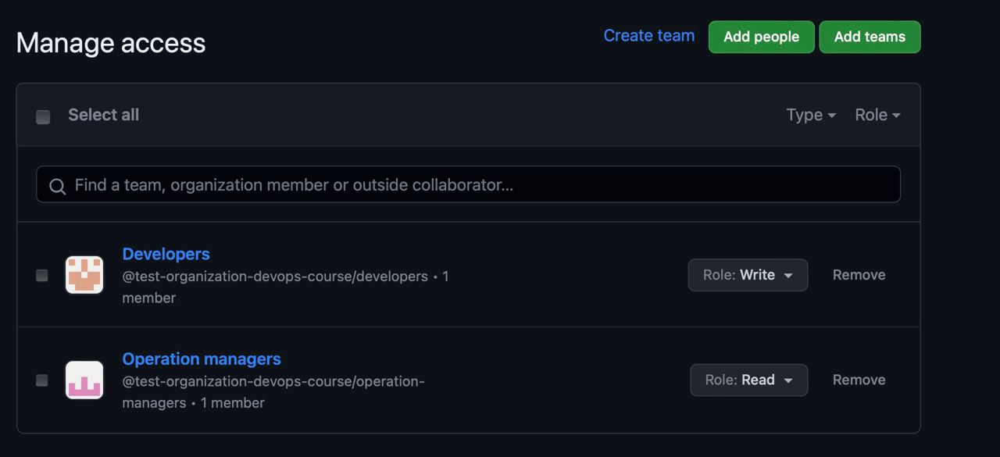

# Terraform lab

## Task 01

### Show state

```bash
> terraform state list
docker_container.nginx
docker_image.nginx

> terraform state show docker_container.nginx
resource "docker_container" "nginx" {
    attach                                      = false
    command                                     = [
        "nginx",
        "-g",
        "daemon off;",
    ]
    container_read_refresh_timeout_milliseconds = 15000
    cpu_shares                                  = 0
    entrypoint                                  = [
        "/docker-entrypoint.sh",
    ]
    env                                         = []
    hostname                                    = "cae4fdf7736d"
    id                                          = "cae4fdf7736d4d30a45c21bee241d9d39b9177668fb3785419837c0a04a92d7b"
    image                                       = "sha256:2a4fbb36e96607b16e5af2e24dc6a1025a4795520c98c6b9ead9c4113617cb73"
    init                                        = false
    ipc_mode                                    = "private"
    log_driver                                  = "json-file"
    logs                                        = false
    max_retry_count                             = 0
    memory                                      = 0
    memory_swap                                 = 0
    must_run                                    = true
    name                                        = "tutorial"
    network_data                                = [
        {
            gateway                   = "172.17.0.1"
            global_ipv6_address       = ""
            global_ipv6_prefix_length = 0
            ip_address                = "172.17.0.2"
            ip_prefix_length          = 16
            ipv6_gateway              = ""
            mac_address               = "02:42:ac:11:00:02"
            network_name              = "bridge"
        },
    ]
    network_mode                                = "default"
    privileged                                  = false
    publish_all_ports                           = false
    read_only                                   = false
    remove_volumes                              = true
    restart                                     = "no"
    rm                                          = false
    runtime                                     = "runc"
    security_opts                               = []
    shm_size                                    = 64
    start                                       = true
    stdin_open                                  = false
    stop_signal                                 = "SIGQUIT"
    stop_timeout                                = 0
    tty                                         = false
    wait                                        = false
    wait_timeout                                = 60

    ports {
        external = 8000
        internal = 80
        ip       = "0.0.0.0"
        protocol = "tcp"
    }
}

> terraform state show docker_image.nginx
# docker_image.nginx:
resource "docker_image" "nginx" {
    id           = "sha256:2a4fbb36e96607b16e5af2e24dc6a1025a4795520c98c6b9ead9c4113617cb73nginx"
    image_id     = "sha256:2a4fbb36e96607b16e5af2e24dc6a1025a4795520c98c6b9ead9c4113617cb73"
    keep_locally = false
    name         = "nginx"
    repo_digest  = "nginx@sha256:32da30332506740a2f7c34d5dc70467b7f14ec67d912703568daff790ab3f755"
}
```

### Rename container

```bash
> terraform plan
...
~ name                                        = "tutorial" -> "renamed-container" # forces replacement
...

> docker ps -a
CONTAINER ID   IMAGE          COMMAND                  CREATED         STATUS         PORTS                  NAMES
eae3868bc071   2a4fbb36e966   "/docker-entrypoint.…"   4 seconds ago   Up 3 seconds   0.0.0.0:8000->80/tcp   renamed-container
```

### Add outputs

```bash
> terraform plan
docker_image.nginx: Refreshing state... [id=sha256:2a4fbb36e96607b16e5af2e24dc6a1025a4795520c98c6b9ead9c4113617cb73nginx]
docker_container.nginx: Refreshing state... [id=eae3868bc071f56295fd933c20c4b895151f1dc50abed6377418ecd2accd1d44]

Changes to Outputs:
  + container_id = "eae3868bc071f56295fd933c20c4b895151f1dc50abed6377418ecd2accd1d44"
  + image_id     = "sha256:2a4fbb36e96607b16e5af2e24dc6a1025a4795520c98c6b9ead9c4113617cb73nginx"
> terraform apply
> terraform output
container_id = "eae3868bc071f56295fd933c20c4b895151f1dc50abed6377418ecd2accd1d44"
image_id = "sha256:2a4fbb36e96607b16e5af2e24dc6a1025a4795520c98c6b9ead9c4113617cb73nginx"
> docker ps -a
CONTAINER ID   IMAGE          COMMAND                  CREATED         STATUS         PORTS                  NAMES
eae3868bc071   2a4fbb36e966   "/docker-entrypoint.…"   6 minutes ago   Up 6 minutes   0.0.0.0:8000->80/tcp   renamed-container
```

## Use yandex cloud

```bash
> terraform apply
Apply complete! Resources: 2 added, 0 changed, 1 destroyed.

Outputs:

external_ip_address_vm_1 = "84.201.154.28"
internal_ip_address_vm_1 = "192.168.10.17"

> terraform state list
yandex_compute_instance.vm-1
yandex_vpc_network.network-1
yandex_vpc_subnet.subnet-1

> terraform state show 
# yandex_compute_instance.vm-1:
resource "yandex_compute_instance" "vm-1" {
    created_at                = "2023-09-26T12:00:45Z"
    folder_id                 = "b1gm6bsivu1c8m0rpntv"
    fqdn                      = "epd2l7tlji2ocvfjtbfs.auto.internal"
    id                        = "epd2l7tlji2ocvfjtbfs"
    metadata                  = {
        "ssh-keys" = <<-EOT
            ubuntu:ecdsa-sha2-nistp256 AAAAE2VjZHNhLXNoYTItbmlzdHAyNTYAAAAIbmlzdHAyNTYAAABBBJYqDxoKqMxgZl5ZwjTLxzMieTd3UYsGE/44pyy6GWVyLrcT2wE0KHsifQe0S1n0neHwJGT0cPq3/DXCUKcCCDw= ilyasiluyanov@10.211.15.59-vpn.dhcp.yndx.net
        EOT
    }
    name                      = "terraform1"
    network_acceleration_type = "standard"
    platform_id               = "standard-v1"
    status                    = "running"
    zone                      = "ru-central1-b"

    boot_disk {
        auto_delete = true
        device_name = "epdt69mq69hu40jn7tr2"
        disk_id     = "epdt69mq69hu40jn7tr2"
        mode        = "READ_WRITE"

        initialize_params {
            block_size = 4096
            image_id   = "fd89n8278rhueakslujo"
            size       = 5
            type       = "network-hdd"
        }
    }

    metadata_options {
        aws_v1_http_endpoint = 1
        aws_v1_http_token    = 2
        gce_http_endpoint    = 1
        gce_http_token       = 1
    }

    network_interface {
        index              = 0
        ip_address         = "192.168.10.17"
        ipv4               = true
        ipv6               = false
        mac_address        = "d0:0d:2a:9f:b5:9c"
        nat                = true
        nat_ip_address     = "84.201.154.28"
        nat_ip_version     = "IPV4"
        security_group_ids = []
        subnet_id          = "e2l02l4vilqilkqtbq49"
    }

    placement_policy {
        host_affinity_rules = []
    }

    resources {
        core_fraction = 100
        cores         = 2
        gpus          = 0
        memory        = 2
    }

    scheduling_policy {
        preemptible = false
    }
}
```

### Rename VM

```bash
> terraform plan
...
Terraform will perform the following actions:

  # yandex_compute_instance.vm-1 will be updated in-place
  ~ resource "yandex_compute_instance" "vm-1" {
        id                        = "epd2l7tlji2ocvfjtbfs"
      ~ name                      = "terraform1" -> "renamed-terraform1"
...
> terraform apply
Apply complete! Resources: 0 added, 1 changed, 0 destroyed.

Outputs:

external_ip_address_vm_1 = "84.201.154.28"
internal_ip_address_vm_1 = "192.168.10.17"
> yc compute instance get --name renamed-terraform1
id: epd2l7tlji2ocvfjtbfs
folder_id: b1gm6bsivu1c8m0rpntv
created_at: "2023-09-26T12:00:45Z"
name: renamed-terraform1
zone_id: ru-central1-b
platform_id: standard-v1
resources:
  memory: "2147483648"
  cores: "2"
  core_fraction: "100"
status: RUNNING
metadata_options:
  gce_http_endpoint: ENABLED
  aws_v1_http_endpoint: ENABLED
  gce_http_token: ENABLED
  aws_v1_http_token: DISABLED
boot_disk:
  mode: READ_WRITE
  device_name: epdt69mq69hu40jn7tr2
  auto_delete: true
  disk_id: epdt69mq69hu40jn7tr2
network_interfaces:
  - index: "0"
    mac_address: d0:0d:2a:9f:b5:9c
    subnet_id: e2l02l4vilqilkqtbq49
    primary_v4_address:
      address: 192.168.10.17
      one_to_one_nat:
        address: 84.201.154.28
        ip_version: IPV4
gpu_settings: {}
fqdn: epd2l7tlji2ocvfjtbfs.auto.internal
scheduling_policy: {}
network_settings:
  type: STANDARD
placement_policy: {}
```

## Task 02

### Create a repo

```bash
> terraform apply
Apply complete! Resources: 0 added, 0 changed, 0 destroyed.

Outputs:

url = "https://github.com/ilya-siluyanov/Pwd9000-Demo-Repo-2022"
```

### Import the repo

```bash
> TF_VAR_github_token=... terraform import github_repository.devops-core-course-labs devops-core-course-labs
(`terraform.tfstate` file was generated)
> 
...
# github_repository.devops-core-course-labs will be updated in-place
  ~ resource "github_repository" "devops-core-course-labs" {
      ~ allow_merge_commit          = true -> false
      - has_downloads               = true -> null
      - has_projects                = true -> null
      - has_wiki                    = true -> null
...
```

## Best practises

- Naming conventions (don't repeat resource type in resource name, etc.)
- Use outputs
- Use formatters and validators

## Bonus task

```bash
> TF_VAR_github_token=... terraform plan
data.github_user.self: Reading...
github_repository.devops-core-course-labs: Refreshing state... [id=devops-core-course-labs]
data.github_user.self: Read complete after 1s [id=28011655]

Terraform used the selected providers to generate the following execution plan. Resource actions are indicated with the following symbols:
  + create

Terraform will perform the following actions:

  # github_team.devs will be created
  + resource "github_team" "devs" {
      + create_default_maintainer = true
      + etag                      = (known after apply)
      + id                        = (known after apply)
      + members_count             = (known after apply)
      + name                      = "Developers"
      + node_id                   = (known after apply)
      + privacy                   = "secret"
      + slug                      = (known after apply)
    }

  # github_team.ops will be created
  + resource "github_team" "ops" {
      + create_default_maintainer = true
      + etag                      = (known after apply)
      + id                        = (known after apply)
      + members_count             = (known after apply)
      + name                      = "Operation managers"
      + node_id                   = (known after apply)
      + privacy                   = "secret"
      + slug                      = (known after apply)
    }

  # github_team_membership.devs-ilya will be created
  + resource "github_team_membership" "devs-ilya" {
      + etag     = (known after apply)
      + id       = (known after apply)
      + role     = "maintainer"
      + team_id  = (known after apply)
      + username = "ilya-siluyanov"
    }

  # github_team_membership.ops-ilya will be created
  + resource "github_team_membership" "ops-ilya" {
      + etag     = (known after apply)
      + id       = (known after apply)
      + role     = "member"
      + team_id  = (known after apply)
      + username = "ilya-siluyanov"
    }

  # github_team_repository.devops-core-course-labs-devs will be created
  + resource "github_team_repository" "devops-core-course-labs-devs" {
      + etag       = (known after apply)
      + id         = (known after apply)
      + permission = "write"
      + repository = "devops-core-course-labs"
      + team_id    = (known after apply)
    }

  # github_team_repository.devops-core-course-labs-ops will be created
  + resource "github_team_repository" "devops-core-course-labs-ops" {
      + etag       = (known after apply)
      + id         = (known after apply)
      + permission = "read"
      + repository = "devops-core-course-labs"
      + team_id    = (known after apply)
    }

Plan: 6 to add, 0 to change, 0 to destroy.

> terraform apply
...
Outputs:

url = "https://github.com/test-organization-devops-course/devops-core-course-labs"
```


