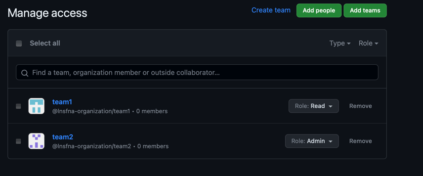

# Terraform
## Docker 

### terraform state list
Output:
```
docker_container.app_go
docker_container.app_python
docker_image.app_go
docker_image.app_python
```
### terraform show
Output:
```
# docker_container.app_go:
resource "docker_container" "app_go" {
    attach                                      = false
    command                                     = [
        "./app_go",
    ]
    container_read_refresh_timeout_milliseconds = 15000
    cpu_shares                                  = 0
    entrypoint                                  = []
    env                                         = []
    hostname                                    = "6ee09781e519"
    id                                          = "6ee09781e519edf0a5f54bd9f2072fd46ef457ab606da827e58af52b3a0e726a"
    image                                       = "sha256:3c02292c6fc8369feee38d9f2cb612a91206f5db61a813f4774f69b0d5909d81"
    init                                        = false
    ipc_mode                                    = "private"
    log_driver                                  = "json-file"
    logs                                        = false
    max_retry_count                             = 0
    memory                                      = 0
    memory_swap                                 = 0
    must_run                                    = true
    name                                        = "app_go"
    network_data                                = [
        {
            gateway                   = "172.17.0.1"
            global_ipv6_address       = ""
            global_ipv6_prefix_length = 0
            ip_address                = "172.17.0.3"
            ip_prefix_length          = 16
            ipv6_gateway              = ""
            mac_address               = "02:42:ac:11:00:03"
            network_name              = "bridge"
        },
    ]
    network_mode                                = "default"
    privileged                                  = false
    publish_all_ports                           = false
    read_only                                   = false
    remove_volumes                              = true
    restart                                     = "no"
    rm                                          = false
    runtime                                     = "runc"
    security_opts                               = []
    shm_size                                    = 64
    start                                       = true
    stdin_open                                  = false
    stop_timeout                                = 0
    tty                                         = false
    user                                        = "user"
    wait                                        = false
    wait_timeout                                = 60
    working_dir                                 = "/"

    ports {
        external = 8081
        internal = 8081
        ip       = "0.0.0.0"
        protocol = "tcp"
    }
}

# docker_container.app_python:
resource "docker_container" "app_python" {
    attach                                      = false
    command                                     = []
    container_read_refresh_timeout_milliseconds = 15000
    cpu_shares                                  = 0
    entrypoint                                  = [
        "python3",
        "-m",
        "app_python",
    ]
    env                                         = []
    hostname                                    = "157201ada544"
    id                                          = "157201ada544d4ee73bfa4eea34fb13af43b5d5adb57192922890e198caf7f28"
    image                                       = "sha256:79e0c4cf2910efa126a902c54eafd91cdbe494bd3008e9fd82c0212d75314088"
    init                                        = false
    ipc_mode                                    = "private"
    log_driver                                  = "json-file"
    logs                                        = false
    max_retry_count                             = 0
    memory                                      = 0
    memory_swap                                 = 0
    must_run                                    = true
    name                                        = "app_python"
    network_data                                = [
        {
            gateway                   = "172.17.0.1"
            global_ipv6_address       = ""
            global_ipv6_prefix_length = 0
            ip_address                = "172.17.0.2"
            ip_prefix_length          = 16
            ipv6_gateway              = ""
            mac_address               = "02:42:ac:11:00:02"
            network_name              = "bridge"
        },
    ]
    network_mode                                = "default"
    privileged                                  = false
    publish_all_ports                           = false
    read_only                                   = false
    remove_volumes                              = true
    restart                                     = "no"
    rm                                          = false
    runtime                                     = "runc"
    security_opts                               = []
    shm_size                                    = 64
    start                                       = true
    stdin_open                                  = false
    stop_timeout                                = 0
    tty                                         = false
    user                                        = "user"
    wait                                        = false
    wait_timeout                                = 60
    working_dir                                 = "/app"

    ports {
        external = 8080
        internal = 8080
        ip       = "0.0.0.0"
        protocol = "tcp"
    }
}

# docker_image.app_go:
resource "docker_image" "app_go" {
    id           = "sha256:3c02292c6fc8369feee38d9f2cb612a91206f5db61a813f4774f69b0d5909d81lnsfna/app_go"
    image_id     = "sha256:3c02292c6fc8369feee38d9f2cb612a91206f5db61a813f4774f69b0d5909d81"
    keep_locally = false
    name         = "lnsfna/app_go"
    repo_digest  = "lnsfna/app_go@sha256:9fdbd523760f1c7557697dc19f67b1e2e68261e995890473a0314579f5b7ac01"
}

# docker_image.app_python:
resource "docker_image" "app_python" {
    id           = "sha256:79e0c4cf2910efa126a902c54eafd91cdbe494bd3008e9fd82c0212d75314088lnsfna/app_python"
    image_id     = "sha256:79e0c4cf2910efa126a902c54eafd91cdbe494bd3008e9fd82c0212d75314088"
    keep_locally = false
    name         = "lnsfna/app_python"
    repo_digest  = "lnsfna/app_python@sha256:a60cc035958aad6b977ad50906da0ee1ce7adee40a2603bd9c916dbc7a27165c"
}
```

### terraform output

Output:
```
go_container_id = "6ee09781e519edf0a5f54bd9f2072fd46ef457ab606da827e58af52b3a0e726a"
go_image_id = "sha256:3c02292c6fc8369feee38d9f2cb612a91206f5db61a813f4774f69b0d5909d81lnsfna/app_go"
python_container_id = "157201ada544d4ee73bfa4eea34fb13af43b5d5adb57192922890e198caf7f28"
python_image_id = "sha256:79e0c4cf2910efa126a902c54eafd91cdbe494bd3008e9fd82c0212d75314088lnsfna/app_python"
```

## YandexCloud
As russian credit cards are restricted in AWS, i decided to use YandexCLoud. 

### Init terraform:
```
terraform init -backend-config="access_key=$ACCESS_KEY"-backend-config="secret_key=$SECRET_KEY"
```
### Apply terraform:
```
terraform apply -var="cloud_id=$YC_CLOUD_ID" -var="folder_id=$YC_CATALOG_ID" -var="service_account_key_file=$YC_KEY_PATH"
```

### terraform state list

Output:
```
yandex_compute_image.ubuntu_2004
yandex_compute_instance.vm-1
yandex_vpc_network.network-1
yandex_vpc_subnet.subnet-1
```

### terraform show

Output:
```
# yandex_compute_image.ubuntu_2004:
resource "yandex_compute_image" "ubuntu_2004" {
    created_at    = "2023-09-26T11:18:46Z"
    folder_id     = "b1gqtkcc8ktga62edqu6"
    id            = "fd8m4rsmq1h574oau0as"
    min_disk_size = 5
    pooled        = false
    product_ids   = [
        "f2ed6k5slaamr94lfdqu",
    ]
    size          = 4
    source_family = "ubuntu-2004-lts"
    status        = "ready"
}

# yandex_compute_instance.vm-1:
resource "yandex_compute_instance" "vm-1" {
    created_at                = "2023-09-26T11:18:58Z"
    folder_id                 = "b1gqtkcc8ktga62edqu6"
    fqdn                      = "fhmcm18frvk6i0dhpd5g.auto.internal"
    id                        = "fhmcm18frvk6i0dhpd5g"
    metadata                  = {
        "ssh-keys" = <<-EOT
            ubuntu:ssh-ed25519 AAAAC3NzaC1lZDI1NTE5AAAAIBg7zb98jwHYj0WUX13c9mYdzNqf5GWAjypJxwvak4S3 alinasafina@MacBook-Pro-3.local
        EOT
    }
    name                      = "terraform1"
    network_acceleration_type = "standard"
    platform_id               = "standard-v1"
    status                    = "running"
    zone                      = "ru-central1-a"

    boot_disk {
        auto_delete = true
        device_name = "fhm4m7b9iak2hil0gv1i"
        disk_id     = "fhm4m7b9iak2hil0gv1i"
        mode        = "READ_WRITE"

        initialize_params {
            block_size = 4096
            image_id   = "fd8m4rsmq1h574oau0as"
            size       = 5
            type       = "network-hdd"
        }
    }

    metadata_options {
        aws_v1_http_endpoint = 1
        aws_v1_http_token    = 2
        gce_http_endpoint    = 1
        gce_http_token       = 1
    }

    network_interface {
        index              = 0
        ip_address         = "192.168.10.15"
        ipv4               = true
        ipv6               = false
        mac_address        = "d0:0d:cb:05:0f:df"
        nat                = true
        nat_ip_address     = "158.160.120.130"
        nat_ip_version     = "IPV4"
        security_group_ids = []
        subnet_id          = "e9b2fo6cn6loi08v5mn7"
    }

    placement_policy {
        host_affinity_rules = []
    }

    resources {
        core_fraction = 100
        cores         = 2
        gpus          = 0
        memory        = 2
    }

    scheduling_policy {
        preemptible = false
    }
}

# yandex_vpc_network.network-1:
resource "yandex_vpc_network" "network-1" {
    created_at                = "2023-09-26T10:22:51Z"
    default_security_group_id = "enp1q2cplpnm3cn3m5sv"
    folder_id                 = "b1gqtkcc8ktga62edqu6"
    id                        = "enptm3esh55lj9e46c8m"
    labels                    = {}
    name                      = "network1"
    subnet_ids                = [
        "e9b2fo6cn6loi08v5mn7",
    ]
}

# yandex_vpc_subnet.subnet-1:
resource "yandex_vpc_subnet" "subnet-1" {
    created_at     = "2023-09-26T10:22:55Z"
    folder_id      = "b1gqtkcc8ktga62edqu6"
    id             = "e9b2fo6cn6loi08v5mn7"
    labels         = {}
    name           = "subnet1"
    network_id     = "enptm3esh55lj9e46c8m"
    v4_cidr_blocks = [
        "192.168.10.0/24",
    ]
    v6_cidr_blocks = []
    zone           = "ru-central1-a"
}
```

### terraform output 

Output:
```
external_ip_address_vm_1 = "158.160.60.155"
internal_ip_address_vm_1 = "192.168.10.33"

```

## GitHub (with bonus task)
To add teams i've created an organization lnsfna-organization.

Import existing repo:
```
terraform import "github_repository.terraform" "DevOpsCourse"
```
Link to repository: https://github.com/lnsfna-organization/DevOpsCourse
### terraform state list

Output:
```
github_branch_default.main
github_branch_protection.default
github_repository.terraform
github_team.team1
github_team.team2
github_team_repository.team_1_to_repo
github_team_repository.team_2_to_repo

```

### terraform show

Output:
```
## github_branch_default.main:
resource "github_branch_default" "main" {
    branch     = "main"
    id         = "DevOpsCourse"
    rename     = false
    repository = "DevOpsCourse"
}

# github_branch_protection.default:
resource "github_branch_protection" "default" {
    allows_deletions                = false
    allows_force_pushes             = false
    blocks_creations                = false
    enforce_admins                  = true
    id                              = "BPR_kwDOKYnc-M4CgTu9"
    lock_branch                     = false
    pattern                         = "main"
    repository_id                   = "DevOpsCourse"
    require_conversation_resolution = true
    require_signed_commits          = false
    required_linear_history         = false

    required_pull_request_reviews {
        dismiss_stale_reviews           = false
        require_code_owner_reviews      = false
        require_last_push_approval      = false
        required_approving_review_count = 1
        restrict_dismissals             = false
    }
}

# github_repository.terraform:
resource "github_repository" "terraform" {
    allow_auto_merge            = false
    allow_merge_commit          = true
    allow_rebase_merge          = true
    allow_squash_merge          = true
    allow_update_branch         = false
    archived                    = false
    auto_init                   = true
    default_branch              = "main"
    delete_branch_on_merge      = false
    description                 = "DevOps course labs"
    etag                        = "W/\"7fae50dd74c3402dfccf624ef4d78ae105f5902a2d3362264567572197d6615b\""
    full_name                   = "lnsfna-organization/DevOpsCourse"
    git_clone_url               = "git://github.com/lnsfna-organization/DevOpsCourse.git"
    has_discussions             = false
    has_downloads               = false
    has_issues                  = true
    has_projects                = false
    has_wiki                    = true
    html_url                    = "https://github.com/lnsfna-organization/DevOpsCourse"
    http_clone_url              = "https://github.com/lnsfna-organization/DevOpsCourse.git"
    id                          = "DevOpsCourse"
    is_template                 = false
    license_template            = "mit"
    merge_commit_message        = "PR_TITLE"
    merge_commit_title          = "MERGE_MESSAGE"
    name                        = "DevOpsCourse"
    node_id                     = "R_kgDOKYnc-A"
    private                     = false
    repo_id                     = 696900856
    squash_merge_commit_message = "COMMIT_MESSAGES"
    squash_merge_commit_title   = "COMMIT_OR_PR_TITLE"
    ssh_clone_url               = "git@github.com:lnsfna-organization/DevOpsCourse.git"
    svn_url                     = "https://github.com/lnsfna-organization/DevOpsCourse"
    topics                      = []
    visibility                  = "public"
    vulnerability_alerts        = false

    security_and_analysis {
        secret_scanning {
            status = "disabled"
        }
        secret_scanning_push_protection {
            status = "disabled"
        }
    }
}

# github_team.team1:
resource "github_team" "team1" {
    create_default_maintainer = false
    description               = "test team 1"
    etag                      = "W/\"9dc300f5a96be1b00286c0f97d21bbd760672f9cad0ed51bd83894a912bb9c47\""
    id                        = "8645474"
    members_count             = 0
    name                      = "team1"
    node_id                   = "T_kwDOCLVnYc4Ag-ti"
    privacy                   = "secret"
    slug                      = "team1"
}

# github_team.team2:
resource "github_team" "team2" {
    create_default_maintainer = false
    description               = "test team 2"
    etag                      = "W/\"360b096ff89bda944b6cb437e07b8fac257a45cec3532d505a47a52754be7f9a\""
    id                        = "8645473"
    members_count             = 0
    name                      = "team2"
    node_id                   = "T_kwDOCLVnYc4Ag-th"
    privacy                   = "secret"
    slug                      = "team2"
}

# github_team_repository.team_1_to_repo:
resource "github_team_repository" "team_1_to_repo" {
    etag       = "W/\"45a68088e4f808844cd3aa54b1454a2341a84d864ba1f4e00eadeed3d24d9560\""
    id         = "8645474:DevOpsCourse"
    permission = "pull"
    repository = "DevOpsCourse"
    team_id    = "8645474"
}

# github_team_repository.team_2_to_repo:
resource "github_team_repository" "team_2_to_repo" {
    etag       = "W/\"684fa43306b1220e4b8e959324979ba35b0984f17adb9bc2ae69e941e0ad2b9b\""
    id         = "8645473:DevOpsCourse"
    permission = "admin"
    repository = "DevOpsCourse"
    team_id    = "8645473"
}
```
### terraform output
Output:
```
team1_id = "8645474"
team2_id = "8645473"
```
### Added teams:


## Terraform best practices that i've used

* Separate terraform files by area of usage: variables, outputs
* Separate files for management (Docker, YandexCLoud and GitHub are separated)
* Use identical variable naming (snake_case)
* Use terraform fmt and terraform validate commands to keep config consistent and correct