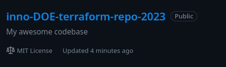

# Terraform

I followed the Terraform documents and deployed a docker infrastructure.

`terraform state list`:

```bash
docker_container.nginx
docker_image.nginx
```

`terraform state show`:

```bash
# docker_container.nginx:
resource "docker_container" "nginx" {
    attach                                      = false
    command                                     = [
        "nginx",
        "-g",
        "daemon off;",
    ]
    container_read_refresh_timeout_milliseconds = 15000
    cpu_shares                                  = 0
    entrypoint                                  = [
        "/docker-entrypoint.sh",
    ]
    env                                         = []
    hostname                                    = "fa40cc49d2c4"
    id                                          = "fa40cc49d2c4a4a7dd43c389d9c129991041827c69247a07da2d92ff4b6e7e3d"
    image                                       = "sha256:f5a6b296b8a29b4e3d89ffa99e4a86309874ae400e82b3d3993f84e1e3bb0eb9"
    init                                        = false
    ipc_mode                                    = "private"
    log_driver                                  = "json-file"
    logs                                        = false
    max_retry_count                             = 0
    memory                                      = 0
    memory_swap                                 = 0
    must_run                                    = true
    name                                        = "tutorial"
    network_data                                = [
        {
            gateway                   = "172.17.0.1"
            global_ipv6_address       = ""
            global_ipv6_prefix_length = 0
            ip_address                = "172.17.0.2"
            ip_prefix_length          = 16
            ipv6_gateway              = ""
            mac_address               = "02:42:ac:11:00:02"
            network_name              = "bridge"
        },
    ]
    network_mode                                = "default"
    privileged                                  = false
    publish_all_ports                           = false
    read_only                                   = false
    remove_volumes                              = true
    restart                                     = "no"
    rm                                          = false
    runtime                                     = "runc"
    security_opts                               = []
    shm_size                                    = 64
    start                                       = true
    stdin_open                                  = false
    stop_signal                                 = "SIGQUIT"
    stop_timeout                                = 0
    tty                                         = false
    wait                                        = false
    wait_timeout                                = 60

    ports {
        external = 8000
        internal = 80
        ip       = "0.0.0.0"
        protocol = "tcp"
    }
}

# docker_image.nginx:
resource "docker_image" "nginx" {
    id           = "sha256:f5a6b296b8a29b4e3d89ffa99e4a86309874ae400e82b3d3993f84e1e3bb0eb9nginx"
    image_id     = "sha256:f5a6b296b8a29b4e3d89ffa99e4a86309874ae400e82b3d3993f84e1e3bb0eb9"
    keep_locally = false
    name         = "nginx"
    repo_digest  = "nginx@sha256:6926dd802f40e5e7257fded83e0d8030039642e4e10c4a98a6478e9c6fe06153"
}
```

Applied changes:

*   Change docker\_container.nginx ports.external value from 8000 to 8080
*   Added variable for the container name:

    ```t
    variable "container_name" {
    description = "Value of the name for the Docker container"
    type        = string
    default     = "ExampleNginxContainer"
    }
    ```

    Use it in resource "docker\_container"

        name  = var.container_name

    Set the container name using the defined variable:

    ```bash
    terraform apply -var "container_name=inno_container"
    ```

`terraform output`:

```bash
container_id = "7b6ab6265d45012414d48dde963e6023ddd59d52fa951b82c19f6b307cda3242"
image_id = "sha256:f5a6b296b8a29b4e3d89ffa99e4a86309874ae400e82b3d3993f84e1e3bb0eb9nginx"
```

# Yandex cloud

Following Yandex Cloud Terraform tutorial instead of AWS (as it has a free tier).

I registered a Yandex Cloud service account and created a key (which is stored in a separate file).

In a new folder, `terraform-yandex` I created the terraform files.

`terraform state list`:

```bash
yandex_iam_service_account.sa
yandex_iam_service_account_static_access_key.sa-static-key
yandex_resourcemanager_folder_iam_member.sa-editor
yandex_storage_bucket.inno-doe-lab4-dl
```

`terraform state show yandex_storage_bucket.inno-doe-lab4-dl`:

```bash
# yandex_storage_bucket.inno-doe-lab4-dl:
resource "yandex_storage_bucket" "inno-doe-lab4-dl" {
    access_key            = "<REDACTED>"
        bucket                = "inno-doe-lab4-dl"
        bucket_domain_name    = "inno-doe-lab4-dl.storage.yandexcloud.net"
        default_storage_class = "STANDARD"
        folder_id             = "<REDACTED>"
        force_destroy         = false
        id                    = "inno-doe-lab4-dl"
        max_size              = 0
        secret_key            = (sensitive value)

        anonymous_access_flags {
            config_read = false
                list        = false
                read        = false
        }

    versioning {
        enabled = false
    }
}
```

Snippet from running `terraform apply`:

```bash
Terraform used the selected providers to generate the following execution plan.
Resource actions are indicated with the following symbols:
  + create

Terraform will perform the following actions:

  # yandex_iam_service_account.sa will be created
  + resource "yandex_iam_service_account" "sa" {
      + created_at = (known after apply)
      + folder_id  = "b1g8hgj9hl7kkr2vsh1c"
      + id         = (known after apply)
      + name       = "tf-test-sa"
    }

  # yandex_iam_service_account_static_access_key.sa-static-key will be created
  + resource "yandex_iam_service_account_static_access_key" "sa-static-key" {
      + access_key           = (known after apply)
      + created_at           = (known after apply)
      + description          = "static access key for object storage"
      + encrypted_secret_key = (known after apply)
      + id                   = (known after apply)
      + key_fingerprint      = (known after apply)
      + secret_key           = (sensitive value)
      + service_account_id   = (known after apply)
    }

  # yandex_resourcemanager_folder_iam_member.sa-editor will be created
  + resource "yandex_resourcemanager_folder_iam_member" "sa-editor" {
      + folder_id = "b1g8hgj9hl7kkr2vsh1c"
      + id        = (known after apply)
      + member    = (known after apply)
      + role      = "storage.editor"
    }

  # yandex_storage_bucket.test will be created
  + resource "yandex_storage_bucket" "test" {
      + access_key            = (known after apply)
      + acl                   = (known after apply)
      + bucket                = "tf-test-bucket"
      + bucket_domain_name    = (known after apply)
      + default_storage_class = (known after apply)
      + folder_id             = (known after apply)
      + force_destroy         = false
      + id                    = (known after apply)
      + secret_key            = (sensitive value)
      + website_domain        = (known after apply)
      + website_endpoint      = (known after apply)
    }
```

# GitHub provider

I followed the tutorial.

The created repository after applying configuration:



## Modifying existing repository

After impoting my repository, I add a description property.

`terraform plan -out deploy.tfplan`:

```bash
...
# github_repository.DOE-course-labs will be updated in-place
    ~ resource "github_repository" "DOE-course-labs" {
        + description                 = "Updated description from terraform"
...
```

And apply the changes with `terraform apply deploy.tfplan`:

```bash
github_repository.DOE-course-labs: Modifying... [id=DOE-course-labs]
github_repository.DOE-course-labs: Modifications complete after 3s [id=DOE-course-labs]
```

# Best Practices Followed

*   Using terraform formatting.
*   Storing sensitive info as secrets (marked sensitive).
*   Segmenting the configuration (variables, terraform config, providers) into separate files.
