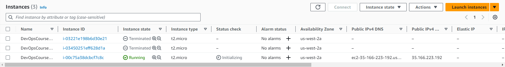

# Terraform

## Task 1 - Docker

### State Show

```# docker_container.python_app_container:
resource "docker_container" "python_app_container" {
    attach                                      = false
    command                                     = []
    container_read_refresh_timeout_milliseconds = 15000
    cpu_shares                                  = 0
    entrypoint                                  = [
        "python3",
        "app.py",
        "-prod",
    ]
    env                                         = []
    hostname                                    = "c0ab732e4413"
    id                                          = "c0ab732e44137859c138da9e2a399e60474cff0ac3d3cd8f4497061e518f42b6"
    image                                       = "sha256:8f8f33311f695c64d7aa2454d0b48c0b0682996bfc12d03b964700bba7e559b4"
    init                                        = false
    ipc_mode                                    = "private"
    log_driver                                  = "json-file"
    logs                                        = false
    max_retry_count                             = 0
    memory                                      = 0
    memory_swap                                 = 0
    must_run                                    = true
    name                                        = "my-container"
    network_data                                = [
        {
            gateway                   = "172.17.0.1"
            global_ipv6_address       = ""
            global_ipv6_prefix_length = 0
            ip_address                = "172.17.0.2"
            ip_prefix_length          = 16
            ipv6_gateway              = ""
            mac_address               = "02:42:ac:11:00:02"
            network_name              = "bridge"
        },
    ]
    network_mode                                = "default"
    privileged                                  = false
    publish_all_ports                           = false
    read_only                                   = false
    remove_volumes                              = true
    restart                                     = "no"
    rm                                          = false
    runtime                                     = "runc"
    security_opts                               = []
    shm_size                                    = 64
    start                                       = true
    stdin_open                                  = false
    stop_timeout                                = 0
    tty                                         = false
    user                                        = "limiteduser"
    wait                                        = false
    wait_timeout                                = 60
    working_dir                                 = "/app"

    ports {
        external = 8080
        internal = 8000
        ip       = "0.0.0.0"
        protocol = "tcp"
    }
}

# docker_image.python_app_image:
resource "docker_image" "python_app_image" {
    id           = "sha256:8f8f33311f695c64d7aa2454d0b48c0b0682996bfc12d03b964700bba7e559b4nabiull2020/moscow-time-flask-app:latest"
    image_id     = "sha256:8f8f33311f695c64d7aa2454d0b48c0b0682996bfc12d03b964700bba7e559b4"
    keep_locally = false
    name         = "nabiull2020/moscow-time-flask-app:latest"
    repo_digest  = "nabiull2020/moscow-time-flask-app@sha256:6b34ef1f548ed31952fd98d5c19dff74a727ecb3b15cd24c6281742222b04c5c"
}

```

### State List

```
docker_container.python_app_container
docker_image.python_app_image
```

### Applied Changes

```
Terraform used the selected providers to generate the following execution plan. Resource actions are indicated with the
following symbols:
  + create
  - destroy

Terraform will perform the following actions:

  # docker_container.app_container will be created
  + resource "docker_container" "app_container" {
      + attach                                      = false
      + bridge                                      = (known after apply)
      + command                                     = (known after apply)
      + container_logs                              = (known after apply)
      + container_read_refresh_timeout_milliseconds = 15000
      + entrypoint                                  = (known after apply)
      + env                                         = (known after apply)
      + exit_code                                   = (known after apply)
      + hostname                                    = (known after apply)
      + id                                          = (known after apply)
      + image                                       = (known after apply)
      + init                                        = (known after apply)
      + ipc_mode                                    = (known after apply)
      + log_driver                                  = (known after apply)
      + logs                                        = false
      + must_run                                    = true
      + name                                        = "my-container"
      + network_data                                = (known after apply)
      + read_only                                   = false
      + remove_volumes                              = true
      + restart                                     = "no"
      + rm                                          = false
      + runtime                                     = (known after apply)
      + security_opts                               = (known after apply)
      + shm_size                                    = (known after apply)
      + start                                       = true
      + stdin_open                                  = false
      + stop_signal                                 = (known after apply)
      + stop_timeout                                = (known after apply)
      + tty                                         = false
      + wait                                        = false
      + wait_timeout                                = 60

      + ports {
          + external = 8000
          + internal = 8000
          + ip       = "0.0.0.0"
          + protocol = "tcp"
        }
    }

  # docker_container.python_app_container will be destroyed
  # (because docker_container.python_app_container is not in configuration)
  - resource "docker_container" "python_app_container" {
      - attach                                      = false -> null
      - command                                     = [] -> null
      - container_read_refresh_timeout_milliseconds = 15000 -> null
      - cpu_shares                                  = 0 -> null
      - dns                                         = [] -> null
      - dns_opts                                    = [] -> null
      - dns_search                                  = [] -> null
      - entrypoint                                  = [
          - "python3",
          - "app.py",
          - "-prod",
        ] -> null
      - env                                         = [] -> null
      - group_add                                   = [] -> null
      - hostname                                    = "c0ab732e4413" -> null
      - id                                          = "c0ab732e44137859c138da9e2a399e60474cff0ac3d3cd8f4497061e518f42b6"
 -> null
      - image                                       = "sha256:8f8f33311f695c64d7aa2454d0b48c0b0682996bfc12d03b964700bba7e559b4" -> null
      - init                                        = false -> null
      - ipc_mode                                    = "private" -> null
      - log_driver                                  = "json-file" -> null
      - log_opts                                    = {} -> null
      - logs                                        = false -> null
      - max_retry_count                             = 0 -> null
      - memory                                      = 0 -> null
      - memory_swap                                 = 0 -> null
      - must_run                                    = true -> null
      - name                                        = "my-container" -> null
      - network_data                                = [
          - {
              - gateway                   = "172.17.0.1"
              - global_ipv6_address       = ""
              - global_ipv6_prefix_length = 0
              - ip_address                = "172.17.0.2"
              - ip_prefix_length          = 16
              - ipv6_gateway              = ""
              - mac_address               = "02:42:ac:11:00:02"
              - network_name              = "bridge"
            },
        ] -> null
      - network_mode                                = "default" -> null
      - privileged                                  = false -> null
      - publish_all_ports                           = false -> null
      - read_only                                   = false -> null
      - remove_volumes                              = true -> null
      - restart                                     = "no" -> null
      - rm                                          = false -> null
      - runtime                                     = "runc" -> null
      - security_opts                               = [] -> null
      - shm_size                                    = 64 -> null
      - start                                       = true -> null
      - stdin_open                                  = false -> null
      - stop_timeout                                = 0 -> null
      - storage_opts                                = {} -> null
      - sysctls                                     = {} -> null
      - tmpfs                                       = {} -> null
      - tty                                         = false -> null
      - user                                        = "limiteduser" -> null
      - wait                                        = false -> null
      - wait_timeout                                = 60 -> null
      - working_dir                                 = "/app" -> null

      - ports {
          - external = 8080 -> null
          - internal = 8000 -> null
          - ip       = "0.0.0.0" -> null
          - protocol = "tcp" -> null
        }
    }

  # docker_image.app_image will be created
  + resource "docker_image" "app_image" {
      + id           = (known after apply)
      + image_id     = (known after apply)
      + keep_locally = false
      + name         = "nabiull2020/moscow-time-flask-app:latest"
      + repo_digest  = (known after apply)
    }

  # docker_image.python_app_image will be destroyed
  # (because docker_image.python_app_image is not in configuration)
  - resource "docker_image" "python_app_image" {
      - id           = "sha256:8f8f33311f695c64d7aa2454d0b48c0b0682996bfc12d03b964700bba7e559b4nabiull2020/moscow-time-flask-app:latest" -> null
      - image_id     = "sha256:8f8f33311f695c64d7aa2454d0b48c0b0682996bfc12d03b964700bba7e559b4" -> null
      - keep_locally = false -> null
      - name         = "nabiull2020/moscow-time-flask-app:latest" -> null
      - repo_digest  = "nabiull2020/moscow-time-flask-app@sha256:6b34ef1f548ed31952fd98d5c19dff74a727ecb3b15cd24c6281742222b04c5c" -> null
    }

Plan: 2 to add, 0 to change, 2 to destroy.

Changes to Outputs:
  ~ container_id = "c0ab732e44137859c138da9e2a399e60474cff0ac3d3cd8f4497061e518f42b6" -> (known after apply)
  ~ image_id     = "sha256:8f8f33311f695c64d7aa2454d0b48c0b0682996bfc12d03b964700bba7e559b4nabiull2020/moscow-time-flask-app:latest" -> (known after apply)
```

### Output

```
container_id = "73bd0e4a456acdfb7d20f231291f881546dd52169e018a725985dddd9f58b028"
image_id = "sha256:8f8f33311f695c64d7aa2454d0b48c0b0682996bfc12d03b964700bba7e559b4nabiull2020/moscow-time-flask-app:latest"
```

## Task 1 - AWS



### State Show

```# aws_instance.app_server:
resource "aws_instance" "app_server" {
    ami                                  = "ami-830c94e3"
    arn                                  = "arn:aws:ec2:us-west-2:682849823866:instance/i-0686ea9183ef710f3"
    associate_public_ip_address          = true
    availability_zone                    = "us-west-2a"
    cpu_core_count                       = 1
    cpu_threads_per_core                 = 1
    disable_api_termination              = false
    ebs_optimized                        = false
    get_password_data                    = false
    hibernation                          = false
    id                                   = "i-0686ea9183ef710f3"
    instance_initiated_shutdown_behavior = "stop"
    instance_state                       = "running"
    instance_type                        = "t2.micro"
    ipv6_address_count                   = 0
    ipv6_addresses                       = []
    monitoring                           = false
    primary_network_interface_id         = "eni-034083f07e2bb8264"
    private_dns                          = "ip-172-31-27-53.us-west-2.compute.internal"
    private_ip                           = "172.31.27.53"
    public_dns                           = "ec2-54-191-87-7.us-west-2.compute.amazonaws.com"
    public_ip                            = "54.191.87.7"
    secondary_private_ips                = []
    security_groups                      = [
        "default",
    ]
    source_dest_check                    = true
    subnet_id                            = "subnet-0aab25821e22bed79"
    tags                                 = {
        "Name" = "DevOpsCourseAppServerInstance"
    }
    tags_all                             = {
        "Name" = "DevOpsCourseAppServerInstance"
    }
    tenancy                              = "default"
    vpc_security_group_ids               = [
        "sg-0ba46fa84cd286e3e",
    ]

    capacity_reservation_specification {
        capacity_reservation_preference = "open"
    }

    credit_specification {
        cpu_credits = "standard"
    }

    enclave_options {
        enabled = false
    }

    metadata_options {
        http_endpoint               = "enabled"
        http_put_response_hop_limit = 1
        http_tokens                 = "optional"
        instance_metadata_tags      = "disabled"
    }

    root_block_device {
        delete_on_termination = true
        device_name           = "/dev/sda1"
        encrypted             = false
        iops                  = 0
        tags                  = {}
        throughput            = 0
        volume_id             = "vol-08f0c73c2ae1ffd5b"
        volume_size           = 8
        volume_type           = "standard"
    }
}
```

### State List

```
aws_instance.app_server
```

### Applied Changes

```
Terraform used the selected providers to generate the following execution plan. Resource actions are
indicated with the following symbols:
  ~ update in-place

Terraform will perform the following actions:

  # aws_instance.app_server will be updated in-place
  ~ resource "aws_instance" "app_server" {
        id                                   = "i-0686ea9183ef710f3"
      ~ tags                                 = {
          ~ "Name" = "DevOpsCourseAppServerInstance" -> "DevOps_Server"
        }
      ~ tags_all                             = {
          ~ "Name" = "DevOpsCourseAppServerInstance" -> "DevOps_Server"
        }
        # (27 unchanged attributes hidden)

        # (5 unchanged blocks hidden)
    }

Plan: 0 to add, 1 to change, 0 to destroy.

Do you want to perform these actions?
  Terraform will perform the actions described above.
  Only 'yes' will be accepted to approve.

  Enter a value: yes

aws_instance.app_server: Modifying... [id=i-0686ea9183ef710f3]
aws_instance.app_server: Modifications complete after 9s [id=i-0686ea9183ef710f3]

Apply complete! Resources: 0 added, 1 changed, 0 destroyed.

Outputs:

public_ip = "54.191.87.7"
```

### Output

```
public_ip = "54.191.87.7"
```

## Task 2 - Best practices

1. Include outputs

2. `terraform fmt` to format code

3. Use env variables for security

4. Use terraform variables

5. Validate terraform

## Task 3


https://github.com/DevOps-Damir-Org/DevOps-Course-Terraform-Repo