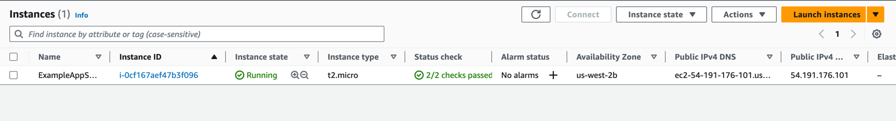
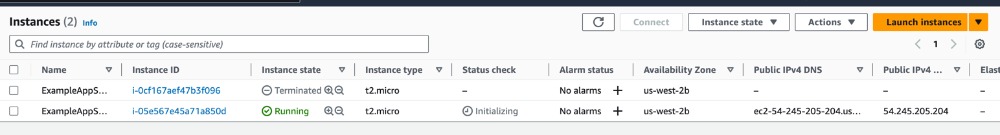
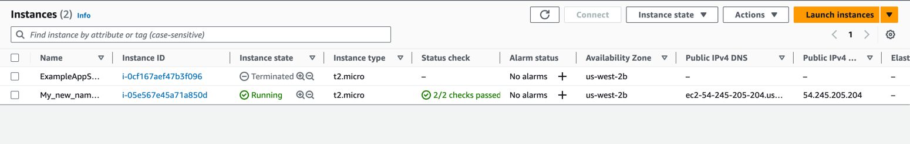

# Terraform used best practices
- Did not store tokens explicitly as code
- For sensitive variables I have used "sensitive" option
- Each variable has its description
- Avoided hardcoded variable values
- "import"s collected in a separate file "imports.tf"
- Existing infrastructure is imported instead of hardcode
- Formatted and validated .tf files after updates
- Used "terraform plans" to verify the changes

# Terraform Docker Tutorial

### Resource states

`$ terraform state show docker_image.nginx`
```
# docker_image.nginx:
resource "docker_image" "nginx" {
    id           = "sha256:61395b4c586da2b9b3b7ca903ea6a448e6783dfdd7f768ff2c1a0f3360aaba99nginx"
    image_id     = "sha256:61395b4c586da2b9b3b7ca903ea6a448e6783dfdd7f768ff2c1a0f3360aaba99"
    keep_locally = false
    name         = "nginx"
    repo_digest  = "nginx@sha256:32da30332506740a2f7c34d5dc70467b7f14ec67d912703568daff790ab3f755"
}
```


`$ terraform state show docker_container.nginx`
```
# docker_container.nginx:
resource "docker_container" "nginx" {
    attach                                      = false
    command                                     = [
        "nginx",
        "-g",
        "daemon off;",
    ]
    container_read_refresh_timeout_milliseconds = 15000
    cpu_shares                                  = 0
    entrypoint                                  = [
        "/docker-entrypoint.sh",
    ]
    env                                         = []
    hostname                                    = "9e6d90a6d028"
    id                                          = "9e6d90a6d028bbeecde2e4d0b5d842f8f8081a7ad51de74422446fae33db6814"
    image                                       = "sha256:61395b4c586da2b9b3b7ca903ea6a448e6783dfdd7f768ff2c1a0f3360aaba99"
    init                                        = false
    ipc_mode                                    = "private"
    log_driver                                  = "json-file"
    logs                                        = false
    max_retry_count                             = 0
    memory                                      = 0
    memory_swap                                 = 0
    must_run                                    = true
    name                                        = "tutorial"
    network_data                                = [
        {
            gateway                   = "172.17.0.1"
            global_ipv6_address       = ""
            global_ipv6_prefix_length = 0
            ip_address                = "172.17.0.2"
            ip_prefix_length          = 16
            ipv6_gateway              = ""
            mac_address               = "02:42:ac:11:00:02"
            network_name              = "bridge"
        },
    ]
    network_mode                                = "default"
    privileged                                  = false
    publish_all_ports                           = false
    read_only                                   = false
    remove_volumes                              = true
    restart                                     = "no"
    rm                                          = false
    runtime                                     = "runc"
    security_opts                               = []
    shm_size                                    = 64
    start                                       = true
    stdin_open                                  = false
    stop_signal                                 = "SIGQUIT"
    stop_timeout                                = 0
    tty                                         = false
    wait                                        = false
    wait_timeout                                = 60

    ports {
        external = 8000
        internal = 80
        ip       = "0.0.0.0"
        protocol = "tcp"
    }
}
```

### Apply after port change

`$ terraform apply` (After changing the port to 8080)
```
docker_image.nginx: Refreshing state... [id=sha256:61395b4c586da2b9b3b7ca903ea6a448e6783dfdd7f768ff2c1a0f3360aaba99nginx]
docker_container.nginx: Refreshing state... [id=9e6d90a6d028bbeecde2e4d0b5d842f8f8081a7ad51de74422446fae33db6814]

Terraform used the selected providers to generate the following execution plan. Resource actions are indicated with the following symbols:
-/+ destroy and then create replacement

Terraform will perform the following actions:

  # docker_container.nginx must be replaced
-/+ resource "docker_container" "nginx" {
      + bridge                                      = (known after apply)
      ~ command                                     = [
          - "nginx",
          - "-g",
          - "daemon off;",
        ] -> (known after apply)
      + container_logs                              = (known after apply)
      - cpu_shares                                  = 0 -> null
      - dns                                         = [] -> null
      - dns_opts                                    = [] -> null
      - dns_search                                  = [] -> null
      ~ entrypoint                                  = [
          - "/docker-entrypoint.sh",
        ] -> (known after apply)
      ~ env                                         = [] -> (known after apply)
      + exit_code                                   = (known after apply)
      - group_add                                   = [] -> null
      ~ hostname                                    = "9e6d90a6d028" -> (known after apply)
      ~ id                                          = "9e6d90a6d028bbeecde2e4d0b5d842f8f8081a7ad51de74422446fae33db6814" -> (known after apply)
      ~ init                                        = false -> (known after apply)
      ~ ipc_mode                                    = "private" -> (known after apply)
      ~ log_driver                                  = "json-file" -> (known after apply)
      - log_opts                                    = {} -> null
      - max_retry_count                             = 0 -> null
      - memory                                      = 0 -> null
      - memory_swap                                 = 0 -> null
        name                                        = "tutorial"
      ~ network_data                                = [
          - {
              - gateway                   = "172.17.0.1"
              - global_ipv6_address       = ""
              - global_ipv6_prefix_length = 0
              - ip_address                = "172.17.0.2"
              - ip_prefix_length          = 16
              - ipv6_gateway              = ""
              - mac_address               = "02:42:ac:11:00:02"
              - network_name              = "bridge"
            },
        ] -> (known after apply)
      - network_mode                                = "default" -> null
      - privileged                                  = false -> null
      - publish_all_ports                           = false -> null
      ~ runtime                                     = "runc" -> (known after apply)
      ~ security_opts                               = [] -> (known after apply)
      ~ shm_size                                    = 64 -> (known after apply)
      ~ stop_signal                                 = "SIGQUIT" -> (known after apply)
      ~ stop_timeout                                = 0 -> (known after apply)
      - storage_opts                                = {} -> null
      - sysctls                                     = {} -> null
      - tmpfs                                       = {} -> null
        # (14 unchanged attributes hidden)

      ~ ports {
          ~ external = 8000 -> 8080 # forces replacement
            # (3 unchanged attributes hidden)
        }
    }

Plan: 1 to add, 0 to change, 1 to destroy.

Do you want to perform these actions?
  Terraform will perform the actions described above.
  Only 'yes' will be accepted to approve.

  Enter a value: yes

docker_container.nginx: Destroying... [id=9e6d90a6d028bbeecde2e4d0b5d842f8f8081a7ad51de74422446fae33db6814]
docker_container.nginx: Destruction complete after 0s
docker_container.nginx: Creating...
docker_container.nginx: Creation complete after 0s [id=035c36c7cdf227a53c49feadfa1c5ef40c544d2e92bc6ed088b26ec1da8b017d]

Apply complete! Resources: 1 added, 0 changed, 1 destroyed.
```

### Using variable for container name
`$ terraform apply -var "container_name=My_new_container_name"`
```
docker_image.nginx: Refreshing state... [id=sha256:61395b4c586da2b9b3b7ca903ea6a448e6783dfdd7f768ff2c1a0f3360aaba99nginx]
docker_container.nginx: Refreshing state... [id=035c36c7cdf227a53c49feadfa1c5ef40c544d2e92bc6ed088b26ec1da8b017d]

Terraform used the selected providers to generate the following execution plan. Resource actions are indicated with the following symbols:
-/+ destroy and then create replacement

Terraform will perform the following actions:

  # docker_container.nginx must be replaced
-/+ resource "docker_container" "nginx" {
      + bridge                                      = (known after apply)
      ~ command                                     = [
          - "nginx",
          - "-g",
          - "daemon off;",
        ] -> (known after apply)
      + container_logs                              = (known after apply)
      - cpu_shares                                  = 0 -> null
      - dns                                         = [] -> null
      - dns_opts                                    = [] -> null
      - dns_search                                  = [] -> null
      ~ entrypoint                                  = [
          - "/docker-entrypoint.sh",
        ] -> (known after apply)
      ~ env                                         = [] -> (known after apply)
      + exit_code                                   = (known after apply)
      - group_add                                   = [] -> null
      ~ hostname                                    = "035c36c7cdf2" -> (known after apply)
      ~ id                                          = "035c36c7cdf227a53c49feadfa1c5ef40c544d2e92bc6ed088b26ec1da8b017d" -> (known after apply)
      ~ init                                        = false -> (known after apply)
      ~ ipc_mode                                    = "private" -> (known after apply)
      ~ log_driver                                  = "json-file" -> (known after apply)
      - log_opts                                    = {} -> null
      - max_retry_count                             = 0 -> null
      - memory                                      = 0 -> null
      - memory_swap                                 = 0 -> null
      ~ name                                        = "tutorial" -> "My_new_container_name" # forces replacement
      ~ network_data                                = [
          - {
              - gateway                   = "172.17.0.1"
              - global_ipv6_address       = ""
              - global_ipv6_prefix_length = 0
              - ip_address                = "172.17.0.2"
              - ip_prefix_length          = 16
              - ipv6_gateway              = ""
              - mac_address               = "02:42:ac:11:00:02"
              - network_name              = "bridge"
            },
        ] -> (known after apply)
      - network_mode                                = "default" -> null
      - privileged                                  = false -> null
      - publish_all_ports                           = false -> null
      ~ runtime                                     = "runc" -> (known after apply)
      ~ security_opts                               = [] -> (known after apply)
      ~ shm_size                                    = 64 -> (known after apply)
      ~ stop_signal                                 = "SIGQUIT" -> (known after apply)
      ~ stop_timeout                                = 0 -> (known after apply)
      - storage_opts                                = {} -> null
      - sysctls                                     = {} -> null
      - tmpfs                                       = {} -> null
        # (14 unchanged attributes hidden)

        # (1 unchanged block hidden)
    }

Plan: 1 to add, 0 to change, 1 to destroy.

```

### Output

`$ terraform output`
```
container_id = "6325415d261b7cd779af867ed44aef95f830a28040e6d903d7156f3b2ffd5366"
image_id = "sha256:61395b4c586da2b9b3b7ca903ea6a448e6783dfdd7f768ff2c1a0f3360aaba99nginx"
```


# Terraform AWS Tutorial

### Resources state after apply
`$ terraform state show aws_instance.app_server`
```
# aws_instance.app_server:
resource "aws_instance" "app_server" {
    ami                                  = "ami-830c94e3"
    arn                                  = "arn:aws:ec2:us-west-2:060279950005:instance/i-0cf167aef47b3f096"
    associate_public_ip_address          = true
    availability_zone                    = "us-west-2b"
    cpu_core_count                       = 1
    cpu_threads_per_core                 = 1
    disable_api_stop                     = false
    disable_api_termination              = false
    ebs_optimized                        = false
    get_password_data                    = false
    hibernation                          = false
    id                                   = "i-0cf167aef47b3f096"
    instance_initiated_shutdown_behavior = "stop"
    instance_state                       = "running"
    instance_type                        = "t2.micro"
    ipv6_address_count                   = 0
    ipv6_addresses                       = []
    monitoring                           = false
    placement_partition_number           = 0
    primary_network_interface_id         = "eni-05b111c968b6b1833"
    private_dns                          = "ip-172-31-20-54.us-west-2.compute.internal"
    private_ip                           = "172.31.20.54"
    public_dns                           = "ec2-54-191-176-101.us-west-2.compute.amazonaws.com"
    public_ip                            = "54.191.176.101"
    secondary_private_ips                = []
    security_groups                      = [
        "default",
    ]
    source_dest_check                    = true
    subnet_id                            = "subnet-033b1b2ff7c67d7ad"
    tags                                 = {
        "Name" = "ExampleAppServerInstance"
    }
    tags_all                             = {
        "Name" = "ExampleAppServerInstance"
    }
    tenancy                              = "default"
    user_data_replace_on_change          = false
    vpc_security_group_ids               = [
        "sg-011f817b90a6d9d6f",
    ]

    capacity_reservation_specification {
        capacity_reservation_preference = "open"
    }

    cpu_options {
        core_count       = 1
        threads_per_core = 1
    }

    credit_specification {
        cpu_credits = "standard"
    }

    enclave_options {
        enabled = false
    }

    maintenance_options {
        auto_recovery = "default"
    }

    metadata_options {
        http_endpoint               = "enabled"
        http_put_response_hop_limit = 1
        http_tokens                 = "optional"
        instance_metadata_tags      = "disabled"
    }

    private_dns_name_options {
        enable_resource_name_dns_a_record    = false
        enable_resource_name_dns_aaaa_record = false
        hostname_type                        = "ip-name"
    }

    root_block_device {
        delete_on_termination = true
        device_name           = "/dev/sda1"
        encrypted             = false
        iops                  = 0
        tags                  = {}
        throughput            = 0
        volume_id             = "vol-0c9fb255753b68d00"
        volume_size           = 8
        volume_type           = "standard"
    }
}
```




`$ terraform state list`
```
aws_instance.app_server
```

### Apply after instance AMI update

`$ terraform apply`

```
Terraform used the selected providers to generate the following execution plan. Resource actions are indicated with the following symbols:
-/+ destroy and then create replacement

Terraform will perform the following actions:

  # aws_instance.app_server must be replaced
-/+ resource "aws_instance" "app_server" {
      ~ ami                                  = "ami-830c94e3" -> "ami-08d70e59c07c61a3a" # forces replacement
      ~ arn                                  = "arn:aws:ec2:us-west-2:060279950005:instance/i-0cf167aef47b3f096" -> (known after apply)
      ~ associate_public_ip_address          = true -> (known after apply)
      ~ availability_zone                    = "us-west-2b" -> (known after apply)
      ~ cpu_core_count                       = 1 -> (known after apply)
      ~ cpu_threads_per_core                 = 1 -> (known after apply)
      ~ disable_api_stop                     = false -> (known after apply)
      ~ disable_api_termination              = false -> (known after apply)
      ~ ebs_optimized                        = false -> (known after apply)
      - hibernation                          = false -> null
      + host_id                              = (known after apply)
      + host_resource_group_arn              = (known after apply)
      + iam_instance_profile                 = (known after apply)
      ~ id                                   = "i-0cf167aef47b3f096" -> (known after apply)
      ~ instance_initiated_shutdown_behavior = "stop" -> (known after apply)
      ~ instance_state                       = "running" -> (known after apply)
      ~ ipv6_address_count                   = 0 -> (known after apply)
      ~ ipv6_addresses                       = [] -> (known after apply)
      + key_name                             = (known after apply)
      ~ monitoring                           = false -> (known after apply)
      + outpost_arn                          = (known after apply)
      + password_data                        = (known after apply)
      + placement_group                      = (known after apply)
      ~ placement_partition_number           = 0 -> (known after apply)
      ~ primary_network_interface_id         = "eni-05b111c968b6b1833" -> (known after apply)
      ~ private_dns                          = "ip-172-31-20-54.us-west-2.compute.internal" -> (known after apply)
      ~ private_ip                           = "172.31.20.54" -> (known after apply)
      ~ public_dns                           = "ec2-54-191-176-101.us-west-2.compute.amazonaws.com" -> (known after apply)
      ~ public_ip                            = "54.191.176.101" -> (known after apply)
      ~ secondary_private_ips                = [] -> (known after apply)
      ~ security_groups                      = [
          - "default",
        ] -> (known after apply)
      ~ subnet_id                            = "subnet-033b1b2ff7c67d7ad" -> (known after apply)
        tags                                 = {
            "Name" = "ExampleAppServerInstance"
        }
      ~ tenancy                              = "default" -> (known after apply)
      + user_data                            = (known after apply)
      + user_data_base64                     = (known after apply)
      ~ vpc_security_group_ids               = [
          - "sg-011f817b90a6d9d6f",
        ] -> (known after apply)
        # (5 unchanged attributes hidden)

      - capacity_reservation_specification {
          - capacity_reservation_preference = "open" -> null
        }

      - cpu_options {
          - core_count       = 1 -> null
          - threads_per_core = 1 -> null
        }

      - credit_specification {
          - cpu_credits = "standard" -> null
        }

      - enclave_options {
          - enabled = false -> null
        }

      - maintenance_options {
          - auto_recovery = "default" -> null
        }

      - metadata_options {
          - http_endpoint               = "enabled" -> null
          - http_put_response_hop_limit = 1 -> null
          - http_tokens                 = "optional" -> null
          - instance_metadata_tags      = "disabled" -> null
        }

      - private_dns_name_options {
          - enable_resource_name_dns_a_record    = false -> null
          - enable_resource_name_dns_aaaa_record = false -> null
          - hostname_type                        = "ip-name" -> null
        }

      - root_block_device {
          - delete_on_termination = true -> null
          - device_name           = "/dev/sda1" -> null
          - encrypted             = false -> null
          - iops                  = 0 -> null
          - tags                  = {} -> null
          - throughput            = 0 -> null
          - volume_id             = "vol-0c9fb255753b68d00" -> null
          - volume_size           = 8 -> null
          - volume_type           = "standard" -> null
        }
    }

Plan: 1 to add, 0 to change, 1 to destroy.


Plan: 1 to add, 0 to change, 1 to destroy.

Do you want to perform these actions?
  Terraform will perform the actions described above.
  Only 'yes' will be accepted to approve.

  Enter a value: yes

aws_instance.app_server: Destroying... [id=i-0cf167aef47b3f096]
aws_instance.app_server: Still destroying... [id=i-0cf167aef47b3f096, 11s elapsed]
aws_instance.app_server: Still destroying... [id=i-0cf167aef47b3f096, 21s elapsed]
aws_instance.app_server: Destruction complete after 24s
aws_instance.app_server: Creating...
aws_instance.app_server: Still creating... [10s elapsed]
aws_instance.app_server: Still creating... [20s elapsed]
aws_instance.app_server: Still creating... [30s elapsed]
aws_instance.app_server: Creation complete after 36s [id=i-05e567e45a71a850d]

Apply complete! Resources: 1 added, 0 changed, 1 destroyed.
```




### Using variable for container name
`apply -var "instance_name=My_new_name_for_container"`
```
aws_instance.app_server: Refreshing state... [id=i-05e567e45a71a850d]

Terraform used the selected providers to generate the following execution plan. Resource actions are indicated with the following symbols:
  ~ update in-place

Terraform will perform the following actions:

  # aws_instance.app_server will be updated in-place
  ~ resource "aws_instance" "app_server" {
        id                                   = "i-05e567e45a71a850d"
      ~ tags                                 = {
          ~ "Name" = "ExampleAppServerInstance" -> "My_new_name_for_container"
        }
      ~ tags_all                             = {
          ~ "Name" = "ExampleAppServerInstance" -> "My_new_name_for_container"
        }
        # (30 unchanged attributes hidden)

        # (8 unchanged blocks hidden)
    }

Plan: 0 to add, 1 to change, 0 to destroy.

Changes to Outputs:
  + instance_id        = "i-05e567e45a71a850d"
  + instance_public_ip = "54.245.205.204"

Do you want to perform these actions?
  Terraform will perform the actions described above.
  Only 'yes' will be accepted to approve.

  Enter a value: yes

aws_instance.app_server: Modifying... [id=i-05e567e45a71a850d]
aws_instance.app_server: Modifications complete after 6s [id=i-05e567e45a71a850d]

Apply complete! Resources: 0 added, 1 changed, 0 destroyed.
```



## Outputs
`$ terraform output`
```
instance_id = "i-05e567e45a71a850d"
instance_public_ip = "54.245.205.204"
```